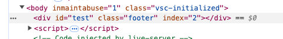
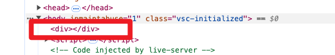
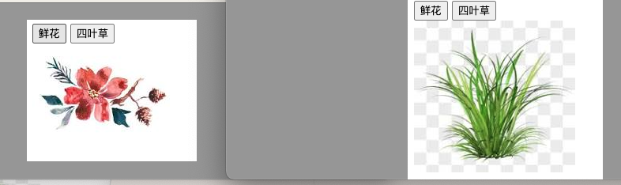

<font color='red' size=5>注：与《JavaScript操作CSS》内容有重合！！！</font>

# 一、属性操作 - 黑马

* [获取属性值](https://book.itheima.net/course/1258676978588860418/1277481554465005570/1277492272824328193)

## 1. 获取属性值

在DOM对象中可以使用 **“element.属性”** 的方式来获取 **内置的属性值**，但是DOM对象并不能直接使用点语法获取到 **自定义属性** 的值，那么如何获取自定义属性值呢？在DOM中，可以使用 `getAttribute('属性')` 方法来返回指定元素的属性值。

```html
<!DOCTYPE html>
<html lang="en">

<head>
  <meta charset="UTF-8">
  <meta name="viewport" content="width=device-width, initial-scale=1.0">
  <title>Document</title>
</head>

<body>
  <div id="demo" index="1" class="nav"></div>

  <script>
    var div = document.querySelector('div');
    console.log(div.id);  // 结果为：demo
    console.log(div.getAttribute('id'));  // 结果为：demo

    console.log(div.index); // undefine      
    console.log(div.getAttribute('index')); // 结果为：1
  </script>
</body>
</html>
```

以上两种方式都可以获取内置属性值，但是在实际运用中推荐使用 `“element.属性”` 这种较为简洁的方式。


## 2. 设置属性值

在DOM对象中可以使用 **“element.属性= '值'”** 的方式来设置内置的属性值，并且针对于自定义属性，提供了 **“element.setAttribute('属性', '值')”** 的方式进行设置。值得一提的是，设置了自定义属性的标签，在浏览器中的HTML结构中可以看到该属性。

```html
<!DOCTYPE html>
<html lang="en">

<head>
  <meta charset="UTF-8">
  <meta name="viewport" content="width=device-width, initial-scale=1.0">
  <title>Document</title>
</head>

<body>

  <div></div>

  <script>
    var div = document.querySelector('div');
    div.id = 'test';
    div.className = 'footer';
    // or
    // div.setAttribute('class', 'footer');
    div.setAttribute('index', 2);
  </script>
</body>

</html>
```




## 3. 移除属性

在DOM中使用 **“element.removeAttribute('属性')”** 的方式来移除元素属性。

```html
<!DOCTYPE html>
<html lang="en">

<head>
  <meta charset="UTF-8">
  <meta name="viewport" content="width=device-width, initial-scale=1.0">
  <title>Document</title>
</head>

<body>
  <div id="test" class="footer" index="2"></div>

  <script>
    var div = document.querySelector('div');
    div.removeAttribute('id');
    div.removeAttribute('class');
    div.removeAttribute('index');
  </script>
</body>
</html>
```




# 二、H5自定义属性 - 黑马

## 1. 设置H5自定义属性

### a. 在HTML中设置自定义属性

在div元素上设置data-index属性，示例代码如下。

```html
<div data-index="2"></div>
```

上述代码中，`data-index` 就是一种自定义属性，“data-” 是自定义属性的前缀，index 是开发者自定义的属性名。

### b. 在JavaScript中设置H5自定义属性

在JavaScript代码中，可以通过setAttribute('属性', 值)或者“元素对象.dataset.属性名='值'”两种方式设置自定义属性。需要注意的是，通过后者的方式只能设置以“data-”开头的自定义属性。示例代码如下。

* “元素对象.dataset.属性名='值'”
* setAttribute('属性', 值)

```html
<!DOCTYPE html>
<html lang="en">

<head>
  <meta charset="UTF-8">
  <meta name="viewport" content="width=device-width, initial-scale=1.0">
  <title>Document</title>
</head>

<body>
  <div data-index="3333"></div>

  <script>
    var div = document.querySelector('div');
      
    // “元素对象.dataset.属性名” 的方式为div元素添加属性。
    div.dataset.index = '2';
    
    // 通过setAttribute('属性', '值')的方式添加data-name='andy'
    div.setAttribute('data-name', 'andy');
  </script>
</body>

</html>
```


## 2. 获取自定义属性值

在DOM操作中，提供了两种获取属性值的方式：

* 第1种是通过getAttribute()方式，该方式可以获取内置属性或者自定义属性；
* 第2种是使用HTML5新增的“element.dataset.属性”或者“element.dataset['属性'] ”方式。

推荐使用第1种，因为第2种有兼容性问题，从IE11才开始支持。

```html
<!DOCTYPE html>
<html lang="en">

<head>
  <meta charset="UTF-8">
  <meta name="viewport" content="width=device-width, initial-scale=1.0">
  <title>Document</title>
</head>

<body>
  <div getTime="20" data-index="2" data-list-name="andy"></div>

  <script>
    var div = document.querySelector('div');

    // 1. getAttribute()
    console.log(div.getAttribute('data-index'));   // 结果为：2
    console.log(div.getAttribute('data-list-name')); // 结果为：andy

    // 2. HTML5新增的获取自定义属性的方法，只能获取“data-”开头的属性
    console.log(div.dataset); // DOMStringMap {index:"2",listName:"andy"}
    console.log(div.dataset.index);    // 结果为：2
    console.log(div.dataset['index']);   // 结果为：2
    console.log(div.dataset.listName);   // 结果为：andy
    console.log(div.dataset['listName']); // 结果为：andy
  </script>
</body>

</html>
```


# 三、操作元素属性（实战） - 黑马

* [操作元素属性 - 黑马](https://book.itheima.net/course/1258676978588860418/1277481554465005570/1277491444889690113)

在DOM中，HTML属性操作是指使用JavaScript来操作一个元素的HTML属性。一个元素包含很多的属性，例如，对于一个img图片元素来说，我们可以操作它的src、title属性等；或者对于input元素来说，我们可以操作它的disabled、checked、selected属性等。接下来以案例的形式讲解如何操作常用元素属性及表单元素属性。

## **1. img元素的属性操作**

```js
<!DOCTYPE html>
<html lang="en">

<head>
  <meta charset="UTF-8">
  <meta name="viewport" content="width=device-width, initial-scale=1.0">
  <title>Document</title>
</head>

<body>
  <button id="flower">鲜花</button>
  <button id="grass">四叶草</button> <br>
  

  <script>
    // 1. 获取元素
    var flower = document.getElementById('flower');
    var grass = document.getElementById('grass');
    var img = document.querySelector('img');

    // 2. 注册事件处理程序
    flower.onclick = function () {
      img.src = 'images/flower.jpeg';
      img.title = '鲜花';
    };

    grass.onclick = function () {
      img.src = 'images/grass.jpeg';
      img.title = '四叶草';
    };
  </script>
</body>
</html>
```




## 2. 表单input元素的属性操作

这里我们以单击按钮操作input表单属性为例进行代码演示，示例代码如下。

```html
<!DOCTYPE html>
<html lang="en">

<head>
  <meta charset="UTF-8">
  <meta name="viewport" content="width=device-width, initial-scale=1.0">
  <title>Document</title>
</head>

<body>
  <button>按钮</button>
  <input type="text" value="输入内容">

  <script>
    // 1. 获取元素
    var btn = document.querySelector('button');
    var input = document.querySelector('input');

    // 2. 注册事件处理程序
    btn.onclick = function () {
      input.value = '被点击了！'; // 通过value来修改表单里面的值
      this.disabled = true;   // this指向的是事件函数的调用者 btn
    };
  </script>
</body>
</html>
```


# 四、JS 操作元素属性 - GPT

在 JavaScript 中，可以通过多种方式操作 HTML 元素的属性，常用的有以下几种方法：

## 1. `getAttribute`、`setAttribute` 和 `removeAttribute`

这些方法用于获取、设置和删除元素的指定属性。

```javascript
// 选择一个元素
const element = document.querySelector('selector');

// 获取属性
const value = element.getAttribute('attributeName');

// 设置属性
element.setAttribute('attributeName', 'newValue');

// 删除属性
element.removeAttribute('attributeName');
```

## 2. 使用 `.` 点语法直接访问属性

对于常用属性（比如 `id`、`className`、`src` 等），可以通过点语法直接进行操作：

```javascript
const element = document.querySelector('selector');

// 读取属性
console.log(element.id);         // 获取元素的 id 属性
console.log(element.className);  // 获取元素的 class 属性

// 设置属性
element.id = 'newId';
element.className = 'newClass';
```

## 3. 操作 `class` 属性

可以使用 `classList` 对类名进行添加、删除、切换等操作：

```javascript
const element = document.querySelector('selector');

// 添加类名
element.classList.add('newClass');

// 删除类名
element.classList.remove('oldClass');

// 切换类名（如果类名存在就删除它，否则添加它）
element.classList.toggle('toggleClass');

// 检查类名是否存在
console.log(element.classList.contains('someClass'));
```

## 4. `style` 属性

`style` 对象可以直接设置元素的内联样式：

```javascript
const element = document.querySelector('selector');

// 设置样式
element.style.color = 'red';
element.style.fontSize = '20px';

// 清除样式
element.style.color = '';  // 还原为默认样式
```

## 5. 读取和修改 `data-*` 自定义属性

HTML5 中可以用 `data-*` 自定义属性存储数据，使用 `dataset` 访问这些属性：

```javascript
const element = document.querySelector('selector');

// 获取自定义属性
console.log(element.dataset.customAttr);

// 设置自定义属性
element.dataset.customAttr = 'newValue';
```

通过这些方法，JavaScript 可以高效地操作元素的属性，实现动态效果。


