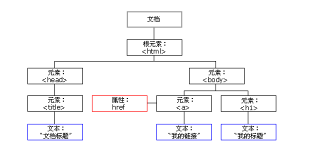

# 一、节点介绍

<font color='red' size=5>获取元素通用有两种方式，Element在单独文档《JavaScript操作HTML》</font>


## 1. 节点概述

一般地，节点至少拥有 `nodeType`（节点类型）、`nodeName`（节点名称）和 `nodeValue`（节点值）这三个基本属性。

* 元素节点  `nodeType`  为 1
* 属性节点  `nodeType`  为 2
* 文本节点  `nodeType`  为 3 （文本节点包含文字、空格、换行等）

我们在实际开发中，节点操作主要操作的是 **元素节点**。开发者可以根据nodeType的值来判断是否为元素节点。


## 2. 节点层级



- 根节点：`<html>` 标签是整个文档的根节点，有且仅有一个。
- 父节点：指的是某一个节点的上级节点，例如，`<html> `元素则是 `<head>` 和 `<body>` 的父节点。
- 子节点：指的是某一个节点的下级节点，例如，`<head> ` 和 `<body>` 节点是 `<html>` 节点的子节点。
- 兄弟节点：两个节点同属于一个父节点，例如，`<head> ` 和 `<body> ` 互为兄弟节点。


### a. 根节点

根节点：`<html>` 标签是整个文档的根节点，有且仅有一个。

```
	document.documentElement;
```


### b. 获取父级节点

* `parentNode` 属性可返回某节点的父节点，注意是最近的一个父节点
* 如果指定的节点没有父节点则返回 null 

```js
    // 获取父节点
    var child = document.querySelector('.box');
    console.log(child.parentNode);
```


### c. 获取子级节点

* `childNodes`
    * `parentNode.childNodes` 返回包含指定节点的子节点的集合，该集合为即时更新的集合。
    * 注意：返回值里面包含了所有的子节点，包括元素节点，文本节点等。如果只想要获得里面的元素节点，则需要专门处理。 所以我们一般不提倡使用 `childNodes`。

* `children`
    * `parentNode.children` 是一个只读属性，返回所有的子元素节点。它只返回子元素节点，其余节点不返回 （这个是我们重点掌握的）。

* `firstChild`
    * `firstChild` 返回第一个子节点，找不到则返回null。同样，也是包含所有的节点。

* `lastChild`
    * `lastChild` 返回最后一个子节点，找不到则返回null。同样，也是包含所有的节点。

* `firstElementChild` （IE9 以上才支持）
    * `firstElementChild`  返回第一个子元素节点，找不到则返回null。

* `lastElementChild` （IE9 以上才支持）
    * `lastElementChild` 返回最后一个子元素节点，找不到则返回null。  


> <font color='red' size=4>实际开发中，firstChild 和 lastChild 包含其他节点，操作不方便，而 firstElementChild 和 lastElementChild 又有兼容性问题，那么我们如何获取第一个子元素节点或最后一个子元素节点呢？</font>
>
> 解决方案：
>
> * 如果想要第一个子元素节点，可以使用 parentNode.chilren[0] 
>
> * 如果想要最后一个子元素节点，可以使用 parentNode.chilren[parentNode.chilren.length - 1] </font>


### d. 获取兄弟节点

* `previousSibling`
    * `previousSibling` 返回当前元素上一个兄弟元素节点，找不到则返回null。同样，也是包含所有的节点。

* `nextSibling`
    * `nextSibling` 返回当前元素的下一个兄弟元素节点，找不到则返回null。同样，也是包含所有的节点。

* `previousElementSibling` （IE9 以上才支持）
    * `previousElementSibling` 返回当前元素上一个兄弟节点，找不到则返回null。 

* `nextElementSibling` （IE9 以上才支持）
    * `nextElementSibling` 返回当前元素下一个兄弟元素节点，找不到则返回null。 


如何解决兼容性问题 ？

答：自己封装一个兼容性的函数  

```js
function getNextElementSibling(element) {
  var el = element;
  while (el = el.nextSibling) {
    if (el.nodeType === 1) {
        return el;
    }
  }
  return null;
}  
```


# 二、创建、添加、删除、拷贝节点

<font color='red' size=5>具体查看《JavaScript操作HTML》元素的相关操作！！！</font>


# 二、Node vs Element

* [DOM 精通了？请问 Node 和 Element 有何区别？](https://juejin.cn/post/7066778860024496165)

```html
<div id="parent">
    This is parent content.
    <div id="child1">This is child1.</div>
    <div id="child2">This is child2.</div>
</div>
```

