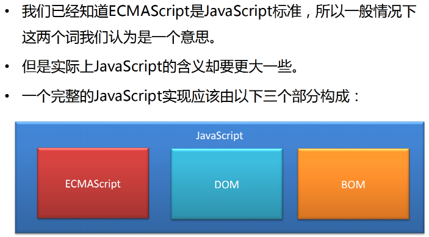

# 一、JavaScript 的组成

* ECMAScript：规定了js基础语法核心知识。 
    * 比如：变量、分支语句、循环语句、对象等等 

* Web APIs : 
    * DOM 操作文档，比如对页面元素进行移动、大小、添加删除等操作 
    * BOM 操作浏览器，比如页面弹窗，检测窗口宽度、存储数据到浏览器等等

## ECMAScript 与 JavaScript 关系

- ECMAScript：是JavaScript的核心。ECMAScript规定了JavaScript的编程语法和基础核心内容，是所有浏览器厂商共同遵守的一套JavaScript语法工业标准。
- DOM：文档对象模型，是W3C组织推荐的处理可扩展标记语言的标准编程接口，通过DOM提供的接口，可以对页面上的各种元素进行操作（如大小、位置、颜色等）。
- BOM：浏览器对象模型，它提供了独立于内容的、可以与浏览器窗口进行互动的对象结构。通过BOM，可以对浏览器窗口进行操作（如弹出框、控制浏览器导航跳转等）。

# 二、JavaScript的特点

## 1. JavaScript是一种脚本语言

脚本（Script）简单地说就是一条条的文本命令，这些命令按照程序流程逐条被执行。常见的脚本语言有JavaScript、TypeScript、PHP、Python等。非脚本语言（如C、C++）一般需要编译、链接，生成独立的可执行文件后才能运行，而脚本语言依赖于解释器，只在被调用时自动进行解释或编译。脚本语言通常都有简单、易学、易用的特点，语法规则比较松散，使开发人员能够快速完成程序的编写工作。

## 2. JavaScript可以跨平台

JavaScript语言不依赖操作系统，仅需要浏览器的支持。在移动互联网时代，利用手机等各类移动设备上网的用户越来越多，JavaScript的跨平台性使其在移动端也承担着重要的职责。

## 3. JavaScript支持面向对象

面向对象是软件开发中的一种重要的编程思想，其优点非常多。例如，基于面向对象思想诞生了许多优秀的库和框架（如jQuery），可以使JavaScript开发变得快捷和高效，降低了开发成本。

# 三、解释型语言 & 动态语言

计算机高级语言主要有『编译型』和『解释型』

* JavaScript是一门解释型语言，所谓解释型值语言不需要被编译为机器码在执行，而是直接执行。
* 解释型语言运行较慢也是它的劣势。
* 不过解释型语言中使用了JIT技术，使得运行速度得以改善。

* **动态语言（弱类型语言）**是运行时才确定数据类型的语言，变量在使用之前无需申明类型，通常变量的值是被赋值的那个值的类型。比如Php、Asp、JavaScript、Python、Perl等等。

* **静态语言（强类型语言）**是编译时变量的数据类型就可以确定的语言，大多数静态语言要求在使用变量之前必须生命数据类型。比如Java、C、C++、C#等。

* JavaScript是一门动态语言，所谓的动态语言可以暂时理解为在语言中的一切内容都是不确定的。比如一个变量，这一时刻是个整型，下一时刻可能会变成字符串了。当然这个问题我们以后再谈。

* 不过在补充一句动态语言相比静态语言性能上要差一些，不过由于JavaScript中应用的JIT技术，所以JS可能是运行速度最快的动态语言了。

