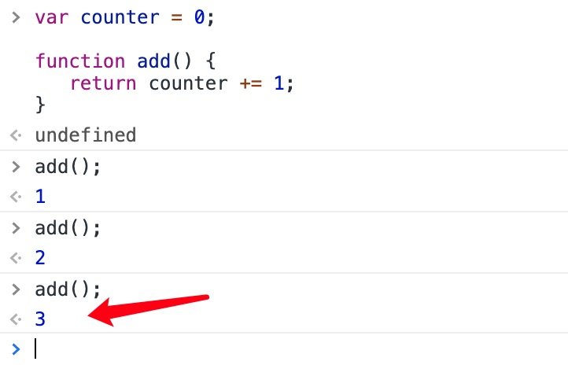
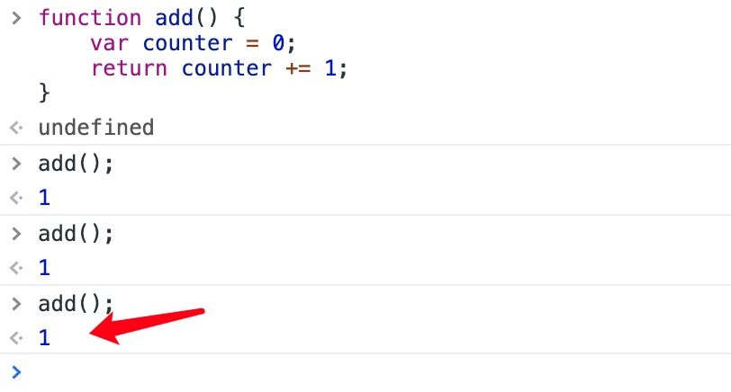

[闭包 - MDN](https://developer.mozilla.org/zh-CN/docs/Web/JavaScript/Closures)


# 一、闭包 - 菜鸟

[菜鸟教程 - JavaScript 闭包](https://www.runoob.com/js/js-function-closures.html)

## 1. 计数器困境

设想下如果你想统计一些数值，且该计数器在所有函数中都是可用的。

你可以使用全局变量，函数设置计数器递增：

```js
var counter = 0;
 
function add() {
   return counter += 1;
}
 
add();	// 计数器现在为 1
add();	// 计数器现在为 2
add();  // 计数器现在为 3
```



计数器数值在执行 add() 函数时发生变化。

但问题来了，页面上的任何脚本都能改变计数器，即便没有调用 add() 函数。

如果我在函数内声明计数器，如果没有调用函数将无法修改计数器的值：

```js
function add() {
    var counter = 0;
    return counter += 1;
}
 
add();
add();
add();
 
// 本意是想输出 3, 但事与愿违，输出的都是 1 !
```



以上代码将无法正确输出，每次我调用 add() 函数，计数器都会设置为 1。

**JavaScript 内嵌函数可以解决该问题。**


## 2. JavaScript 内嵌函数

所有函数都能访问全局变量。 

实际上，在 JavaScript 中，所有函数都能访问它们上一层的作用域。

JavaScript 支持嵌套函数。嵌套函数可以访问上一层的函数变量。

该实例中，内嵌函数 **plus()** 可以访问父函数的 **counter** 变量：

```js
function add() {
    var counter = 0;
    function plus() {counter += 1;}
    plus();    
    return counter; 
}
```

如果我们能在外部访问 **plus()** 函数，这样就能解决计数器的困境。

我们同样需要确保 **counter = 0** 只执行一次。

**我们需要闭包。**


## 3. JavaScript 闭包

```js
var add = (function () {
    var counter = 0;
    return function () {return counter += 1;}
})();
 
add();
add();
add();
 
// 计数器为 3
```

**实例解析**

变量 **add** 指定了函数自我调用的返回字值。

自我调用函数只执行一次。设置计数器为 0。并返回函数表达式。

add变量可以作为一个函数使用。非常棒的部分是它可以访问函数上一层作用域的计数器。

这个叫作 JavaScript **闭包。**它使得函数拥有私有变量变成可能。

计数器受匿名函数的作用域保护，只能通过 add 方法修改。


### a. 概括

> ### 闭包是一种保护私有变量的机制，它在函数执行时创建一个私有作用域，从而保护内部的私有变量不受外界干扰。
>
> ### 直观地说，闭包就像是一个不会被销毁的栈环境。


# 二、什么是闭包 - GPT

闭包是 JavaScript 中一个重要的概念，它允许一个函数访问其外部函数的作用域，即使外部函数已经执行完毕。简单来说，闭包使得内部函数能够“记住”并访问它的外部函数的变量。

以下是一个简单的示例：

```javascript
function outerFunction() {
  let outerVariable = 'I am outside!';

  function innerFunction() {
    let outerVariable += 'A'
    console.log(outerVariable);
  }

  return innerFunction;
}

const myFunction = outerFunction();
myFunction(); // 输出: I am outside!A
myFunction(); // 输出: I am outside!AA
myFunction(); // 输出: I am outside!AAA
```

在这个例子中，`innerFunction` 是一个闭包，它访问了 `outerFunction` 中的 `outerVariable`。即使 `outerFunction` 已经执行完毕，`innerFunction` 仍然可以访问 `outerVariable`。


# 三、闭包 - 黑马

[黑马程序员 - 闭包](https://book.itheima.net/course/1258676978588860418/1277481554465005570/1277487981577379843)

闭包的常见创建方式就是在一个函数内部创建另一个函数，通过另一个函数访问这个函数的局部变量。为了让大家更加清楚闭包函数的实现，下面我们通过代码进行演示。

```javascript
function fn() {
    var times = 0;

    var c = function () {
        return ++times;
    };

    return c;
}

var count = fn();    // 保存fn()返回的函数，此时count就是一个闭包

// 访问测试
console.log(count());  // 输出结果：1
console.log(count());  // 输出结果：2
console.log(count());  // 输出结果：3
console.log(count());  // 输出结果：4
console.log(count());  // 输出结果：5
```

上述 **`c方法`** 代码，利用闭包函数实现了在全局作用域中访问局部变量times，并让变量的值始终存储在内存中。第8行代码调用fn()函数后，接下来将匿名函数的引用返回给count变量，且匿名函数中使用了局部变量times。因此，局部变量times不会在fn()函数执行完成后被JavaScript回收，依然保存在内存中。


