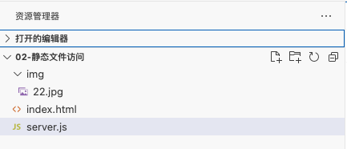

# 一、使用Nodejs内置的http模块搭建web服务器

* [MDN - Hello Node.js](https://developer.mozilla.org/zh-CN/docs/Learn/Server-side/Express_Nodejs/Introduction#hello_node.js)
* demo：./04-server-demo/01-nodejs-http/01-最简单的web服务器/nodejs-http.js


以下示例将创建一个 web 服务器，它将监听对 URL `http://127.0.0.1:8000/` 所有种类的 HTTP 请求，当接收到一个请求时，脚本将做出响应：返回一个字符串“Hello World”。如果已经安装了 Node，可以按照下面的步骤尝试一下：

1. 打开终端（Windows 中打开命令行工具）

2. 创建一个空文件夹用来存放项目，比如"test-node"，然后在终端输入以下命令进入这个文件夹：

    ```sh
    $ cd test-node
    ```

3. 用你最喜欢的文本编辑器创建一个名为"hello.js" 的文件，把以下代码粘贴进来。

    ```js
    // 调用 HTTP 模块
    const http = require("http");
    
    // 创建 HTTP 服务器并监听 8000 端口的所有请求
    http
      .createServer((request, response) => {
        // 用 HTTP 状态码和内容类型来设定 HTTP 响应头
        response.writeHead(200, { "Content-Type": "text/plain" });
    
        // 发送响应体 "Hello World"
        response.end("Hello World\n");
      })
      .listen(8000);
    
    // 在控制台打印访问服务器的 URL
    console.log("服务器运行于 http://127.0.0.1:8000/");
    ```

4. 将其保存在刚才创建的文件夹。

5. 返回终端并输入以下命令：

    ```sh
    $ node "hello.js"
    ```

最后，在浏览器地址栏中输入 `"http://localhost:8000"` 并按回车，可以看到一个大面积空白的网页，左上角有“Hello World" 字样。


# 二、进阶 - 访问静态资源

* [node.js教你写一个web服务器(保姆级教程)](https://juejin.cn/post/7092006570531241998#heading-42)

* demo：./04-server-demo/01-nodejs-http/02-静态文件访问/nodejs-http.js


```js
const http = require('http');
const fs = require('fs');
const path = require('path');

//创建服务器
const app = http.createServer((req, res) => {

  if (req.url === '/index.html') {
    let htmlString = fs.readFileSync(path.join(__dirname, 'index.html'));
    res.end(htmlString);
  }
  else if (req.url === '/style.css') {
    let cssString = fs.readFileSync(path.join(__dirname, 'style.css'));
    res.setHeader('content-type', 'text/css');
    res.end(cssString);
  } else if (req.url === '/1.png') {
    let pngString = fs.readFileSync(path.join(__dirname, '/1.png'));
    res.end(pngString);
  } else if (req.url === '/img/22.jpg') {
    let pngString = fs.readFileSync(path.join(__dirname, '/img/22.jpg'));
    res.end(pngString);
  } else {
    res.setHeader('content-type', 'text/html;charset=utf-8');
    res.statusCode = 404;
    res.end('<h2>可惜了, 找不到你要的资源' + req.url + '</h2>');
  }
});
 
//启动服务器，监听8082端口
app.listen(8082, () => {
  console.log('8082端口启动');
});
```




启动：`node server.js`

http://localhost:8082/index.html

http://localhost:8082/img/22.jpg


