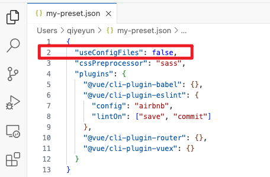
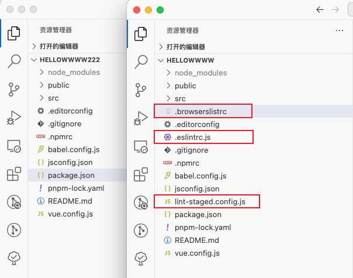
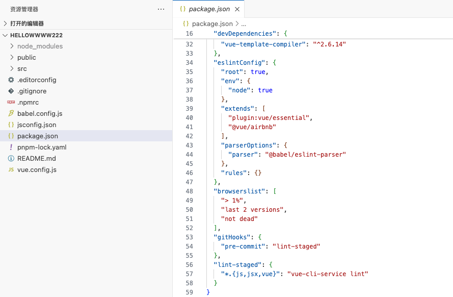
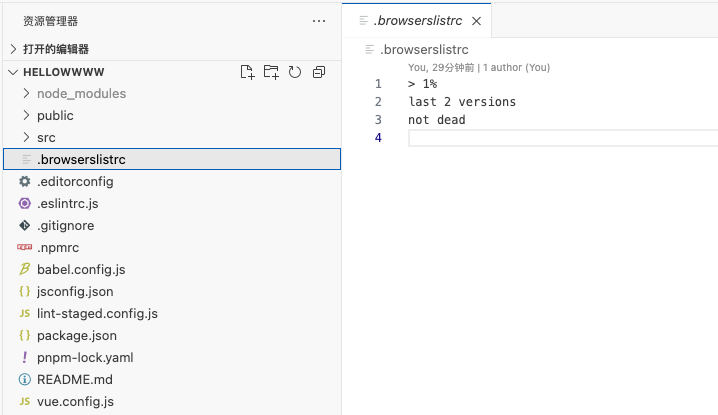
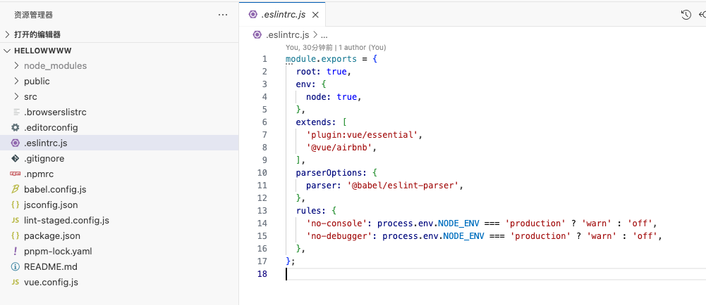
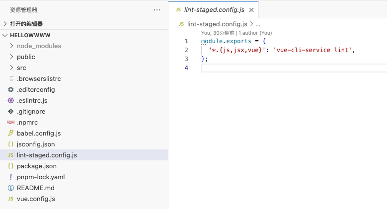

# 使用 preset 创建 Vue2 工程

* [VueCLI官网 - 加载文件系统中的 Preset](https://cli.vuejs.org/zh/guide/plugins-and-presets.html#%E8%BF%9C%E7%A8%8B-preset)

你可以直接在本地测试 preset。如果 `--preset` 选项的值是一个相对或绝对文件路径，或是以 `.json` 结尾，则 Vue CLI 会加载本地的preset。

本地文件 `my-preset.json` ：


```sh
# ./my-preset 应当是一个包含 preset.json 的文件夹
vue create --preset ./my-preset my-project

# 或者，直接使用当前工作目录下的 json 文件：
vue create --preset my-preset.json my-project
```


# 单独配置文件 对比



创建两个不同的项目。一个使用 ConfigFile，一个不使用。


## 工程目录对比

<font size=5 color=''>两个项目文件对比：发现少了一些Config文件。都被集成到了 `package.json` 中了。</font>




## 详细对比

* <font size=5> `package.json` - 无单独Config文件，集成在一起。</font>



* <font size=5>单独的Config文件</font>





