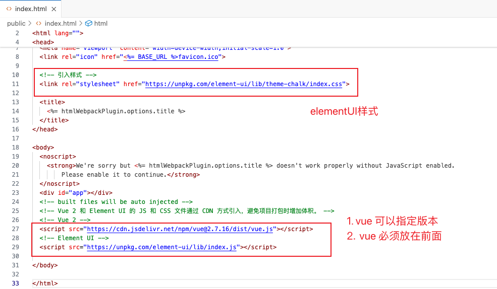
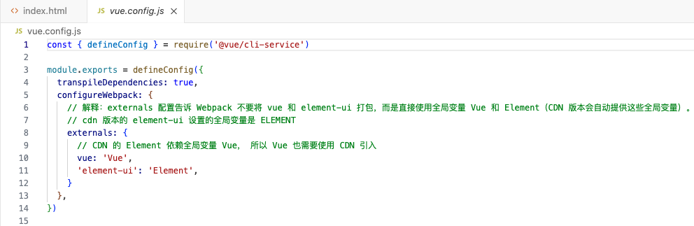
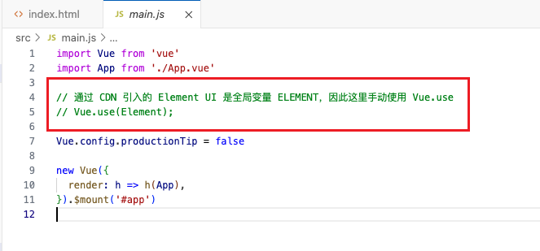
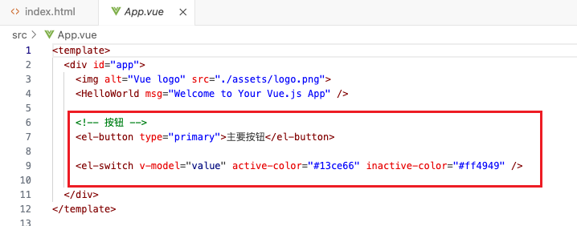
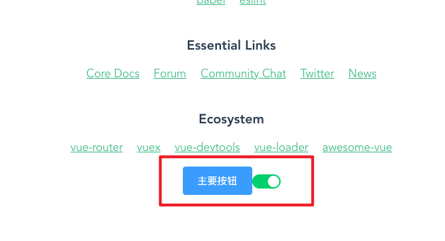

# Vue2 cdn引入ElementUI

* 参考：https://blog.csdn.net/weixin_46057852/article/details/133092380


## 1. 创建Vue2 项目

```sh
$ vue create XXXX
```


## 2. cdn引入步骤

1 在 `index.html` 文件中引入对应版本的cdn， ***引入vue.js的cdn一定要放在其他两个前面要不然会报错*** ；




2 可移除 `package.json` 中的 Vue 包；


3 然后再 `vue.config.js` 中配置 webpack，禁止将 Vue 与 ElementUI 打包；

```js
module.exports = { 
  configureWebpack: {
    externals: {
      // CDN 的 Element 依赖全局变量 Vue， 所以 Vue 也需要使用 CDN 引入
      'vue': 'Vue',
      // 不去 node_modules 中找，而是去找 全局变量 ELEMENT
      'element-ui': 'ELEMENT'
    },
  }
}

```




4 不需要再 main.js 注册 `Vue.use(Element);`




5 使用组件




6 运行

