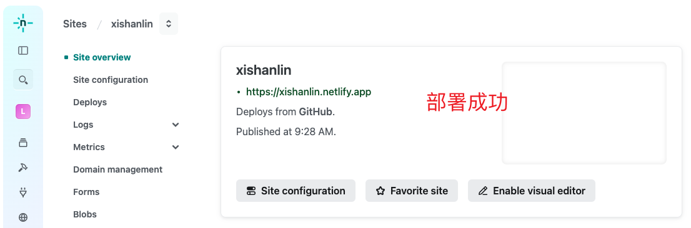
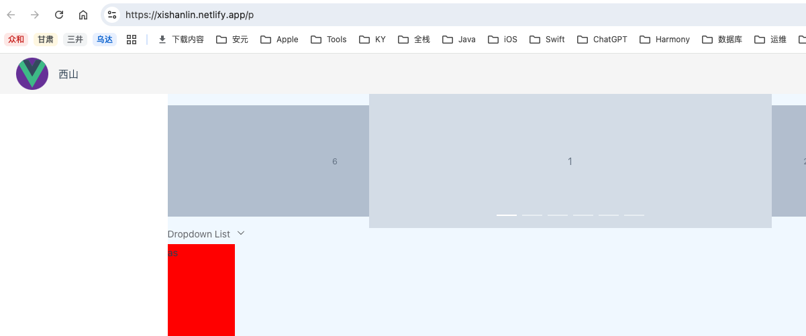
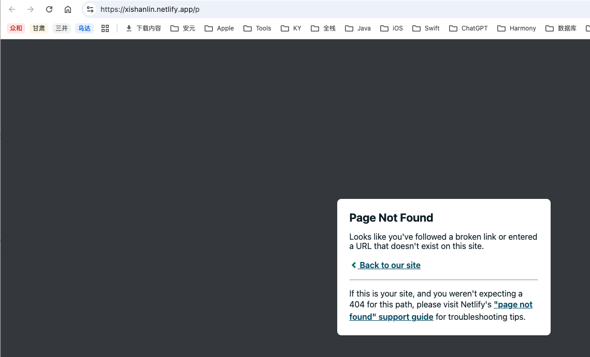

* [使用netlify实现自动化部署前端项目（无服务器版本）](https://blog.csdn.net/weixin_47436633/article/details/129281237)


# 一、仓库

* 前端仓库：https://github.com/xishan-lin/xishan-lin
* 资源仓库：https://github.com/xishan-lin/resourcesRepo


# 二、Netlify实操





## 1. 首次加载成功，刷新404






### a. 解决：`netlify.toml` 新增 `redirects`

在项目根目录创建文件 `netlify.toml` 文件。编辑 `netlify.toml` 文件，增加redirect，避免出现刷新后404。

```sh
[[redirects]]
  # 配置 SPA 重定向，防止刷新页面时出现 404
  from = "/*"
  to = "/index.html"
  status = 200
```


### b. `netlify.toml` 更多配置

```sh
[build]
  # 指定构建命令
  command = "npm run build" 

  # 指定输出目录，Vue 默认是 dist
  publish = "dist123" 

  # 环境变量（可选）
  [build.environment]
    NODE_VERSION = "18"

[[redirects]]
  # 配置 SPA 重定向，防止刷新页面时出现 404
  from = "/*"
  to = "/index.html"
  status = 200
```


## 2. 配置二级路由

## 项目的基础公共路径


