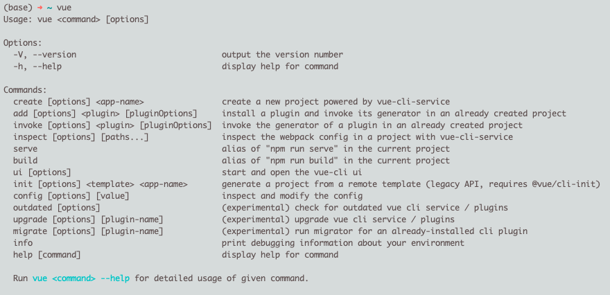

* [Vue CLI 官网](https://cli.vuejs.org/zh/)


# 一、脚手架是什么

* CLI： `Command-Line Interface` 命令行界面，俗称脚手架。

* Vue脚手架（Vue CLI）是一个基于Vue.js进行快速开发的完整系统。它包括一个图形化的项目管理界面和一套完整的脚手架工具，帮助开发者快速搭建Vue项目。


# 二、安装脚手架

```sh
# 安装 node.js，同时安装 npm。

# 全局安装Vue CLI
$ npm install -g @vue/cli
```

验证




# 三、问题

## A⭐️. Vue2为什么使用 npm run dev 启动服务?

在 Vue 2 项目中，使用 `npm run dev` 启动开发服务的原因主要与 **Vue CLI 的工作机制**、**Webpack 的集成** 以及 **开发环境优化** 相关。以下是详细解析：

---

### 1. **`npm run dev` 的底层逻辑**
在 Vue 2 的官方脚手架（Vue CLI）生成的项目中，`package.json` 的 `scripts` 字段会预定义以下命令：
```json
{
  "scripts": {
    "dev": "webpack-dev-server --inline --progress --config build/webpack.dev.conf.js",
    "build": "node build/build.js"
  }
}
```
- **实际执行**：`npm run dev` 会调用 `webpack-dev-server`，并加载 Vue CLI 内置的 Webpack 开发配置（`webpack.dev.conf.js`）。
- **核心作用**：启动一个本地开发服务器（默认 `http://localhost:8080`），提供实时编译和热更新。

---

### 2. **为什么需要 `webpack-dev-server`？**
Vue 2 的开发环境依赖 Webpack 的以下能力：
- **模块化打包**：将 `.vue` 文件、ES6+ 代码、SASS/LESS 等编译为浏览器可运行的 JS/CSS。
- **热模块替换（HMR）**：修改代码后自动局部刷新页面，无需手动重启。
- **开发服务器**：提供静态文件服务、代理转发（解决跨域）、Source Map 等调试支持。

---

### 3. **Vue CLI 的封装设计**
Vue CLI 隐藏了复杂的 Webpack 配置，通过 `npm run dev` 实现了：
- **标准化流程**：开发者无需手动配置 Webpack。
- **环境隔离**：开发模式（`dev`）和生产模式（`build`）使用不同的 Webpack 配置。
  - **开发模式**：启用 HMR、不压缩代码、保留调试信息。
  - **生产模式**：代码压缩、Tree Shaking、移除 console 等优化。

---

### 4. **关键配置解析**
在 Vue CLI 生成的 `build/webpack.dev.conf.js` 中，会定义：
- **入口文件**：通常是 `src/main.js`。
- **HMR 插件**：`webpack.HotModuleReplacementPlugin`。
- **开发服务器配置**：
  ```js
  devServer: {
    hot: true,         // 启用热更新
    open: true,        // 自动打开浏览器
    proxy: {           // 代理 API 请求
      '/api': 'http://localhost:3000'
    }
  }
  ```

---

### 5. **为什么不直接运行 `webpack-dev-server`？**
- **依赖隔离**：`npm run` 会优先使用项目本地安装的 `webpack-dev-server`（位于 `node_modules/.bin/`），避免全局版本冲突。
- **参数简化**：复杂的 Webpack 参数被封装在配置文件中，开发者只需记住 `npm run dev`。

---

### 6. **与 Vue 3 的差异**
- **Vue 2**：默认基于 Webpack，启动较慢（需打包所有模块）。
- **Vue 3**：推荐使用 Vite（基于原生 ES Modules，秒级启动），但旧项目仍可能沿用 Webpack。

---

### 7. **自定义开发命令**
如果需要调整默认行为，可以修改 `package.json`：
```json
{
  "scripts": {
    "dev": "webpack-dev-server --port 3000 --host 0.0.0.0",
    "dev:debug": "node --inspect-brk ./node_modules/webpack-dev-server/bin/webpack-dev-server.js"
  }
}
```

---

### 总结
- **`npm run dev` 是 Vue 2 开发模式的标准化入口**，背后是 Webpack 的完整工具链。
- **核心价值**：简化配置、提供热更新、隔离环境差异。
- **延伸知识**：理解 `webpack-dev-server` 和 Vue CLI 的协作机制，有助于自定义开发环境（如修改端口、代理规则等）。


## B⭐️. Vue2项目运行后，为啥端口号是8080

在 Vue 2 项目中，默认使用 **8080 端口** 作为开发服务器的端口号，这是由 **Vue CLI 的默认配置** 和 **历史惯例** 共同决定的。以下是具体原因和背后的逻辑：

---

### 1. **Vue CLI 的默认配置**
Vue CLI（Vue 2 的官方脚手架工具）在初始化项目时，会预设 Webpack 的开发服务器（`webpack-dev-server`）的默认端口为 **8080**。  
配置文件通常位于 `build/webpack.dev.conf.js` 或 `vue.config.js` 中，包含类似以下代码：
```javascript
devServer: {
  port: 8080,      // 默认端口
  host: 'localhost',
  hot: true,
  open: true       // 自动打开浏览器
}
```

---

### 2. **为什么选择 8080？**
#### （1）历史惯例
- **Web 开发的常见备用端口**：  
  80 是 HTTP 默认端口，但需要管理员权限。8080 是开发者常用的替代端口（类似 8000、3000、8888 等），无需 root 权限即可使用。
- **避免冲突**：  
  8080 通常不会被其他服务（如数据库、后端服务）占用，适合前端开发。

#### （2）工具链的约定
- **Webpack-dev-server 的默认值**：  
  Vue CLI 基于 Webpack，而 `webpack-dev-server` 的默认端口就是 8080，Vue CLI 沿用了这一设定。

---

### 3. **如何修改默认端口？**
如果 8080 被占用或需要自定义端口，可以通过以下方式修改：
#### （1）修改 `package.json` 脚本
```json
{
  "scripts": {
    "dev": "webpack-dev-server --port 3000",  // 覆盖默认端口
  }
}
```
#### （2）配置 `vue.config.js`（Vue CLI 项目）
```javascript
module.exports = {
  devServer: {
    port: 3000,  // 改为 3000
    open: true
  }
};
```
#### （3）通过环境变量
```bash
# 启动时指定端口
npm run dev -- --port 3000
```

---

### 4. **端口冲突时的表现**
如果 8080 已被占用，`webpack-dev-server` 会尝试自动递增端口（如 8081、8082），但行为可能因版本不同而异。  
建议显式指定端口以避免意外问题。

---

### 5. **与其他框架的对比**
| 框架/工具        | 默认开发端口 | 配置文件         |
| ---------------- | ------------ | ---------------- |
| Vue CLI 2/3      | 8080         | `vue.config.js`  |
| Vite             | 5173         | `vite.config.js` |
| Create-React-App | 3000         | `.env`           |
| Next.js          | 3000         | `next.config.js` |

---

### 6. **背后的技术原因**
- **开发服务器的本质**：  
  `webpack-dev-server` 是一个基于 Node.js 的本地 HTTP 服务器，需要绑定一个可用端口。
- **端口选择优先级**：  
  1. 用户自定义配置（最高优先级）  
  2. 环境变量（如 `PORT=3000 npm run dev`）  
  3. 工具默认值（如 8080）。

---

### 总结
- **8080 是 Vue CLI 2 的默认端口**，源于 Webpack 的惯例和开发便利性。
- **修改方式**：通过 `vue.config.js` 或命令行参数覆盖。
- **最佳实践**：在团队协作中显式声明端口，避免因环境差异导致问题。

理解这一点有助于快速解决端口冲突或自定义开发环境配置。


## C⭐️. Vue2中，为何使用 npm run build 能够自动打包项目?

在 Vue 2 项目中，`npm run build` 能够自动完成项目的打包和优化，这背后依赖于 **Vue CLI 的预设配置**、**Webpack 的打包机制** 以及 **npm scripts 的自动化流程**。以下是详细解析：

---

### 1. **`npm run build` 的底层命令**
在 Vue CLI 创建的项目中，`package.json` 的 `scripts` 字段会定义 `build` 命令：
```json
{
  "scripts": {
    "build": "node build/build.js"
  }
}
```
- **实际执行**：运行 `build/build.js` 脚本（由 Vue CLI 生成），该脚本会调用 Webpack 并加载生产环境配置。

---

### 2. **Webpack 的核心作用**
`build/build.js` 脚本内部会：
1. **加载 Webpack 生产配置**（通常是 `build/webpack.prod.conf.js`）。
2. **启动 Webpack 打包流程**，完成以下关键操作：
   - **代码编译**：将 `.vue`、`.js`、`.scss` 等文件转换为浏览器可运行的 JS 和 CSS。
   - **依赖打包**：将所有模块及其依赖合并为少量文件（如 `app.[hash].js`、`vendor.[hash].js`）。
   - **静态资源处理**：图片、字体等文件会被压缩并输出到 `dist/static` 目录。
   - **代码优化**：包括 Tree Shaking（移除未使用代码）、Scope Hoisting（作用域提升）、代码压缩（UglifyJS/Terser）等。

---

### 3. **Vue CLI 的预设优化**
Vue CLI 隐藏了复杂的 Webpack 配置，但默认启用了生产环境专用的优化插件：
- **`webpack.optimize.UglifyJsPlugin`**（或 `TerserPlugin`）：压缩 JS 代码。
- **`ExtractTextPlugin`**：将 CSS 从 JS 中提取为独立文件。
- **`HtmlWebpackPlugin`**：生成优化的 `index.html`，自动注入打包后的资源引用。
- **`SplitChunksPlugin`**：分离第三方库（如 `vue`、`vuex`）到 `vendor.js`。

---

### 4. **打包后的输出结构**
运行 `npm run build` 后，项目根目录会生成 `dist` 文件夹，结构如下：
```
dist/
├── index.html          # 入口 HTML 文件
├── static/
│   ├── js/
│   │   ├── app.[hash].js     # 应用主代码
│   │   └── vendor.[hash].js  # 第三方依赖
│   └── css/
│       └── app.[hash].css    # 提取的 CSS 文件
└── static/img/         # 压缩后的图片
```

---

### 5. **为何能“自动”完成？**
- **标准化流程**：Vue CLI 提前配置好了 Webpack 的所有生产环境优化规则。
- **环境变量控制**：通过 `process.env.NODE_ENV === 'production'` 区分开发/生产环境，自动启用优化插件。
- **脚本封装**：`build/build.js` 封装了 Webpack 的调用逻辑，开发者无需手动输入复杂命令。

---

### 6. **自定义打包配置**
如果需要调整打包行为，可以通过以下方式：
#### （1）修改 `vue.config.js`
```javascript
module.exports = {
  productionSourceMap: false, // 关闭 Source Map 以减小体积
  configureWebpack: {
    optimization: {
      splitChunks: {
        chunks: 'all'  // 更精细的代码分割
      }
    }
  }
};
```
#### （2）扩展 Webpack 配置
```javascript
chainWebpack: config => {
  config.plugin('html').tap(args => {
    args[0].title = 'My App'; // 修改 HTML 标题
    return args;
  });
}
```

---

### 7. **与其他工具对比**
| 功能           | Vue CLI (Webpack)    | Vite (Rollup)      |
| -------------- | -------------------- | ------------------ |
| **打包速度**   | 较慢（全量打包）     | 极快（ES Modules） |
| **配置复杂度** | 高（需理解 Webpack） | 低（开箱即用）     |
| **生产优化**   | 完善（多年沉淀）     | 轻量但够用         |

---

### 总结
- **`npm run build` 的本质**：通过 Vue CLI 封装的 Webpack 配置，一键触发生产环境打包。
- **自动化背后的技术**：Webpack 的模块化打包 + Vue CLI 的预设优化规则。
- **扩展性**：可通过 `vue.config.js` 灵活定制，适应项目需求。

理解这一流程有助于优化打包结果（如减小体积、加快加载速度）或解决打包过程中的问题（如资源路径错误）。


