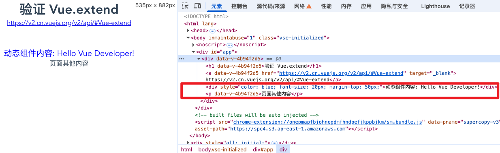

* [Vue2 官网 - 全局API - Vue-extend](https://v2.cn.vuejs.org/v2/api/#Vue-extend)


# Vue.extend 组件构造器

`Vue.extend` 是Vue.js 提供的一个构造器，用于创建一个“子类”组件构造器。它接收一个包含组件选项的对象作为参数，并返回一个扩展自Vue 的构造函数。通过这个构造函数，可以实例化并挂载组件。简单来说，`Vue.extend` 允许你定义一个可复用的组件，并提供组件的模板、数据、方法等。

详细解释:

**1.** **作用:**

`Vue.extend` 的主要作用是创建一个可复用的Vue 组件构造器。这个构造器可以用于创建多个组件实例，每个实例都有相同的结构和行为，但可以拥有不同的数据。

**2.** **参数:**

`Vue.extend` 接受一个对象作为参数，这个对象包含了组件的各种选项，例如：

- `template`:定义组件的HTML 模板。
- `data`:组件的数据，注意，在`Vue.extend`中，`data`必须是一个函数，返回一个对象，用于避免多个实例共享同一个数据对象。
- `methods`:组件的方法，用于响应用户的操作。
- `computed`:组件的计算属性，用于根据其他数据计算得出的属性。
- `props`:组件的属性，用于接收外部传入的数据。
- `watch`:用于监听组件数据变化。
- `components`:用于在当前组件中嵌套其他组件。
- `mixins`:用于混入其他组件的选项。
- `extends`:用于继承其他组件的选项。

**3.** **用法:**

- 使用 `Vue.extend` 创建一个组件构造器。
- 使用 `new` 关键字实例化这个构造器，创建一个组件实例。
- 将组件实例挂载到DOM 元素上，使其显示出来。

**4.** **示例:**

```javascript
   // 创建一个组件构造器
   var MyComponent = Vue.extend({
     template: '<p>{{ message }}</p>',
     data: function() {
       return {
         message: 'Hello from MyComponent!'
       }
     }
   });

   // 创建组件实例
   var vm = new MyComponent();

   // 挂载到 DOM 元素
   vm.$mount('#my-element');
```

**1.** 与 `Vue.component` 的区别:

- `Vue.component` 用于全局注册组件，注册后的组件可以直接在模板中使用标签名来引用，例如 `<my-component>`。
- `Vue.extend` 创建的组件需要通过 `new` 关键字实例化后才能使用，并且需要手动挂载到DOM 元素上。
- `Vue.component` 内部实际上也是使用 `Vue.extend` 来实现的。

**2.** **应用场景:**

- 创建可复用的组件，例如按钮、输入框等。
- 在非单文件组件开发中，用于定义组件的结构和行为。
- 在需要动态创建和挂载组件的场景中，例如弹出框、提示框等。

总结:

`Vue.extend` 是一个强大的工具，它允许开发者定义可复用的组件，并提供了丰富的配置选项来控制组件的行为。理解 `Vue.extend` 的用法，有助于更好地利用Vue.js 框架，构建复杂的应用程序。


## 问题：`template` 加载不出来

浏览器控制台遇到的报错：

```
You are using the runtime-only build of Vue where the template compiler is not available. Either pre-compile the templates into render functions, or use the compiler-included build.
```

**原因分析：**

你当前项目用的是 Vue 的 runtime-only 版本（即 `vue.runtime.esm.js`），它**不支持在运行时解析 template  字符串**，只能用 `render` 函数。

而你用 `Vue.extend({ template: '...' })` 这种写法，只有在 compiler-included 版本（如 `vue.esm.js`）下才支持。

## 解决方案

### 方案一：用 `render` 函数代替 `template`

将
```js
const MyComponent = Vue.extend({
  template: '<p>AAAAa</p>'
})
```
改为
```js
const MyComponent = Vue.extend({
  render(h) {
    return h('p', 'AAAAa')
  }
})
```
这样无论 runtime-only 还是完整版都能用。

### 方案二：切换为 compiler-included 版本（不推荐）

在 `vue.config.js` 里加：
```js
configureWebpack: {
  resolve: {
    alias: {
      'vue$': 'vue/dist/vue.esm.js'
    }
  }
}
```
然后重启项目。这样可以用 `template`，但**不推荐**，因为会增加包体积。


### 方案三：配置`runtimeCompiler: true`

在 `vue.config.js` 里加，作用与方案二相同

* 更多情况 [vue.config.js系列文章]()

```js
const { defineConfig } = require('@vue/cli-service')
module.exports = defineConfig({
  runtimeCompiler: true, // 启用模板编译器（会增加包体积）
  configureWebpack: {
    resolve: {
      alias: {
        vue$: 'vue/dist/vue.esm.js'
      }
    }
  },
})

```


## 推荐方案一

**直接用 render 函数即可，最兼容也最推荐。**

你的代码修正示例

```js
const MyComponent = Vue.extend({
  render(h) {
    return h('p', 'AAAAa')
  }
})
```

如需动态内容，可以这样：

```js
const MyComponent = Vue.extend({
  props: ['name'],
  render(h) {
    return h('p', `Hello, ${this.name}`)
  }
})
```


## 实战代码

```vue
<template>
  <div>
    <h1>验证 Vue.extend</h1>
    <a href="https://v2.cn.vuejs.org/v2/api/#Vue-extend" target="_blank">https://v2.cn.vuejs.org/v2/api/#Vue-extend</a>

    <!-- 挂载点（确保是原生元素） -->
    <div ref="componentMount" class="mount-point"></div>

    <p>页面其他内容</p>
  </div>
</template>

<script>
import Vue from 'vue'

export default {
  name: 'MyPage',

  data() {
    return {
      dynamicComponent: null
    }
  },

  mounted() {
    this.$nextTick(() => {
      // 1. 创建组件构造器（使用渲染函数）
      const MyComponent = Vue.extend({
        props: ['name'],
        render(h) {
          return h(
            'div',
            {
              style: { color: 'blue', fontSize: '20px', marginTop: '50px' }
            },
            `动态组件内容: Hello ${this.name}!`
          )
        }
      })

      // 2. 创建实例
      const instance = new MyComponent({
        propsData: { name: 'Vue Developer' }
      })

      // 3. 挂载到DOM
      if (this.$refs.componentMount) {
        instance.$mount(this.$refs.componentMount)
        this.dynamicComponent = instance
      } else {
        console.error('挂载点元素不存在')
      }
    })
  },

  beforeDestroy() {
    // 4. 清理工作
    if (this.dynamicComponent) {
      this.dynamicComponent.$destroy()
      this.dynamicComponent = null
    }
  }
}
</script>

<style scoped>
.mount-point {
  margin-top: 50px;
  border: 1px dashed #ccc;
  padding: 10px;
  margin: 10px 0;
}
</style>
```


## 截图




# Vue.extend 用来解决ts中this.$router找不到问题

`Vue.extend` 是 Vue 2.x 中用于创建组件的一种语法方式，尤其是在使用 TypeScript 时比较常见。

## 作用
`Vue.extend` 方法会基于传入的选项对象（通常是一个包含 data、methods、components 等的对象）创建一个“扩展的”Vue 构造器。这样做的好处是可以更好地支持类型推断和类型检查。

## 语法示例
```ts
import Vue from 'vue';

export default Vue.extend({
  name: 'MyComponent',
  data() {
    return {
      message: 'Hello'
    }
  },
  methods: {
    greet() {
      alert(this.message);
    }
  }
});
```

## 为什么不用直接导出对象？
在普通的 JavaScript 里，直接导出对象就可以了：
```js
export default {
  // ...
}
```
但在 TypeScript 下，直接导出对象会丢失类型推断，this 的类型也不准确。用 `Vue.extend` 可以让 this 拥有正确的类型提示。

## 总结
- `Vue.extend` 是 Vue 2.x 提供的一个 API，用于创建带类型的组件构造器。
- 在 Vue 3.x 及其 Composition API 里已经不推荐使用，直接用 `defineComponent` 或 `<script setup>` 更加简洁。

如果你还有其他关于 Vue 语法的问题，欢迎继续提问！