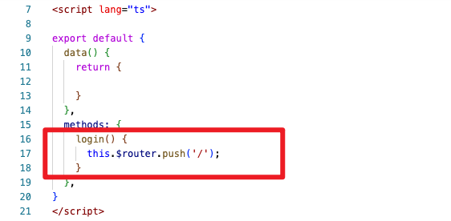
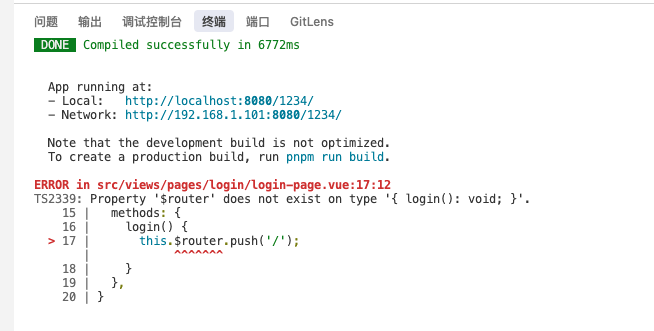
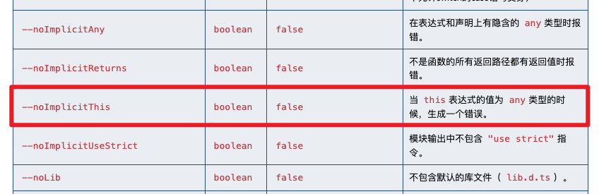
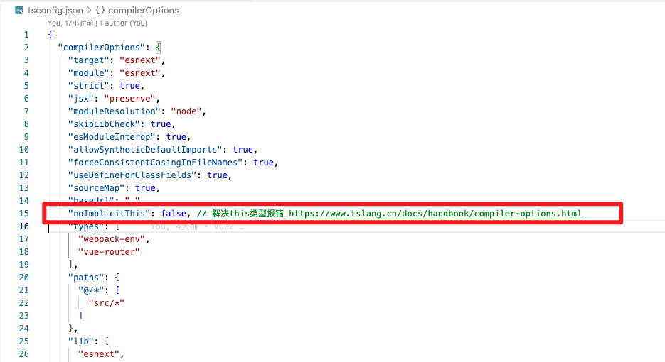
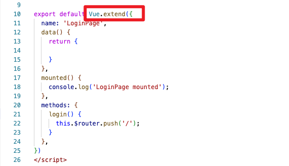

#Vue2 + TypeScript项目中，运行报错，找不到this.$router

* 问题：this 找不到 $router
* TS2339: Property '$router' does not exist on type '{ login(): void; }'.

```tsx
<script lang="ts">
export default {
  methods: {
    login() {
      this.$router.push('/');
    }
  },
}
</script>
```






## 原因：丢失类型推断

* 为什么不用直接导出对象？

在普通的 JavaScript 里，直接导出对象就可以了：

```js
export default {
 	// ...
}
```

但在 TypeScript 下，直接导出对象会丢失类型推断，this 的类型也不准确。用 Vue.extend 可以让 this 拥有正确的类型提示。


## 方案一：设置 `--noImplicitThis`

* 参考：https://blog.csdn.net/xypds2010/article/details/140726092

* TS官网：https://www.tslang.cn/docs/handbook/compiler-options.html

TypeScript官网配置：



typescript.json文件中新增：




## 方案二：`Vue.extend({})`

* 详情文档：Vue2中Vue.extend介绍.md

- Vue.extend 是 Vue 2.x 中用于创建组件的一种语法方式，尤其是在使用 TypeScript 时比较常见。
- Vue.extend 是 Vue 2.x 提供的一个 API，用于创建带类型的组件构造器。
- Vue.extend 方法会基于传入的选项对象（通常是一个包含 data、methods、components 等的对象）创建一个“扩展的”Vue 构造器。这样做的好处是可以更好地支持类型推断和类型检查。

```ts
<script lang="ts">
import Vue from 'vue'

export default Vue.extend({
  methods: {
    login() {
      this.$router.push('/');
    }
  },
})
</script>
```

