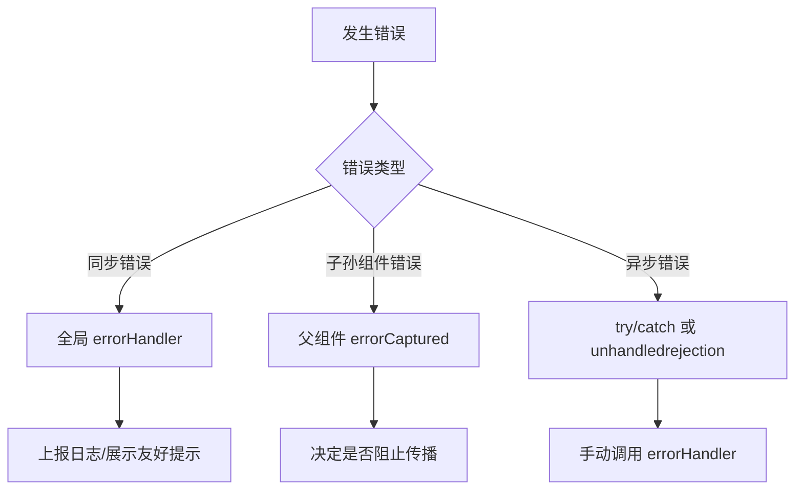

* [5种处理Vue异常的方法](https://blog.fundebug.com/2019/06/17/handling-errors-in-vuejs/)


- errorHandler
- warnHandler
- renderError
- errorCaptured
- window.onerror (不仅仅针对 Vue)


在 Vue.js 中，异常处理是保证应用健壮性的关键。以下是全面处理 Vue 异常的方法，涵盖全局捕获、组件级捕获和异步错误处理：

---

### **1. 全局错误处理（推荐）**
在 Vue 入口文件（如 `main.js`）中配置全局错误处理器：
```javascript
// main.js
Vue.config.errorHandler = (err, vm, info) => {
  // err: 错误对象
  // vm: 发生错误的 Vue 实例
  // info: Vue 特定的错误信息（如生命周期钩子名）
  
  console.error(`全局捕获: ${err}\n组件: ${vm.$options.name}\n位置: ${info}`);
  
  // 发送错误到监控系统（如 Sentry）
  // logErrorToService(err, vm, info);
};
```

---

### **2. 生命周期钩子 `errorCaptured`（组件级捕获）**
在父组件中捕获子孙组件的错误：
```javascript
export default {
  errorCaptured(err, vm, info) {
    // 返回 false 阻止错误继续向上传播
    console.error(`组件捕获: ${err}\n子组件: ${vm.$options.name}\n位置: ${info}`);
    return true; // 继续向上冒泡
  }
}
```

---

### **3. 异步错误处理**
Vue 的全局错误处理器 **无法捕获** 异步回调中的错误（如 `setTimeout`、`Promise`），需额外处理：

#### **Promise 错误**
```javascript
async fetchData() {
  try {
    const res = await axios.get('/api/data');
  } catch (err) {
    console.error('异步请求失败:', err);
    // 手动传递给全局处理器
    if (Vue.config.errorHandler) {
      Vue.config.errorHandler(err, this, 'fetchData');
    }
  }
}
```

#### **全局捕获未处理的 Promise 异常**
```javascript
// 浏览器环境
window.addEventListener('unhandledrejection', event => {
  console.error('未处理的 Promise 异常:', event.reason);
  event.preventDefault(); // 阻止默认错误打印
});
```

---

### **4. 渲染函数/模板错误处理**
使用 `v-if` 避免渲染错误：
```vue
<template>
  <div>
    <div v-if="user.profile">{{ user.profile.name }}</div>
    <div v-else>数据加载中...</div>
  </div>
</template>
```

---

### **5. Vue 3 Composition API 处理**
使用 `onErrorCaptured` 钩子：
```javascript
import { onErrorCaptured } from 'vue';

export default {
  setup() {
    onErrorCaptured((err, vm, info) => {
      console.error('Composition API 捕获:', err);
      return true; // 继续传播
    });
  }
}
```

---

### **6. 错误边界组件（Vue 3 实验性功能）**
使用 `<ErrorBoundary>` 组件包裹可能出错的区域：
```vue
<ErrorBoundary>
  <UnstableComponent/>
</ErrorBoundary>

<!-- 自定义错误边界组件 -->
<template>
  <slot v-if="!hasError"/>
  <div v-else class="error-fallback">
    组件崩溃，已捕获错误
  </div>
</template>

<script>
export default {
  data: () => ({ hasError: false }),
  errorCaptured() {
    this.hasError = true;
    return false; // 阻止错误继续传播
  }
};
</script>
```

---

### **7. 关键实践建议**
1. **生产环境监控**  
   集成错误监控服务（如 Sentry、Bugsnag）：
   ```javascript
   import * as Sentry from '@sentry/vue';
   
   Sentry.init({
     Vue,
     dsn: 'YOUR_DSN',
     trackComponents: true // 追踪组件信息
   });
   ```

2. **区分开发/生产环境**  
   开发环境：在控制台显示详细错误  
   生产环境：隐藏细节，展示友好提示

3. **避免阻塞性错误**  
   使用错误边界隔离局部 UI 崩溃

4. **日志记录**  
   记录错误上下文（用户信息、路由状态等）

---

### **错误处理流程图**


通过组合使用这些方法，可构建健壮的 Vue 错误处理体系，显著提升应用稳定性。