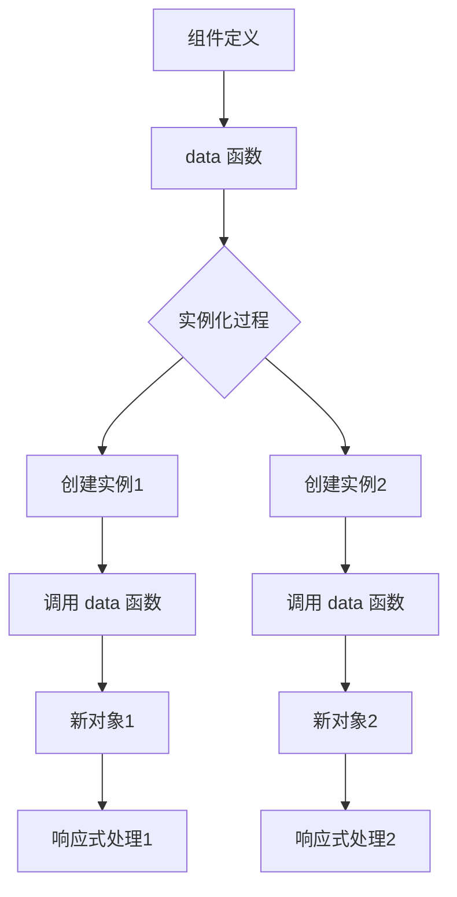

# Vue 2 中组件 data 为什么必须是函数：深度解析

在 Vue 2 中，组件的 `data` 选项必须是一个函数而不是一个对象，这是 Vue 设计中的一个重要特性。理解这一设计决策需要深入 Vue 的响应式系统和组件实例化机制。

## 一、核心问题：数据共享风险

### 1. 对象形式的潜在问题
假设 `data` 允许直接使用对象：

```javascript
// 错误示例：直接使用对象（实际不允许）
export default {
  data: {
    count: 0
  }
}
```

当多个组件实例使用同一个 `data` 对象时：

```vue
<template>
  <div>
    <Counter/>
    <Counter/>
    <Counter/>
  </div>
</template>
```

**问题表现**：
- 所有组件实例共享同一个 `count` 属性
- 点击一个按钮会影响所有计数器
- 状态无法独立管理

### 2. 根本原因：引用类型特性
JavaScript 对象是引用类型：
```javascript
const sharedData = { count: 0 }

// 组件A
const compA = { data: sharedData }

// 组件B
const compB = { data: sharedData }

compA.data.count++ // compB.data.count 也会变成1
```

## 二、函数形式如何解决

### 1. 正确实现
```javascript
export default {
  data() {
    return {
      count: 0
    }
  }
}
```

### 2. 解决机制
每次创建组件实例时：
```javascript
// Vue内部处理
function createComponentInstance() {
  const options = componentOptions
  
  // 关键步骤：调用data函数获取新对象
  const data = typeof options.data === 'function'
    ? options.data.call(this)
    : {}
  
  // 转换为响应式数据
  observe(data)
}
```

### 3. 内存模型图解
```
实例1: { count: 0 } ← 独立内存空间
实例2: { count: 0 } ← 独立内存空间
实例3: { count: 0 } ← 独立内存空间
```

## 三、Vue 源码解析

在 `vue/src/core/instance/state.js` 中：

```javascript
function initData(vm: Component) {
  let data = vm.$options.data
  
  // 重要：检查data类型
  data = vm._data = typeof data === 'function'
    ? getData(data, vm) // 执行函数获取对象
    : data || {}
  
  // 开发环境警告
  if (process.env.NODE_ENV !== 'production') {
    if (!isPlainObject(data)) {
      warn('data functions should return an object', vm)
    }
  }
  
  // ...后续响应式处理
}
```

## 四、特殊场景：根实例差异

### 1. 根实例允许对象形式
```javascript
new Vue({
  el: '#app',
  data: { // 允许直接使用对象
    message: 'Hello Vue!'
  }
})
```

### 2. 为什么允许？
- 根实例只会创建一次
- 不存在多个实例共享问题
- 简化初始化配置

## 五、常见错误模式

### 1. 返回共享对象
```javascript
const sharedData = { count: 0 }

export default {
  data() {
    return sharedData // 错误！仍然共享
  }
}
```

### 2. 箭头函数问题
```javascript
export default {
  data: () => ({ // 箭头函数
    count: 0
  })
}
```

**潜在风险**：
- `this` 指向错误（指向父作用域）
- 无法访问组件实例

### 3. 工厂函数不纯
```javascript
let id = 0

export default {
  data() {
    return {
      id: id++ // 副作用！导致不可预测行为
    }
  }
}
```

## 六、最佳实践

### 1. 标准写法
```javascript
export default {
  data() {
    return {
      // 初始数据
      counter: 0,
      items: [],
      user: null
    }
  }
}
```

### 2. 复杂初始化
```javascript
export default {
  data() {
    return {
      // 基于props的初始化
      localValue: this.value,
      
      // 复杂数据结构
      nested: {
        config: {
          enabled: true
        }
      },
      
      // 避免共享引用
      defaultOptions: JSON.parse(JSON.stringify(DEFAULT_OPTIONS))
    }
  }
}
```

### 3. 类组件模式
```javascript
class ComponentData {
  constructor() {
    this.count = 0
    this.todos = []
  }
}

export default {
  data() {
    return new ComponentData()
  }
}
```

## 七、与 Vue 3 的对比

| 特性             | Vue 2                 | Vue 3                             |
| ---------------- | --------------------- | --------------------------------- |
| **data 类型**    | 必须为函数            | 可函数或对象                      |
| **根实例**       | 允许对象              | 允许对象                          |
| **组合式 API**   | 无                    | 使用 `setup()` + `ref`/`reactive` |
| **响应式原理**   | Object.defineProperty | Proxy                             |
| **数据共享风险** | 函数解决              | 自动处理                          |

**Vue 3 的改进**：
```javascript
// Vue 3 组合式API - 无data选项
import { ref } from 'vue'

export default {
  setup() {
    const count = ref(0) // 自动处理独立性
    return { count }
  }
}
```

## 八、设计哲学思考

### 1. 组件本质：工厂模式
Vue 组件设计采用工厂模式：
- 组件定义是"蓝图"
- 组件实例是具体产品
- `data` 函数是实例化钩子

### 2. 函数式编程影响
- 纯函数：相同输入 ⇒ 相同输出
- 避免副作用
- 隔离状态

### 3. 与 React 对比
React 类组件：
```javascript
class Counter extends React.Component {
  state = { count: 0 } // 每个实例独立
}
```
- 自动处理实例隔离
- Vue 通过函数显式控制

## 九、常见问题解答

### Q：为什么不能是对象但可以是函数？
**A**：函数延迟执行，在实例化时生成新对象

### Q：如何确保数据独立性？
**A**：
1. 总是返回新对象
2. 避免外部引用
3. 使用深拷贝处理复杂对象

### Q：性能影响？
**A**：
- 轻微开销（每次实例化创建新对象）
- 远小于状态共享带来的问题
- 可通过对象池优化（但不推荐）

## 十、总结：核心要点

1. **隔离性需求**：防止多个组件实例共享状态
2. **JavaScript 特性**：对象是引用类型，函数提供作用域隔离
3. **工厂模式**：每个实例通过函数调用获得独立数据副本
4. **响应式基础**：Vue 需要在初始化时转换数据
5. **框架一致性**：统一处理方式简化设计



**最佳实践口诀**：
> "组件数据需隔离，函数返回新对象  
> 根实例可特殊，共享状态要不得  
> 复杂数据深拷贝，避免引用埋隐患  
> Vue 3 虽改进，原理理解仍关键"

理解这一设计决策，有助于开发者编写更健壮的 Vue 组件，避免状态管理中的常见陷阱。