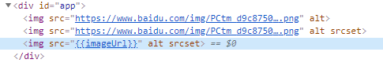

# 插值操作 

```handlebars
<HTML元素>{{变量或js表达式}}</HTML元素>
```

简单说, 就是将data中的文本数据,插入到html中.

- 在{{}}内部可以写:变量、算术计算、 三目、 访问数组元素、 创建对象、调用函数等，总之只要有返回的合法的js变量和表达式都行。但是不可以写程序结构(分支和循环)以及没有返回值的js表达式。
- 给html标签的内容赋值, 不可以给标签中的属性赋值

```vue
<body>
  <div id="app">
    <h3>用户名:{{username}}</h3>
    <h3>性别:{{gender==1?"男":"女"}}</h3>
    <h3>小计:¥{{(price*count).toFixed(2)}}</h3>
    <h3>下单时间: {{new Date(orderTime).toLocaleString()}}</h3>
    <h3>今天星期{{week[new Date().getDay()]}}</h3>
  </div>
  <script>
    new Vue({
      el:"#app",
      data:{
        uname:"dingding",
        gender:1,
        price:12.5,
        count:5,
        orderTime:1600228004389,
        week:["日","一","二","三","四","五","六"]
      }
    })
  </script>
</body>
```


## 动态绑定不支持插值语法

在动态绑定属性时，不能用Matach语法，Vue不会对属性值进行解析，显示出来的属性值只是一个字符串，Matach只能用在属性的content区域

```html
<div id="app">
    
    <!-- v-bind 语法糖 : -->
    
    
</div>
```




# 模板字符串

使用${}实现变量和字符串的拼接

```js
alert(`http://localhost:3000/cart/${obj.id}`)
alert(`${this.a}世界`)

// vue文件中，绑定属性使用字符串模板，这样写
:name="`name-client-${count}`"
```


