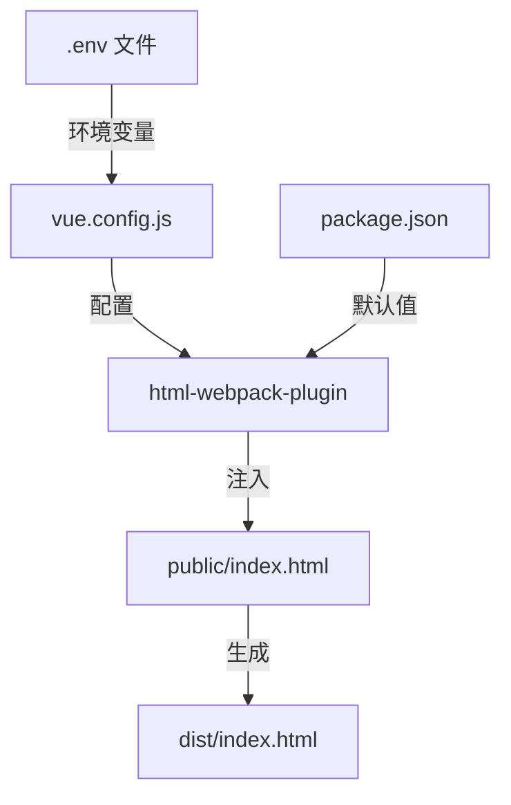

# Vue 2 中 htmlWebpackPlugin.options.title 详解

在 Vue 2 项目中，`htmlWebpackPlugin.options.title` 是 **Webpack 构建过程中用于动态设置 HTML 页面标题的配置值**。这个值通常来源于项目配置，用于在构建时注入到生成的 HTML 文件中。

## 核心概念

### 1. 作用机制
- **html-webpack-plugin**：Webpack 插件，用于生成 HTML 文件
- **options.title**：插件配置项，指定页面标题
- **构建时注入**：在 Webpack 构建过程中，将标题值插入 HTML 模板

### 2. 典型使用场景
```html
<!-- public/index.html 模板文件 -->
<head>
  <title><%= htmlWebpackPlugin.options.title %></title>
</head>
```

## 默认值与配置来源

### 1. 默认值
- Vue CLI 创建的项目默认使用 `package.json` 中的 `name` 字段
- 例如：`"name": "my-app"` → 标题为 `"my-app"`

### 2. 配置位置

#### 在 `vue.config.js` 中配置：
```javascript
// vue.config.js
module.exports = {
  chainWebpack: config => {
    config.plugin('html').tap(args => {
      args[0].title = '我的自定义标题' // 设置标题
      args[0].meta = { // 同时设置meta标签示例
        description: 'Vue应用描述'
      }
      return args
    })
  }
}
```

#### 在 `package.json` 中配置：
```json
{
  "name": "my-vue-app",
  "vue": {
    "htmlWebpackPlugin": {
      "title": "应用标题"
    }
  }
}
```

## 多环境配置示例

### 1. 基于环境变量设置标题
```javascript
// vue.config.js
const appTitle = process.env.VUE_APP_TITLE || '默认标题'

module.exports = {
  chainWebpack: config => {
    config.plugin('html').tap(args => {
      args[0].title = appTitle
      return args
    })
  }
}
```

### 2. 使用 .env 文件配置
```ini
# .env.development
VUE_APP_TITLE=开发环境标题

# .env.production
VUE_APP_TITLE=生产环境标题
```

## 高级用法

### 1. 多页面应用不同标题
```javascript
// vue.config.js
module.exports = {
  pages: {
    index: {
      entry: 'src/main.js',
      title: '首页'
    },
    admin: {
      entry: 'src/admin.js',
      title: '管理后台'
    }
  },
  
  chainWebpack: config => {
    // 为每个页面单独设置标题
    Object.keys(module.exports.pages).forEach(page => {
      config.plugin(`html-${page}`).tap(args => {
        args[0].title = module.exports.pages[page].title
        return args
      })
    })
  }
}
```

### 2. 动态组合标题
```javascript
// vue.config.js
module.exports = {
  chainWebpack: config => {
    config.plugin('html').tap(args => {
      const version = require('./package.json').version
      args[0].title = `我的应用 v${version}`
      return args
    })
  }
}
```

## 实际应用场景

### 1. SEO 优化
```javascript
// 设置包含关键词的标题
args[0].title = 'Vue电商平台 - 优质商品在线购物'
```

### 2. 多语言支持
```javascript
// 根据构建参数设置不同语言标题
const titles = {
  en: 'My Vue App',
  zh: '我的Vue应用'
}
args[0].title = titles[process.env.VUE_APP_LANG]
```

### 3. 环境标识
```javascript
// 开发环境添加标识
const isProd = process.env.NODE_ENV === 'production'
args[0].title = `${isProd ? '' : '[DEV] '}应用标题`
```

## 常见问题解决

### 1. 标题不生效？
**检查步骤**：
1. 确认 `public/index.html` 中有 `<%= htmlWebpackPlugin.options.title %>`
2. 确保 `vue.config.js` 配置正确
3. 重启开发服务器 `npm run serve`
4. 检查是否有多个 html-webpack-plugin 配置冲突

### 2. 如何访问路由标题？
**结合 Vue Router**：
```javascript
// router.js
const routes = [
  {
    path: '/',
    name: 'Home',
    component: Home,
    meta: { title: '首页' }
  }
]

// 导航守卫中设置标题
router.beforeEach((to, from, next) => {
  document.title = to.meta.title || '默认标题'
  next()
})
```

### 3. 与页面组件内标题冲突？
**解决方案**：
```javascript
// 在组件内
export default {
  mounted() {
    document.title = '页面特定标题'
  }
}
```

## 最佳实践

### 1. 配置优先级
1. 页面级配置 (vue.config.js pages)
2. 环境变量 (VUE_APP_TITLE)
3. package.json name
4. 默认值 ("Vue App")

### 2. 安全注意事项
避免直接使用用户输入作为标题：
```javascript
// 错误示例（XSS风险）
args[0].title = userInputTitle

// 正确做法
const sanitize = str => str.replace(/<[^>]*>/g, '')
args[0].title = sanitize(userInputTitle)
```

### 3. 完整配置示例
```javascript
// vue.config.js
const packageInfo = require('./package.json')

module.exports = {
  chainWebpack: config => {
    config.plugin('html').tap(args => {
      const env = process.env.NODE_ENV
      const envPrefix = env === 'production' ? '' : `[${env.toUpperCase()}] `
      
      args[0] = {
        ...args[0],
        title: `${envPrefix}${packageInfo.name} v${packageInfo.version}`,
        meta: {
          description: packageInfo.description,
          keywords: 'vue, webpack, spa'
        },
        favicon: './public/favicon.ico'
      }
      return args
    })
  }
}
```

## 与传统方案对比

| 方案                  | 优点                | 缺点           |
| --------------------- | ------------------- | -------------- |
| **htmlWebpackPlugin** | 构建时确定，SEO友好 | 无法动态改变   |
| **document.title**    | 运行时动态更新      | 初始加载有延迟 |
| **Vue Router 守卫**   | 基于路由动态设置    | 需要额外代码   |

**推荐组合方案**：
1. 使用 `htmlWebpackPlugin.options.title` 设置初始标题（SEO优化）
2. 在路由守卫中更新标题（动态页面）
3. 关键页面添加组件内标题设置（特殊需求）

## 总结

在 Vue 2 项目中：
1. `htmlWebpackPlugin.options.title` 是 Webpack 构建时注入的 HTML 标题
2. 默认值为 `package.json` 中的 `name` 字段
3. 可通过 `vue.config.js` 自定义配置
4. 支持基于环境变量动态设置
5. 是 SEO 优化的基础配置项
6. 可与运行时标题更新方案结合使用

典型配置路径：


合理配置标题能提升用户体验和SEO效果，是Vue项目基础但重要的配置项。