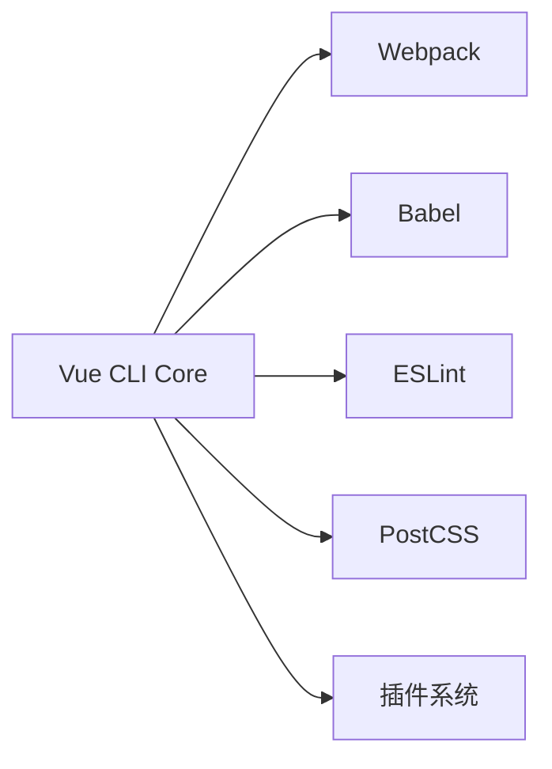

Vue CLI 是 Vue.js 官方提供的**标准化开发工具链**，专为构建现代 Vue.js 应用程序而设计。以下是对它的全面解析：

---

### **核心定位**
- **脚手架工具**：快速初始化 Vue 项目结构（组件、路由、状态管理等）
- **构建系统**：集成 Webpack、Babel 等现代化工具
- **开发助手**：提供开箱即用的开发服务器、热更新等功能
- **扩展平台**：支持插件系统（如 TypeScript、PWA 等）

> 类比：Vue CLI ≈ React 的 Create React App + Angular CLI

---

### **核心功能**
| **功能模块**   | **作用**                        | **实际命令示例**                             |
| -------------- | ------------------------------- | -------------------------------------------- |
| **项目初始化** | 创建预配置项目                  | `vue create my-project`                      |
| **交互式配置** | 可视化选择 ESLint/TS/PWA 等特性 |  |
| **开发服务器** | 启动热更新调试环境              | `npm run serve`                              |
| **生产构建**   | 代码压缩打包                    | `npm run build`                              |
| **GUI 可视化** | 图形化管理项目                  | `vue ui`                                     |

---

### **核心架构**

- **分层设计**：
  1. `@vue/cli` (全局命令)
  2. `@vue/cli-service` (项目本地构建服务)
  3. 插件（如 `@vue/cli-plugin-router`）

---

### **典型项目结构（通过 CLI 创建）**
```
my-project/
├── public/                # 静态资源
├── src/
│   ├── assets/            # 模块资源
│   ├── components/        # 通用组件
│   ├── views/             # 路由页面
│   ├── router/            # 路由配置
│   ├── store/             # Vuex 状态管理
│   ├── App.vue            # 根组件
│   └── main.js            # 入口文件
├── .env                   # 环境变量
├── vue.config.js          # 配置覆盖文件
└── package.json           # 项目依赖
```

---

### **核心优势**
1. **零配置启动**  
   ```bash
   vue create my-app && cd my-app && npm run serve
   ```
   立即获得包含 Babel/ESLint/HMR 的全功能开发环境

2. **渐进式配置**  
   在 `vue.config.js` 中可扩展或覆盖配置：
   ```javascript
   module.exports = {
     chainWebpack: config => {
       // 添加 Webpack 插件
       config.plugin('html').tap(args => {
         args[0].title = '我的应用'
         return args
       })
     }
   }
   ```

3. **插件生态**  
   官方插件：
   - `@vue/cli-plugin-typescript`
   - `@vue/cli-plugin-pwa`
   - `@vue/cli-plugin-unit-jest`

4. **现代模式构建**  
   ```bash
   vue-cli-service build --modern
   ```
   生成同时支持现代/老旧浏览器的双版本包

---

### **演进历程**
1. **Vue CLI 2.x**：基于 Webpack 模板（`webpack-simple`, `webpack`）
2. **Vue CLI 3.x+** (2018起)：插件化架构，配置可插拔
3. **Vite 时代**：Vue 官方新推荐工具，但 CLI 仍在维护

---

### **何时使用**
| **场景**              | **推荐工具**        |
| --------------------- | ------------------- |
| 企业级复杂项目        | ✅ Vue CLI           |
| 需要深度 Webpack 定制 | ✅ Vue CLI           |
| 极速启动简单项目      | ❌ 推荐 Vite         |
| 微前端子应用          | ✅ Vue CLI + qiankun |

---

### **创建项目演示**
```bash
# 全局安装
npm install -g @vue/cli

# 创建项目（选择手动配置）
vue create my-project

? Please pick a preset: 
❯ Manually select features 
? Check the features needed: 
◉ Babel
◯ TypeScript
◉ Router
◯ Vuex
◉ CSS Pre-processors
◉ Linter
```

> 💡 提示：现在 Vue 官方推荐使用 [Vite](https://vitejs.dev/) 创建新项目（`npm create vue@latest`），但 Vue CLI 仍是维护状态项目的主流选择