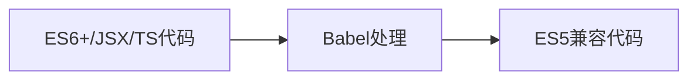

# Babel 详解：现代 JavaScript 的编译器

Babel 是 JavaScript 生态系统中最核心的工具之一，它解决了 JavaScript 语言版本差异带来的开发与运行环境兼容性问题。以下是关于 Babel 的全面解析：

## 一、Babel 的本质

Babel 是一个 **JavaScript 编译器**（更准确说是转译器，Transpiler），主要功能包括：

1. **语法转换**：将新版 JS 代码（如 ES6+）转换为旧版（如 ES5）以实现浏览器兼容
2. **特性补充**：通过 Polyfill 方式在旧环境实现新 API
3. **代码转换**：JSX 转为 JS、TypeScript 转为 JS 等
4. **代码优化**：删除调试代码、简化语法等



## 二、核心工作原理

### 1. 编译流程
```mermaid
graph TD
    A[源代码] --> B[解析(Parser)]
    B --> C[抽象语法树AST]
    C --> D[转换(Transformer)]
    D --> E[新AST]
    E --> F[生成(Generator)]
    F --> G[目标代码]
```

### 2. 关键技术
- **Parser**（@babel/parser）：将代码转为 AST
- **Traversal**（@babel/traverse）：遍历并修改 AST
- **Generator**（@babel/generator）：将 AST 转回代码

## 三、核心功能模块

### 1. 预设(Presets)
| 预设名                   | 功能描述         |
| ------------------------ | ---------------- |
| @babel/preset-env        | 智能转换ES6+语法 |
| @babel/preset-react      | 处理JSX语法      |
| @babel/preset-typescript | 转换TypeScript   |

### 2. 插件(Plugins)
| 类型         | 示例插件                                 | 功能             |
| ------------ | ---------------------------------------- | ---------------- |
| 语法插件     | @babel/plugin-proposal-optional-chaining | 支持 `?.` 操作符 |
| 转换插件     | @babel/transform-arrow-functions         | 转换箭头函数     |
| 代码优化插件 | babel-plugin-lodash                      | 按需引入lodash   |

### 3. Polyfill
```javascript
// 旧版用法（Babel 7.4之前）
import "@babel/polyfill";

// 新版用法
import "core-js/stable";
import "regenerator-runtime/runtime";
```

## 四、典型配置示例

### 1. 基础配置 (babel.config.js)
```javascript
module.exports = {
  presets: [
    [
      "@babel/preset-env",
      {
        targets: "> 0.25%, not dead",
        useBuiltIns: "usage",
        corejs: 3
      }
    ],
    "@babel/preset-react"
  ],
  plugins: [
    ["@babel/plugin-proposal-decorators", { legacy: true }],
    "@babel/plugin-transform-runtime"
  ]
};
```

### 2. 配合Webpack
```javascript
// webpack.config.js
module: {
  rules: [
    {
      test: /\.jsx?$/,
      exclude: /node_modules/,
      use: {
        loader: "babel-loader",
        options: {
          cacheDirectory: true
        }
      }
    }
  ]
}
```

## 五、Babel 生态工具

| 工具名               | 用途                            |
| -------------------- | ------------------------------- |
| @babel/cli           | 命令行接口工具                  |
| @babel/node          | 直接运行ES6+ Node代码           |
| @babel/eslint-parser | 允许ESLint检查Babel转换前的代码 |
| babel-plugin-import  | 实现按需导入（常用于组件库）    |

## 六、版本演进重点

1. **Babel 6**（2015）
   - 模块化架构拆分
   - 引入preset概念

2. **Babel 7**（2018）
   - 命名空间统一为@babel
   - 弃用babel-polyfill，推荐core-js
   - 支持TypeScript

3. **Babel 8**（规划中）
   - 更小的运行时
   - 改进的TypeScript支持

## 七、现代前端工作流中的角色


## 八、与其他工具对比

| 工具       | 定位                 | 与Babel关系           |
| ---------- | -------------------- | --------------------- |
| TypeScript | 类型检查+转译        | 可替代部分Babel功能   |
| SWC        | Rust编写的快速编译器 | 潜在替代方案          |
| ESBuild    | 极速打包工具         | 互补（Babel处理语法） |

## 九、最佳实践建议

1. **开发环境**：
   ```bash
   npm install --save-dev @babel/core @babel/cli @babel/preset-env
   ```

2. **生产环境**：
   ```bash
   npm install core-js regenerator-runtime
   ```

3. **性能优化**：
   - 使用 `cacheDirectory: true` 缓存转换结果
   - 精确指定目标环境减少不必要的转换
   - 按需引入polyfill（usage模式）

Babel 已成为现代前端开发不可或缺的工具链环节，理解其原理和配置方式对于构建兼容性强、可维护性高的项目至关重要。
