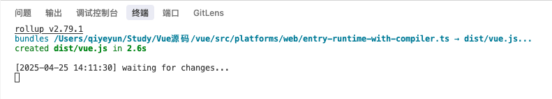

* [⭐️Vue2源码☞ 1 ☞ 搭建源码学习环境](https://juejin.cn/post/7099111383727341605)
* [Vue 源码解读（1）—— 前言](https://juejin.cn/post/6949370458793836580#heading-6)
* [vue源码分析系列之入debug环境搭建](https://segmentfault.com/a/1190000018038749)


## 下载 Vue 源码

- git 命令

```shell
$ git clone https://github.com/vuejs/vue.git
```

- 去 [github](https://link.juejin.cn/?target=https%3A%2F%2Fgithub.com%2Fvuejs%2Fvue%2Ftree%2Fdev) 手动下载然后解压
    - https://github.com/vuejs/


## 安装

```sh
$ pnpm i
```

* package-lock.json —— npm
* yarn-lock.json —— yarn
* pnpm-lock.yaml ——pnpm


## 目录结构

```js
dist —— 发布目录
example —— 范例，测试代码（探索源码使用）
flow —— flow类型声明
packages —— 核心代码外的独立库
scripts —— 构建脚本
src —— 源码
    compiler —— 编译器相关
    core —— 核心代码
        components —— 通用组件（如keep-alive）
        global-api —— 全局API
        instance —— 构造函数等
        observer —— 响应式相关
        util —— 工具函数
        vdom —— 虚拟dom相关
    platforms —— 平台相关
test —— 测试代码
types —— ts类型声明
```


## source map

在 `package.json -> scripts` 中的 新增一条dev 命令中添加 `--sourcemap`，这样就可以在浏览器中调试源码时查看当前代码在源码中的位置。

```json
{
  "scripts": {
    // 新增命令 --sourcemap
    "dev:sourcemap": "rollup -w -c scripts/config.js --sourcemap --environment TARGET:full-dev",
    "dev": "rollup -w -c scripts/config.js --environment TARGET:full-dev",
  }
}

备注：
    添加 --sourcemap //用于查看运行时的源代码
    其中，-c scripts/config.js 指明配置文件
    TARGET:web-full-dev 指明输出文件配置项
```


```js
// 通过dev脚本，可知使用的是scripts/config.js中的配置
// 通过full-dev全局搜索，也可以定位到dev脚本使用的配置

  // Runtime+compiler development build (Browser)
  'full-dev': {
    entry: resolve('web/entry-runtime-with-compiler.ts'),
    dest: resolve('dist/vue.js'),
    format: 'umd',
    env: 'development',
    alias: { he: './entity-decoder' },
    banner
  },

// 通过entry属性，可以找到打包的入口文件：entry-runtime-with-compiler.js
// 这个文件导出了最终封装好的Vue
```


## scripts命令解释

让我解释一下这些开发命令：

1. `dev` 命令：
```bash
rollup -w -c scripts/config.js --environment TARGET:full-dev
```
- `rollup`: 使用 Rollup 打包工具
- `-w`: watch 模式，文件变化时自动重新构建
- `-c scripts/config.js`: 使用 `scripts/config.js` 作为配置文件
- `--environment TARGET:full-dev`: 设置环境变量 TARGET 为 full-dev，表示构建完整开发版本

2. `dev:cjs` 命令：
```bash
rollup -w -c scripts/config.js --environment TARGET:runtime-cjs-dev
```
- 与上面类似，但构建的是 CommonJS 模块格式的开发版本
- `runtime-cjs-dev` 表示只包含运行时（runtime）的 CommonJS 开发版本

这些命令的主要区别在于构建的目标（TARGET）不同：
- `full-dev`: 完整版本，包含编译器和运行时
- `runtime-cjs-dev`: 只包含运行时的 CommonJS 版本

这些命令主要用于开发环境，因为：
1. 使用了 watch 模式（-w），可以实时监听文件变化
2. 构建的是开发版本（dev），包含调试信息
3. 可以快速测试不同模块格式的构建结果

如果你想开始开发，建议使用 `pnpm run dev` 命令，这会启动完整版本的开发构建。


## 运行 dev:sourcemap

```sh
# 执行dev后，会生成编译后的vue.js
$ pnpm dev

# 执行dev:sourcemap后，生成vue.js 和 vue.map.js
$ pnpm dev:sourcemap
```




## 术语

* rumtime：仅包含运行时，不包含编译器 
* common： cjs规范，用于webpack1 
* esm： ES模块，用于webpack2+ 
* umd： universal module definition，兼容cjs和amd，用于浏览器


## 创建html

```html
<!DOCTYPE html>
<html lang="en">

<head>
  <meta charset="UTF-8">
  <meta name="viewport" content="width=device-width, initial-scale=1.0">
  <title>Document</title>
  <script src="../dist/vue.js"></script>
</head>

<body>

  <div id="demo">
    {{ myTitle }}
    <div style="width: 50px; height: 50px; background-color: aqua;" @click="sayHello">点击</div>
  </div>

  <script>
    const app = new Vue({
      el: '#demo',
      data() {
        return {
          myTitle: '明天',
        }
      },
      methods: {
        sayHello() {
          alert('弹框！！！')
        }
      },
    })
  </script>
</body>

</html>
```


