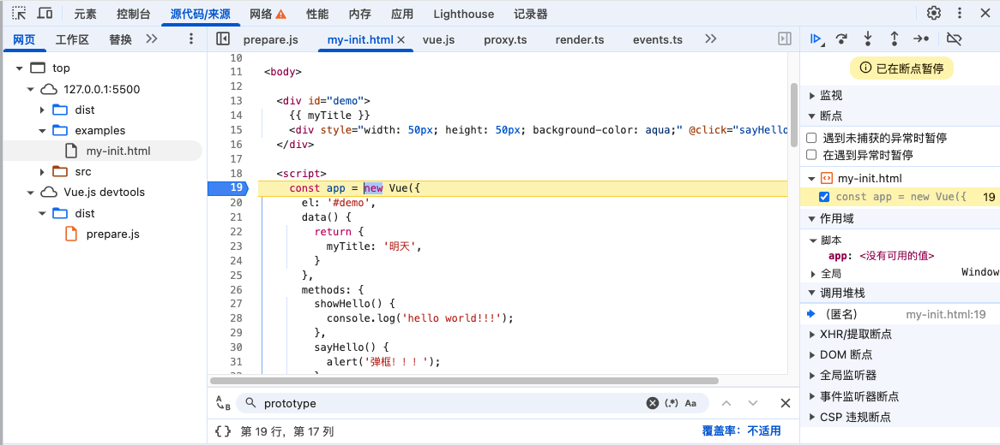
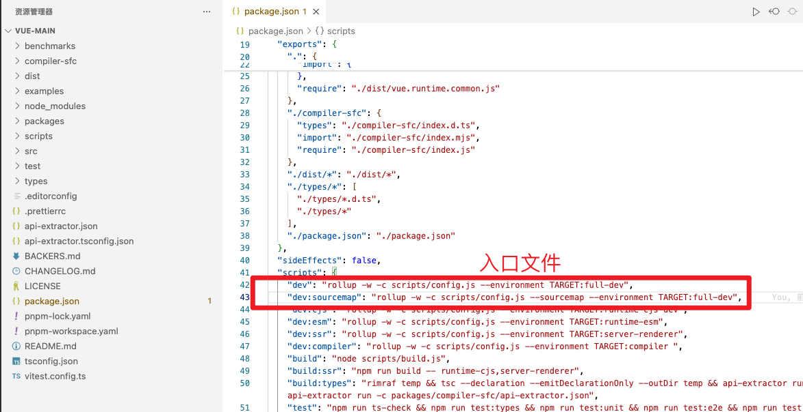
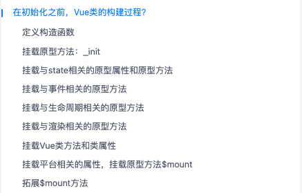
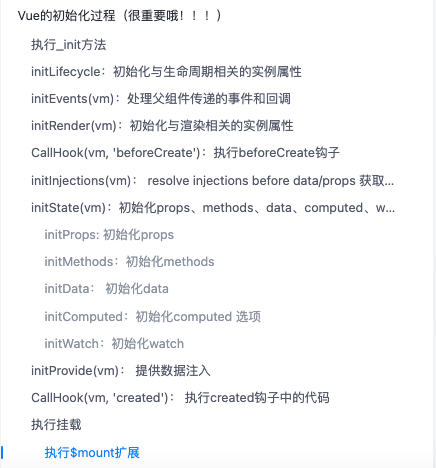

* [Vue 源码解读（2）—— Vue 初始化过程](https://juejin.cn/post/6950084496515399717)

* [Vue2源码解析☞ 2 ☞ 初始化](https://juejin.cn/post/7100124377567461383)

# 问：`new Vue(options)` 发生了什么？

## 1. 找入口

想知道 `new Vue(options)` 都做了什么，就得先找到 Vue 的构造函数是在哪声明的，有两个办法：

### a. 通过编写示例代码，然后打断点的方式

一步到位，**简单**

### b. 从 rollup 配置文件中找到编译的入口

从 rollup 配置文件中找到编译的入口，然后一步步找到 Vue 构造函数，这种方式 **费劲**

> `scripts/config.js` -> 搜索`'full-dev'` -> `'web/entry-runtime-with-compiler.ts'`

## 2. 初始化大致过程

