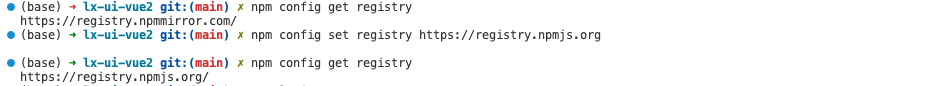
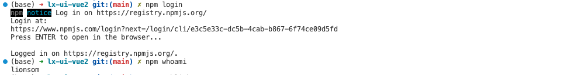
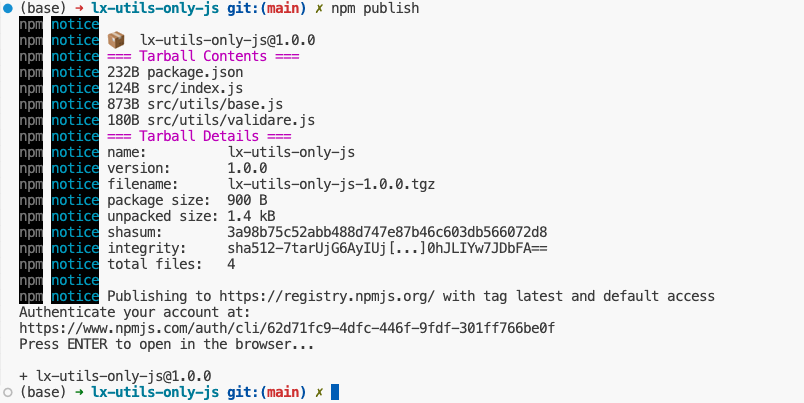
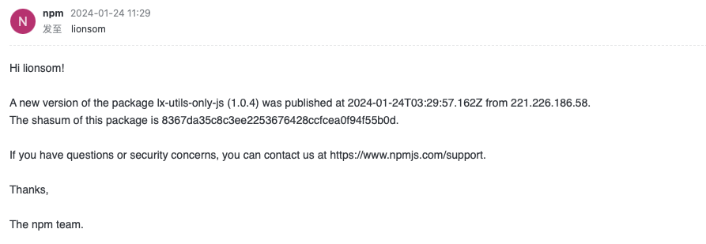

[Vue3入门指南与实战案例 - 依赖包和插件](https://vue3.chengpeiquan.com/guide.html#%E4%BE%9D%E8%B5%96%E5%8C%85%E5%92%8C%E6%8F%92%E4%BB%B6)

[Vue3入门指南与实战案例 - 如何使用包](https://vue3.chengpeiquan.com/guide.html#如何使用包)


# 一、npm是什么？

* [npm官方文档](https://docs.npmjs.com/)

* [npm库网站](https://www.npmjs.com/)

> javascript package manager
>
> Javascript包管理器

NPM由三个不同的组成部分组成：

* 网站

* 命令行接口（CLI）

* 注册表

使用[网站](https://www.npmjs.com/)来发现软件包，设置配置文件并管理NPM体验的其他方面。例如，您可以设置组织来管理对公共或私人软件包的访问。

[CLI](https://docs.npmjs.com/cli/v9/commands/npm) 从终端运行，这是大多数开发人员与NPM互动的方式。

[注册表](https://docs.npmjs.com/cli/v9/using-npm/registry) 是一个大型公共数据库，及其围绕它的元信息。


# 二、[npm的安装](https://docs.npmjs.com/downloading-and-installing-node-js-and-npm)

我们强烈建议使用像 **nvm** 这样的Node版本管理器来安装Node.js和npm。

注意：安装node.js时，将自动安装npm。

* Node 包括

    * npm（Node 程序包管理器）

	* npx（Node 程序包运行器）

```bash
$ nvm install node

$ node -v
v19.9.0

$ npm -v
9.6.3

# 注意:要下载最新版本的npm，在命令行上运行以下命令
$ npm install -g npm

$ nvm use 19
```


## a. [npm更新版本](https://docs.npmjs.com/about-npm-versions)

- [latest release](https://docs.npmjs.com/about-npm-versions#the-latest-release-of-npm): the most recent stable version.

* `npm install npm@latest -g` 安装最新版npm


# 三、npm基本使用

## 1. 查看已安装的所有包列表

### a. 查看全局已安装

查看全局已安装（`-g` 的意思是 `global` 全局的意思）

```sh
$ npm list -g
$ npm ls -g
```

会发现，会把包的所有依赖也显示出来

加上层级控制显示[深度](https://link.segmentfault.com/?enc=viZhmkPR9%2FeR1rc2U7iquA%3D%3D.Qrsl6KBRhzNONqshjKu1KxySbwxQ9OsOWr0gaithSuGEIwQtvFHFUshirA2gjfmzP70W8R7ZM9Z9rYoOCcsa46IzyV7Sl8q%2BPMg%2Fz0YtHv8%3D)：`--depth 0`

```sh
$ npm list -g --depth 0
$ npm ls -g --depth 0
```

这样就只会查到安装的包，并不会查到包的依赖。


### b. 查看项目中已安装

查看当前项目已安装包（项目跟目录必须有 package.json 文件）

```sh
$ npm ls
```

同样也是会把所有包的依赖显示出来。同上，加上 `--depth 0` 就好了。

```sh
$ npm ls --depth 0
```

如果只想显示生产环境依赖的包

```sh
$ npm ls --depth 0 --prod
# npm WARN config production Use `--omit=dev` instead.
$ npm ls --depth 0 --omit=dev
```

只显示开发环境依赖的包

```sh
$ npm ls --depth 0 --dev
# npm WARN config dev Please use --include=dev instead.
$ npm ls --depth 0 --include=dev
```


## 2. 查看包信息

### a. 查看包在 npmjs 服务器的版本

```sh
# 查看npmjs服务器上包pkg的最新的版本信息
$ npm view lodash version

# 查看npmjs服务器上包pkg的所有的版本信息
$ npm view lodash versions

# npmjs服务器上包pkg的最新的版本信息，内容更丰富
$ npm info lodash
```


### b. 查看包在本地安装的版本

* 查看某个项目下包pkg的版本信息，注意该命令需要在某个项目下执行

    ```sh
    $ npm ls lodash
    ```

* 查看本地全局安装的pkg版本

    ```sh
    $ npm ls lodash -g
    ```


## 3. 本地安装

项目的依赖建议优先选择本地安装，这是因为本地安装可以把依赖列表记录到 package.json 里，多人协作的时候可以减少很多问题出现，特别是当本地依赖与全局依赖版本号不一致的时候。

### a. 开发依赖

执行 `npm install` 的时候，如果添加 `--save-dev` 或者 `-D` 选项，可以将依赖安装到本地，并写入开发依赖里。

```shell
# 安装至package.js的 devDependencies目录
$ npm install --save-dev <package-name>
$ npm install -D <package-name>
```

### b. 生产依赖

执行 `npm install` 的时候，添加 `--save` 或者 `-S` 选项可以将依赖安装到本地，并列为生产依赖。

> 需要提前在命令行 `cd` 到的项目目录下再执行安装。
>
> 另外， `--save` 或者 `-S` 选项在实际使用的时候可以省略，因为它是默认选项。

```shell
# 安装至package.js的 dependencies目录
$ npm install --save <package-name>
$ npm install -S <package-name>
```

### c. 开发依赖 VS 生产依赖

> 相同点：
>
> * 开发依赖包也是会被安装到项目根目录下的 `node_modules` 目录里。
>
> 不同点：
>
> * 开发依赖和生产依赖包不同的点在于，只在开发环境生效，构建部署到生产环境时可能会被抛弃，一些只在开发环境下使用的包，就可以安装到开发依赖里，比如检查代码是否正确的 `ESLint` 就可以用这个方式安装。
> * `npm -S`：把安装包的名称和版本号存到到 `dependencie`
> * `npm -D`：把安装包的名称和版本号存到 `devDependencies`


## 4. 全局安装

执行 `npm install` 的时候，如果添加 `--global` 或者 `-g` 选项，可以将依赖安装到全局，它们将被安装在 [配置环境变量](https://vue3.chengpeiquan.com/guide.html#配置环境变量) 里配置的全局资源路径里。

> Mac 用户需要使用 `sudo` 来提权才可以完成全局安装。

```shell
$ npm install --global <package-name>
$ npm install -g <package-name>
```

### a. 全局包的安装路径

```shell
$ npm root -g
/Users/qiyeyun/.nvm/versions/node/v18.16.0/lib/node_modules
```


## 5. 全局安装与本地安装区别

```bash
$ npm install express          # 本地安装
$ npm install express -g       # 全局安装
```

**1. 安装位置**

* 本地安装 将安装包放在 ./node_modules 下（运行 npm 命令时所在的目录），如果没有 node_modules 目录，会在当前执行 npm 命令的目录下生成 node_modules 目录。

* 全局安装 将安装包放在 /usr/local 下或配置好的node的安装目录。

**2. 调用方式**

* 本地安装 可以通过 require() 来引入本地安装的包。

* 全局安装 可以直接在命令行里使用。


## 6. 包版本控制

语法如下，在包名后面紧跟 `@` 符号，再紧跟版本号或者 Tag 名称：

```shell
$ npm install <package-name>@<version | tag>

eg:
$ npm install vue@2.6.14
$ npm install vue@legacy
```


## 7. 包版本升级

更新全部的包：

```shell
$ npm update
```

更新指定的包：

```sh
$ npm update <package-name>
```


## 8. 包卸载

本地卸载：

```shell
$ npm uninstall <package-name>
```

全局卸载：

```shell
$ npm uninstall --global <package-name>
```


# 四、如何使用包

[Vue3入门指南与实战案例 - 如何使用包](https://vue3.chengpeiquan.com/guide.html#如何使用包)

```shell
# 创建新项目
$ npm init -y

# 安装md5包
$ npm install md5
added 4 packages, and audited 5 packages in 2s
found 0 vulnerabilities
```


# 五、发布 npm 包

##  1. 查询包名是否重复 - npm view 

 `npm view <package-name>` 命令查询包名是否已存在

```shell
$ npm view vue

vue@3.2.33 | MIT | deps: 5 | versions: 372
The progressive JavaScript framework for building modern web UI.
https://github.com/vuejs/core/tree/main/packages/vue#readme

keywords: vue

# 后面太多信息这里就省略...
```


## 2. npm使用官方源

登录 [npm官网](https://www.npmjs.com/)

```shell
# 查看 npm 配置
$ npm config list

# 查看源
$ npm config get registry

# 临时修改
$ npm --registry https://registry.npmmirror.com install any-touch

# 持久修改
$ npm config set registry https://registry.npmmirror.com

# 还原 - 官方源
$ npm config set registry https://registry.npmjs.org

# 删除
$ npm config rm registry
```




## 3. 登录npm

```sh
# 终端登录
$ npm login

# 查看当前用户
$ npm whoami
```




## 4. 修改版本

```sh
$ npm version patch  # 补丁版本，最后一位+1

$ npm version minor  # 增加新功能，中间一位+1

$ npm version major  # 大版本，第一位+1
```


## 5. 发布

```sh
# 发布
$ npm publish
```




## 6. 发布成功

* 收到邮件



* npm官网查看


