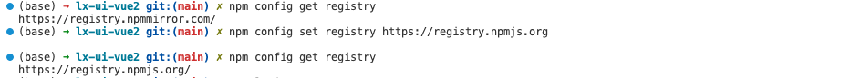

* https://www.npmjs.com

* 对应Demo：

    * [lx-js-cjs](https://github.com/lionsom/Vue_Projects/tree/main/04-my-npm/lx-js-cjs)

    * [lx-js-esm](https://github.com/lionsom/Vue_Projects/tree/main/04-my-npm/lx-js-esm)


# 一、大致流程

- 创建一个 NPM [注册表帐户](https://www.npmjs.com/)。
- 编写一些将成为您的 NPM 包的代码。
- 在本地测试一下。
- 添加**module.exports**以将软件包中可用的内容导出给安装它的人。
- 将您的包发布到 NPM 注册表。
- 使用 npm install 测试您的 NPM 包。


# 二、创建项目

> **npm init** 用来初始化生成package.json，它是 NodeJS 约定的用来存放项目的信息和配置等信息的文件。

```sh
# 创建package.json
$ npm init 

# 自动构建
$ npm init -y
```

package.json

```json
{
  "name": "lx-utils-only-js",
  "version": "1.0.0",
  "description": "只有js的工具库",
  "main": "index.js",
  "scripts": {
    "test": "echo \"Error: no test specified\" && exit 1"
  },
  "author": "",
  "license": "ISC"
}
```


# 三、发布npm

登录 [npm官网](https://www.npmjs.com/)

## 1. npm使用官方源

```shell
# 查看 npm 配置
$ npm config list

# 查看源
$ npm config get registry

# 临时修改
$ npm --registry https://registry.npmmirror.com install any-touch

# 持久修改
$ npm config set registry https://registry.npmmirror.com

# 还原 - 官方源
$ npm config set registry https://registry.npmjs.org

# 删除
$ npm config rm registry
```




## 2. 登录npm

```sh
# 终端登录
$ npm login

# 查看当前用户
$ npm whoami
```


## 3. 修改版本

```sh
$ npm version patch  # 补丁版本，最后一位+1

$ npm version minor  # 增加新功能，中间一位+1

$ npm version major  # 大版本，第一位+1
```


## 4. 发布

```sh
# 发布
$ npm publish
```


## 5. 发布成功

* 收到邮件


* npm官网查看


# 四、安装测试

* 安装包

```sh
# 安装
$ pnpm install lx-utils-only-js@1.0.0
```

* package.json

```json
{
  .....
  "type": "module",   // ESM模块化方案
  "dependencies": {
    "lx-utils-only-js": "^1.0.0"
  }
}
```

* 调用

```js
// test.js
import mmm from 'lx-utils-only-js'

console.log('test01 = ', mmm.BaseMethods.getTypeOf('123'));
console.log('test02 = ', mmm.Validate.mobileCheck('123'));


// 输出
> node ./test.js
test01 =  String
test02 =  false
```


# 五、卸载已发布的某个版本

```sh
# 删除1.0.2的版本
$ npm unpublish lx-utils-only-js@1.0.3
```


## 1. 删除1.0.3版本


# 六、卸载已发布的包

```sh
# 撤销已发布的包
$ npm unpublish lx-utils-only-js

# 强制撤销
$ npm unpublish lx-utils-only-js --force
```


## 1. 卸载 lx-utils-only-js


