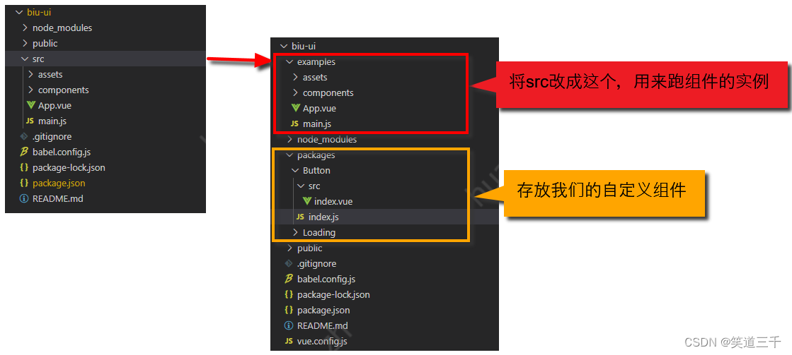
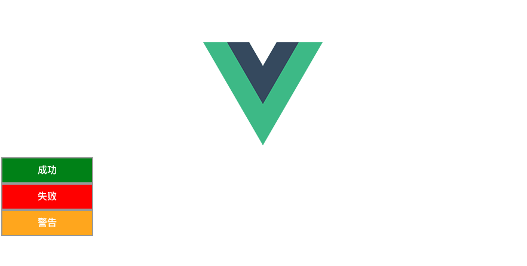
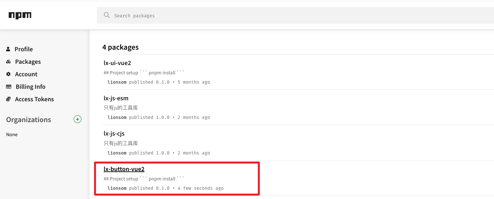

* 官网
    * [npmjs](https://www.npmjs.com)
    * [Vue2 官网 - 插件](https://v2.cn.vuejs.org/v2/guide/plugins.html)

* 博客
    * [从零开始撸一个Vue2.0组件库-并上传到NPM上](https://blog.csdn.net/weixin_42950333/article/details/120415621)
    * [Vue2封装一个全局通知组件并发布到NPM](https://blog.csdn.net/m0_53321320/article/details/131259961)
    * [Vue封装组件并发布到npm仓库](https://zhuanlan.zhihu.com/p/459284053)
    * [从0到1实现一个Vue组件库(入门篇）](https://juejin.cn/post/7105696184375164935)
    * [bilibili- Vue封装组件并发布到npm仓库（保姆级教程）](https://www.bilibili.com/video/BV1MS4y1L7QW/?spm_id_from=333.337.search-card.all.click&vd_source=dc55c355e9f5b6174832aacfb5d8b6aa)
        * 源码地址：https://github.com/Hacker233/vue-component-npm 
        * 文章地址：https://zhuanlan.zhihu.com/p/459284053


* 系列
    * [从0搭建Vue2 UI组件库（一）](https://juejin.cn/post/6996313249557774344)
    * [从0搭建Vue2 UI组件库（二）](https://juejin.cn/post/6996682464366166024/)
    * [从0搭建Vue2 UI组件库（三）](https://juejin.cn/post/6997363984030498846)
    * [从0搭建Vue2 UI组件库（四）](https://juejin.cn/post/6998451113318055944)
    * [从0搭建Vue2 UI组件库（五）](https://juejin.cn/post/6998909274164461598)
    * [从0搭建Vue2 UI组件库（六）](https://juejin.cn/post/6999170919788707847)
    * [从0搭建Vue2 UI组件库（七）](https://juejin.cn/post/6999557591793664031)
    * [从0搭建Vue2 UI组件库（八）](https://juejin.cn/post/7000008336921853983)

* 对应demo
    * 


# 一、最简单尝试

* 参考
    * [从零开始撸一个Vue2.0组件库-并上传到NPM上](https://blog.csdn.net/weixin_42950333/article/details/120415621)
    * [基于vue2.x搭建组件库的流程-（一）-组件库搭建与发布流程](https://blog.csdn.net/weixin_42349568/article/details/127126344)


## 1. 创建Vue2工程

```sh
# 安装vue-cli脚手架
$ npm install -g add @vue/cli

# 创建项目
$ vue create 01-button-vue2

Vue CLI v5.0.8
? Please pick a preset: Manually select features
? Check the features needed for your project: Babel, CSS Pre-processors, Linter, Unit
? Choose a version of Vue.js that you want to start the project with 2.x
? Pick a CSS pre-processor (PostCSS, Autoprefixer and CSS Modules are supported by default): Sass/SCSS (with dart-sass)
? Pick a linter / formatter config: Standard
? Pick additional lint features: Lint on save
? Pick a unit testing solution: Jest
? Where do you prefer placing config for Babel, ESLint, etc.? In package.json
? Save this as a preset for future projects? No
```

（2）运行项目

```sh
$ npm run serve
```


## 2. 整理文件目录



值得注意的是，cli默认会启动src下的服务,如果目录名变了,我们需要手动修改配置,vue-cli3中提供自定义打包配置项目的文件,我们只需要手动创建vue.config.js即可.我们具体修改如下:

首先修改入口文件地址为examples下的main.js

```js
// vue.config.js
const { defineConfig } = require('@vue/cli-service')
module.exports = defineConfig({
  pages: {
    index: {
      entry: "examples/main.js",  // 主页面文件路径
      template: "public/index.html",
      filename: "index.html",
    },
  },
  transpileDependencies: true,
  lintOnSave: false, // 是否开启eslint
})

```


## 3. 创建组件

```vue
// /packages/lx-fail-button/index.vue

<template>
  <div>
    <slot />
  </div>
</template>

<script>
export default {
  name: "lx-fail-button-ui",
};
</script>

<style scoped lang="scss">
div {
  width: 150px;
  height: 40px;
  line-height: 40px;
  border: 2px solid #999;
  text-align: center;
  color: #fff;
  font-weight: bold;
}
</style>
```


## 4. 组件安装入口文件

```js
// /package/index.js

// 导入组件
import LXSuccessButton from './lx-success-button/index.vue';
import LXFailButton from './lx-fail-button/index.vue';
import LXWarningButton from './lx-warning-button/index.vue';

// 组件列表
const components = {
  LXSuccessButton,
  LXFailButton,
  LXWarningButton,
};

// 定义 install 方法，接收 Vue 作为参数。如果使用 use 注册插件，那么所有的组件都会被注册
const install = (Vue) => {
  // 判断是否安装
  if (install.installed) return;
  // 遍历注册全局组件
  const keys = Object.keys(components);
  keys.forEach((name) => {
    const component = components[name]; 
    console.log('注册的组件名称：', component.name || name);
    // 第一个参数：全局组件的名字（字符串类型），第二个参数：哪一个组件（引入的组件名）
    Vue.component(component.name || name, component);
  });
}

// 这里export default是提供给全局引入使用
export default {
  install,
  ...components,
};
```


##  5. 在examples中引入测试

* 全局注册

```js
// /examples/main.js

import Vue from 'vue'
import App from './App.vue'


/*********** 全局引入组件库 ***********/
import XXXUI from "../packages/index.js";
// 全局注册组件库，Vue.use()提供注册插件，插件对象需包含一个install函数。具体可查看官方文档
Vue.use(XXXUI);
/***********************************/


Vue.config.productionTip = false

new Vue({
  render: h => h(App)
}).$mount('#app')
```

* 直接使用组件
* LXFailButton 的名字已经被重新定义了 `lx-fail-button-ui`

```vue
// examples/app.vue
<template>
  <div id="app">
    

    <!-- 全局引入 -->
    <LXSuccessButton>成功</LXSuccessButton>
    <lx-fail-button-ui>失败</lx-fail-button-ui>
    <LXWarningButton>警告</LXWarningButton>

  </div>
</template>
```

* 运行

```sh
$ npm run serve
```



## 6. 打包

```js
{
  "name": "lx-button-vue2",		// 组件名
  "version": "0.1.0",	// 组件库的版本，每次打包发布注意都要更新
  "private": false,   // 改为false，否则无法发布到npm
  "main": "dist/lx-button-vue2.umd.js",   // 组件库打包好的入口文件
  "scripts": {
    "serve": "vue-cli-service serve",
    "build": "vue-cli-service build",
    "lint": "vue-cli-service lint",
     // 打包命令
    "build:lx-button": "vue-cli-service build --target lib --dest dist packages/index.js", 
  },
  ....  
}
```

* 将private设置为false，否则无法发布到npm
* version：组件库版本号

* 增加main为lib/yunpeng-ui.umd.min.js，我们组件库打包好的入口文件。
    * `main` 的作用就是当其它项目引入这个库时，会从 `dist/tips.umd.js` 作为入口寻找。

* 这里解释一下 `build-lib` 命令的参数

    * --target lib 表示这次打包要以 lib 的方式

    * --name tips 表示打包后的文件名前缀

    * --dest 表示打包后的目录名

    * --entry 表示打包的入口文件


## 7. 发布npm

* 登录npm账号

```sh
$ npm login

npm notice Log in on https://registry.npmjs.org/
Login at:
https://www.npmjs.com/login?next=/login/cli/a5bc5641-1aa8-402e-9f49-bf211e06f5a2
Press ENTER to open in the browser...

Logged in on https://registry.npmjs.org/.
```

* 发布

```sh
$ npm publish

....
npm notice shasum:        d877f32f621661b7c7c94b00cc708b3eb6dab7a0
npm notice integrity:     sha512-JmmpiEnh0+u2E[...]4Zr6awssZWxPw==
npm notice total files:   26                                      
npm notice 
npm notice Publishing to https://registry.npmjs.org/ with tag latest and default access
Authenticate your account at:
https://www.npmjs.com/auth/cli/bd8dcc6e-c344-45be-836e-558d17c490a4
Press ENTER to open in the browser...

+ lx-button-vue2@0.1.0
```

* npm官网查看是否发布成功




## 8. 软连接测试（待研究）

https://blog.csdn.net/cookcyq__/article/details/125668784

```
 $ npm link
```


## 8. npm包安装测试
