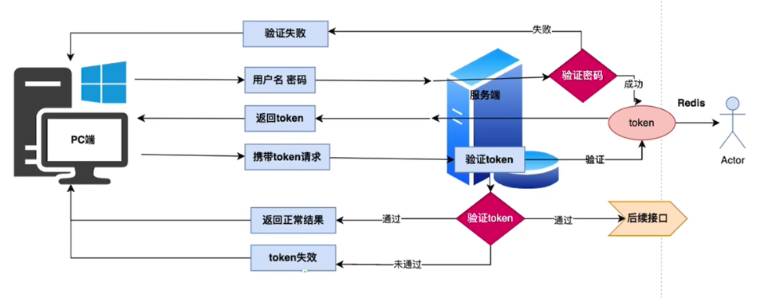
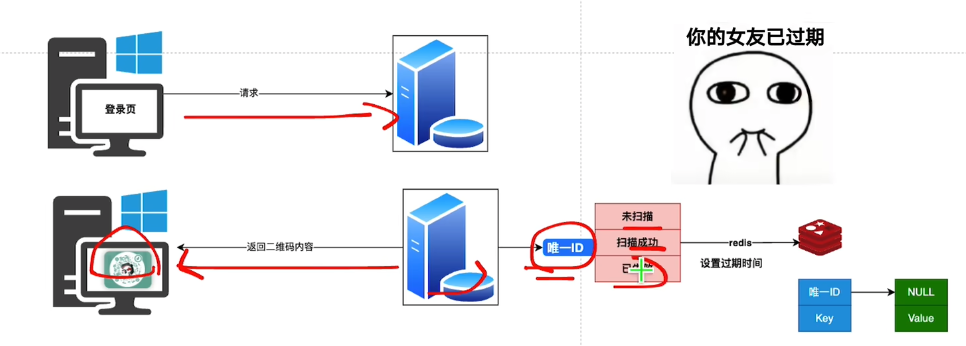
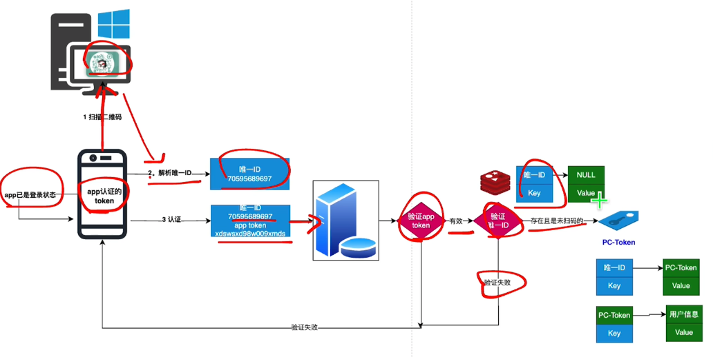
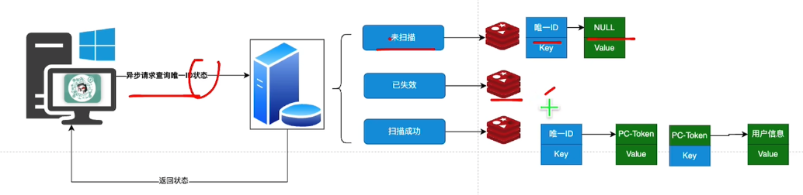
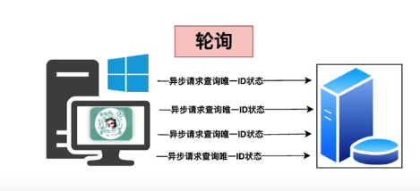
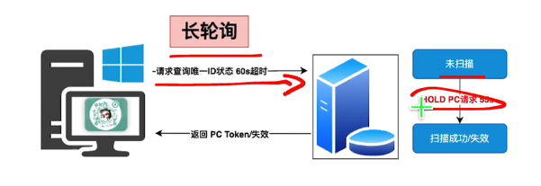
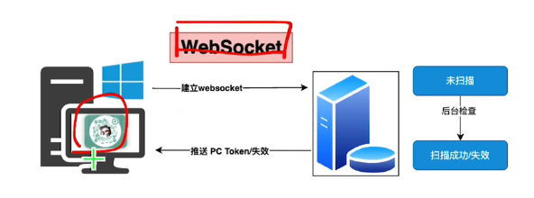

[bilibili - 扫码登录设计](https://www.bilibili.com/video/BV1nJY7efEfz/?spm_id_from=333.788&vd_source=dc55c355e9f5b6174832aacfb5d8b6aa)


# 账号密码登录流程

<font color='red' size=5>最终目的：获取token</font>



# 扫码登录

## pc登录页




## 移动端




## pc端




### 方式








## 完整


# GPT - 扫码登录的设计

扫码登录是一种常见的用户认证方式，通常用于在移动设备和桌面设备之间进行快速安全的登录。这种方式用户体验好且安全性高，广泛应用于各种平台，如微信、支付宝、GitHub 等。以下是扫码登录的设计流程和实现步骤。

### 1. **基本流程**

扫码登录的基本流程包括以下步骤：

1. **生成二维码**：
   - 用户在桌面设备或其他终端上打开需要登录的页面。
   - 服务器生成一个唯一的二维码，该二维码通常包含一个临时的唯一会话标识符（如 `token`），并将其展示在页面上。

2. **用户扫描二维码**：
   - 用户使用移动设备（如手机上的 App）扫描二维码。
   - 移动设备上的 App 解析二维码中的信息，并将该信息发送给服务器进行验证。

3. **验证和授权**：
   - 服务器接收到移动设备发送的请求后，验证会话标识符的有效性。
   - 如果验证通过，服务器可以进一步要求用户进行身份验证（如输入密码、指纹验证等）。
   - 验证通过后，服务器将生成一个授权令牌，并通知桌面设备。

4. **桌面设备登录**：
   - 桌面设备通过轮询或 WebSocket 等方式向服务器请求登录状态。
   - 一旦服务器确认授权，桌面设备即完成登录。

### 2. **详细设计**

#### 2.1 **二维码生成**

- 生成一个唯一的 `session_id` 或 `token`，并在服务器端保存。
- 通过二维码生成库（如 `qrcode`）将 `session_id` 编码成二维码。
- 将生成的二维码展示在网页或应用界面上。

#### 2.2 **二维码扫描与身份验证**

- 用户使用移动端应用扫描二维码。
- 移动端应用解析二维码，获取 `session_id` 后，向服务器发送请求，验证该 `session_id` 的有效性。
- 服务器可以选择要求用户进行额外的身份验证（如输入密码，或通过 OAuth 授权）。
- 验证通过后，服务器更新 `session_id` 的状态，标记为已授权，并通知桌面设备。

#### 2.3 **桌面设备登录确认**

- 桌面设备可以通过轮询或 WebSocket 连接定期检查服务器上 `session_id` 的状态。
- 当服务器确认 `session_id` 已授权时，桌面设备获取用户信息并完成登录。

#### 2.4 **登录完成后的安全处理**

- 登录完成后，服务器应失效 `session_id`，确保该二维码不可重复使用。
- 在桌面设备上设置用户的登录会话，通常通过设置 Cookie 或 JWT。

### 3. **安全性考虑**

- **二维码时效性**：二维码应设置一个有效期，防止长时间未使用的二维码被恶意利用。
- **双向验证**：如果应用场景对安全要求高，可以在移动端验证后再要求用户在桌面端确认。
- **传输加密**：所有通信都应通过 HTTPS 加密，以保护用户信息。
- **设备绑定**：可以通过绑定用户的设备来增强安全性，确保二维码只能在特定设备上登录。

### 4. **示例实现**

#### 4.1 **二维码生成示例**（使用 Node.js 和 `qrcode` 库）

```javascript
const QRCode = require('qrcode');

const generateQRCode = async (sessionId) => {
  try {
    const qrCodeUrl = await QRCode.toDataURL(`https://example.com/login?session_id=${sessionId}`);
    return qrCodeUrl; // 返回二维码的 base64 数据，可以直接在页面上展示
  } catch (err) {
    console.error('Error generating QR code:', err);
  }
};

// Example usage
const sessionId = 'unique-session-id';
generateQRCode(sessionId).then(qrCodeUrl => {
  // 将 qrCodeUrl 渲染到前端页面
});
```

#### 4.2 **扫描二维码并验证示例**

```javascript
const express = require('express');
const app = express();

// 假设 `sessions` 是存储 session_id 的数据库或内存结构
const sessions = {};

app.post('/scan', (req, res) => {
  const { sessionId } = req.body;

  if (sessions[sessionId]) {
    // 验证通过，更新 session 状态
    sessions[sessionId].status = 'authorized';
    res.json({ success: true });
  } else {
    res.json({ success: false, message: 'Invalid session' });
  }
});

app.listen(3000, () => console.log('Server running on port 3000'));
```

### 5. **优化与扩展**

- **状态同步**：使用 WebSocket 替代轮询，可以实时同步移动端与桌面端的状态。
- **多因素认证**：可与其他身份验证方式结合使用，如 SMS、邮件验证码等。
- **分析与日志**：记录每次扫码登录的时间、设备、IP 等信息，以便审计和分析。

扫码登录的设计既要确保用户体验流畅，又要保证安全性。通过以上的设计步骤和代码示例，你可以实现一个安全且高效的扫码登录系统。


