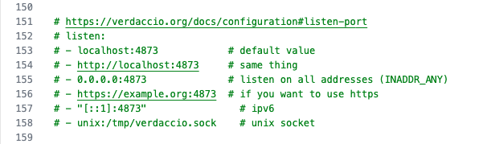
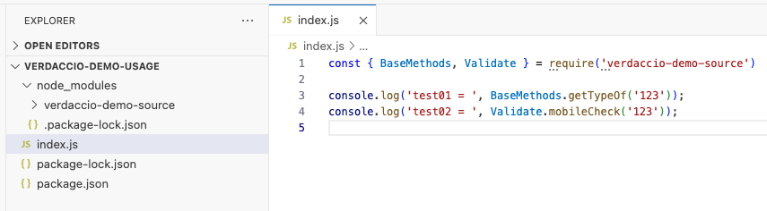
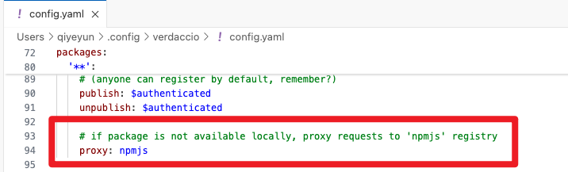

# Verdaccio

* [Verdaccio 官网](https://verdaccio.org/)

* [【前端工程化】使用verdaccio搭建公司npm私有库完整流程和踩坑记录](https://juejin.cn/post/7096701542408912933)

* https://blog.csdn.net/ITyiy/article/details/132445854


# 一、安装

## 1. 使用**npm**全局安装**verdaccio**

```sh
$ npm i verdaccio -g
```


## 2. 直接运行

```sh
$ verdaccio
```


## 3. 关键信息

出现上图后，代表已经启动成功了，可以看到一些关键信息

1. **配置文件的目录**：`/Users/qiyeyun/.config/verdaccio/config.yaml`
2. **服务所在的地址**：http://localhost:4873/


## 4. 打开 http://localhost:4873/

打开[http://localhost:4873/](https://link.juejin.cn/?target=http%3A%2F%2Flocalhost%3A4873%2F)，可以看到私服已经启动好了。


## 5. 全局访问配置

可以看到 **verdaccio** 默认地址是 http://localhost:4873，只能本机访问到，要想在其他电脑上访问到，需要调整一下服务的地址。

打开 `/Users/qiyeyun/.config/verdaccio/config.yaml` 配置：



根据注释可以看到 **listen** 的值默认为 **localhost:4873** ，如果项所有地址都可以访问到，需要修改成 **0.0.0.0:4873**，注意缩进，**listen** 前面不需要有缩进。


我在手机上访问：`192.168.1.102:4873`  成功！！！


# 二、发布测试包

## 1. 创建verdaccio用户

```sh
$ npm adduser --registry http://localhost:4873/

npm notice Log in on http://localhost:4873/
Username: linx01
Password: 123456
Email: (this IS public) 1@qq.com
Logged in on http://localhost:4873/.
```


这样可以在 `http://localhost:4873/` 网页上直接登录！！

或者

```sh
$ npm login --registry=http://0.0.0.0:4873/
npm notice Log in on http://0.0.0.0:4873/
Username: linx01
Password:
Logged in on http://0.0.0.0:4873/.

# 查看当前登录人
$ npm whoami --registry=http://0.0.0.0:4873/

# 退出
$ npm logout --registry=http://0.0.0.0:4873/
```


### a. 删除用户 + 用户信息路径

既然有注册用户，不可避免的需求是在一些场景下，我们需要删除某个用户来禁止其登陆私有 npm 库。

前面也提及了 Verdaccio 默认使用的是 `htpasswd` 来实现鉴权。相应地，注册的用户信息会存储在 `~/.config/verdaccio/htpasswd` 文件中：

```
linx01:iAATKIGipNVLs:autocreated 2024-11-27T02:51:36.081Z
```

这里一条记录对应一个用户，也就是如果这条记录被删除了，那么该用户就不能登陆了，即删除了该用户。


## 2. 创建库

```sh
$ mkdir verdaccio-demo

$ npm init -y
```


## 3. 发布本地私有库

### a. 若未登录用户，发布失败


### b. 若已登录用户

```sh
$ npm publish --registry http://localhost:4873/
```


## 4. 优化包发布

刚才发布包时需要在在**npm publish**后面添加--registry http://localhost:4873/，每次都添加比较麻烦，可以在包项目根目录添加 **.npmrc**文件，添加以下配置

```json
registry=http://localhost:4873/
```

这样再发布包时直接**npm publish**就可以了,会自动提交到对应地址的私有服上面，添加后修改**package.json**的版本**version**字段把**1.0.0**修改为**1.0.1**，再次执行**npm publish**测试，会发现发布成功，并且在可视化界面可以看到版本变化了。


# 三、使用测试包

## 1. 创建新工程并安装


```sh
$ npm install verdaccio-demo-source@0.0.4 -S
```


## 2. 调用




## 3. 运行

```sh
$ npm run start
```

```json
{
  "name": "verdaccio-demo-usage",
  "version": "1.0.0",
  "description": "",
  "main": "index.js",
  "scripts": {
    "test": "echo \"Error: no test specified\" && exit 1",
    "start": "node index.js"    // 运行
  },
  "keywords": [],
  "author": "",
  "license": "ISC",
  "dependencies": {
    "lodash": "^4.17.21",
    "verdaccio-demo-source": "^0.0.4"
  }
}
```


## 4. 测试安装不在verdaccio私有库的包

```sh
$ npm i lodash
```


### a. 原因

前往配置中，查看：




## 5. 执行npm时的路径

设置后，再执行npm时的路径：

* npm install -> Verdaccio -> npmjs

Verdaccio会根据本地缓存情况，自动从官方源下载未缓存的包，提供给用户使用。


## 6. 若未设置 register 如何安装测试包

若没有设置 `registry=http://localhost:4873/` ：


### a. 安装失败

```sh
$ npm install verdaccio-demo-source

$ npm install verdaccio-demo-source --registry=https://open-npm.qpaas.com/
```


### 原因

报错**code**是**404**，是因为默认情况下会从**npm**公共仓库下载包，而不是从我们私有仓库下载包，依然需要在项目根目录添加 **.npmrc**文件，添加配置

```
registry=http://localhost:4873/
```


# 四、从仓库卸载包

```sh
# 删除版本
$ npm unpublish [packageName] --registry http://localhost:4873 --force 
```


# 五、`nrm` 添加、切换源

具体看文档《npm源操作》。

## 1. 查看源列表、添加源

```sh
$ npm i -g nrm

$ nrm ls

# 这里的 lxlx 代表你这个源的简称，你可以因自己的喜好来命名。
$ nrm add lxlx http://localhostm:4873/
```

```sh
$ nrm ls
* npm ---------- https://registry.npmjs.org/
  yarn --------- https://registry.yarnpkg.com/
  tencent ------ https://mirrors.cloud.tencent.com/npm/
  cnpm --------- https://r.cnpmjs.org/
  taobao ------- https://registry.npmmirror.com/
  npmMirror ---- https://skimdb.npmjs.com/registry/

$ nrm add lxlx http://localhostm:4873/

 SUCCESS  Add registry lxlx success, run nrm use lxlx command to use lxlx registry.
 
$ nrm ls
* npm ---------- https://registry.npmjs.org/
  yarn --------- https://registry.yarnpkg.com/
  tencent ------ https://mirrors.cloud.tencent.com/npm/
  cnpm --------- https://r.cnpmjs.org/
  taobao ------- https://registry.npmmirror.com/
  npmMirror ---- https://skimdb.npmjs.com/registry/
  lxlx --------- http://localhostm:4873/           # 这就是新增的
```


## 2. 切换源的三种方式

### a. nrm

```sh
$ nrm use lxlx
```

切换到我们的私有npm源上， 切换好源后，我们之后的 `$ npm i` 就会 **先去私有库查找包**，如果不存在则会去 https://registry.npmmirror.com/（因为上面配置了 proxy）查找包。


### b. `npm set register` 命令

这里需要将Verdaccio设为npm的registry：

```sh
$ npm set registry http://localhost:4873/
```


### c. 直接修改 `.npmrc` 文件


# 六、发布带"命名空间"的包

* [如何使用带scope的包](https://didiaohu.gitbooks.io/npm/content/14-ru-he-shi-yong-ming-ming-kong-jian-de-bao.html)

## 1. 创建项目并发布

* 使用 `npm init` 创建带 scope 包

    要创建带scope的包，仅命令中加上参数 --scope=username 即可，但这种方式是一次性的。

    ```sh
    $ npm init --scope=username
    ```

* **全局设置 scope**

    若需要永久只创建带 scope 的包，则全局设置即可，设置后再创建包就不再需要 --scope 参数了。

    ```sh
    $ npm config set scope username
    
    $ npm init
    ```

* `package.json` 文件

    ```json
    {
      "name" ："@username/project-name" 
    }
    ```


* 发布

    ```sh
    # 发布
    $ npm publish
    
    # 发布一个带scope的包一定要加上 --access=public 参数，表示公开免费
    $ npm publish --access=public
    ```


* http://localhost:4873/


## 2. 使用测试包

```sh
$ npm install @lxnpm/verdaccio-demo-source-scope@0.0.1 -S
```

安装失败


### a. 安装失败原因：缺少命名空间的注册表配置

确保在 `.npmrc` 文件中为命名空间配置了正确的注册表地址。例如，如果你在使用私有注册表：

```json
@lxnpm:registry=http://localhost:4873/
```


再次安装，成功！！！


## 3. 代码调用

```js
const { BaseMethods, Validate } = require('@lxnpm/verdaccio-demo-source-scope')

console.log('test01 = ', BaseMethods.getTypeOf('123'));
console.log('test02 = ', Validate.mobileCheck('123'));
```


# 七、权限

* [发布和删除包权限控制](https://juejin.cn/post/7096701542408912933#heading-17)

## 1. 发布和删除包权限控制

刚才上传包的时候，任何人都可以**npm addUser**创建账号，然后上传**npm**包，这肯定是不安全的，需要对注册账号，还有发布**npm**包到私有库，删除私有库的**npm**包都要做权限控制，而**verdaccio**也提供了权限配置方案。

编辑 **verdaccio** 的配置文件：

```sh
$ vi /Users/qiyeyun/.config/verdaccio/config.yaml
```

找到 **packages** 配置项：

```yaml
 packages:
  '@*/*':
    # scoped packages
    access: $all
    publish: $authenticated
    unpublish: $authenticated
    proxy: npmjs

  '**':
    # allow all users (including non-authenticated users) to read and
    # publish all packages
    #
    # you can specify usernames/groupnames (depending on your auth plugin)
    # and three keywords: "$all", "$anonymous", "$authenticated"
    access: $all

    # allow all known users to publish/publish packages
    # (anyone can register by default, remember?)
    publish: $authenticated
    unpublish: $authenticated
```

包的配置分两种：

1. **作用域包**：一般指@xxx/xxx,比如@vue/core,@vue/compiler。
2. **普通的包**：比如**react**, **vue**, **webpack**。

包配置有几个关键的属性：

1. **access**：表示哪些用户可以访问私有库上的包。
2. **publish**：表示哪些用户可以在私有库上发布包。
3. **unpublish**：表示哪些用户可以在私有库上删除包。

而上面三个配置项对应的选项位：

1. **$all:** 代表所有用户，不管是已注册还是未注册。
2. **$authenticated**：是已注册的用户。
3. **固定的账号**：比如： `publish: user1 user2`

根据上面的信息，可以知晓，我们一般需要把访问包权限设置为已经注册用户才可以访问，而**publish**发布包和**unpublish**删除包两个权限需要设置为固定配置的账号，修改后配置如下。

```yaml
packages:
  '@*/*':
    # scoped packages
    access: $authenticated # 只有注册的账号才可以访问私有库的包
    publish: guojiongwei # 只有该账号可以发布包到私有库
    unpublish: guojiongwei # 只有该账号可以删除私有库上的包
    proxy: npmjs
  '**':
    access:$authenticated  # 只有注册的账号才可以访问私有库的包
    publish: guojiongwei # 只有该账号可以发布包到私有库
    unpublish: guojiongwei # 只有该账号可以删除私有库上的包
```

