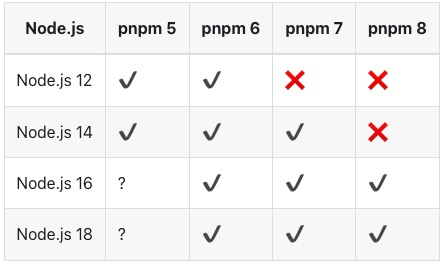

# PNPM

* [pnpm官网](https://pnpm.io/)
    * [Installation](https://pnpm.io/installation)
    * [Uninstalling pnpm](https://pnpm.io/uninstall)

> pnpm: performant npm，是node.js的包管理工具。


前提：

* Node.js
* npm

```shell
# 安装，需要Node.js才能运行。
$ npm install -g pnpm

# or
$ brew install pnpm

# 验证
$ pnpm --version
6.35.1

$ which pnpm
/Users/qiyeyun/.nvm/versions/node/v18.16.0/bin/pnpm
```




# 心得

**npm & pnpm 安装是跟着当前的node走的**

使用nvm切换node不同的版本，pnmp也会变化。

```shell
# 查看当前安装的 node 版本
$ nvm list
->    v12.22.12
       v18.16.0
       
# 查看pnpm版本 
$ pnpm -v
6.35.1
# 查看pnpm路径
$ which pnpm
/Users/qiyeyun/.nvm/versions/node/v12.22.12/bin/pnpm


# 切换node
$ nvm use 18
Now using node v18.16.0 (npm v9.5.1)
# 查看node路径
$ which node
/Users/qiyeyun/.nvm/versions/node/v18.16.0/bin/node


# 再次查看pnpm版本
$ pnpm -v
8.4.0
# 查看pnpm路径
$ which pnpm
/Users/qiyeyun/.nvm/versions/node/v18.16.0/bin/pnpm
```


# 独立安装的pnpm 与 nvm下安装的pnpm

```sh
# 独立安装的pnpm路径
$ which pnpm
/Users/qiyeyun/Library/pnpm/pnpm

# nvm下安装的pnpm路径
$ which pnpm
/Users/qiyeyun/.nvm/versions/node/v14.17.0/bin/pnpm
```

<font color='red' size=5>建议：移除独立安装的，避免造成node版本与pnpm版本不对应！！！</font>


# 日常使用

## pnpm升级

```bash
   ╭──────────────────────────────────────────────────────────────────╮
   │                                                                  │
   │                Update available! 6.35.1 → 8.6.12.                │
   │   Changelog: https://github.com/pnpm/pnpm/releases/tag/v8.6.12   │
   │                Run "pnpm add -g pnpm" to update.                 │
   │                                                                  │
   │      Follow @pnpmjs for updates: https://twitter.com/pnpmjs      │
   │                                                                  │
   ╰──────────────────────────────────────────────────────────────────╯
   
$ pnpm add -g pnpm
$ pnpm -v
```


## 安装库

```sh
$ pnpm add axios
```


