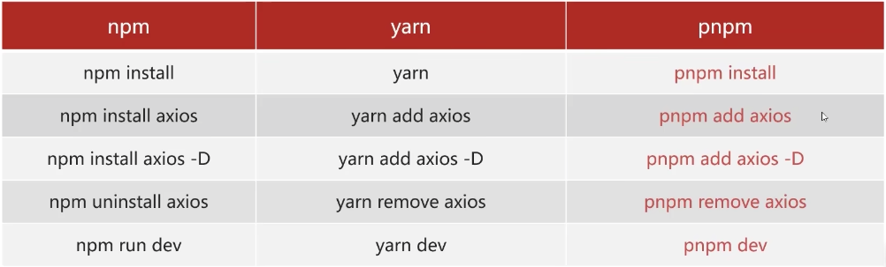

* [尚硅谷2023版Node.js零基础视频教程，nodejs新手到高手](https://www.bilibili.com/video/BV1gM411W7ex?p=16&vd_source=dc55c355e9f5b6174832aacfb5d8b6aa)


# npm VS yarn VS pnpm

* npm是node官方的包管理器
    * 缺点：引入多个包，如A、B，这两个包又同时引用C，此时会存在两个C

* yarn: 解决了npm重复包的问题，
    * 缺点：但是 通过每次新环境的拉取都需要重新拉取全部的库，对于部署来说，很浪费时间。

* pnpm：先将库拉取到本地仓库，再通过软连接，链接到项目中，这样就不需要每次都拉取全部库了。


# 命令对比




# 创建vue项目

* Vue2  -> [Vue CLI](https://cli.vuejs.org/zh/#%E8%B5%B7%E6%AD%A5) -> Webpack
* Vue3 -> [create-vue](https://cn.vuejs.org/guide/scaling-up/tooling.html#project-scaffolding)  -> Vite

```bash
# Vue CLI 创建Vue2项目
$ vue create hello-world

# create-vue 创建Vue3项目，这一指令将会安装并执行 create-vue
$ npm create vue@latest
# or
$ npm init vue@latest
# 创建Vue2项目
$ npm create vue@legacy
```


```bash
# 创建Vue3项目
$ pnpm create vue
```


# 初始化一个Node 项目

如果想让一个项目成为 Node 项目，只需要在命令行 `cd` 到项目所在的目录，执行初始化命令：

```bash
$ npm init

# or
$ npm init -y
```


