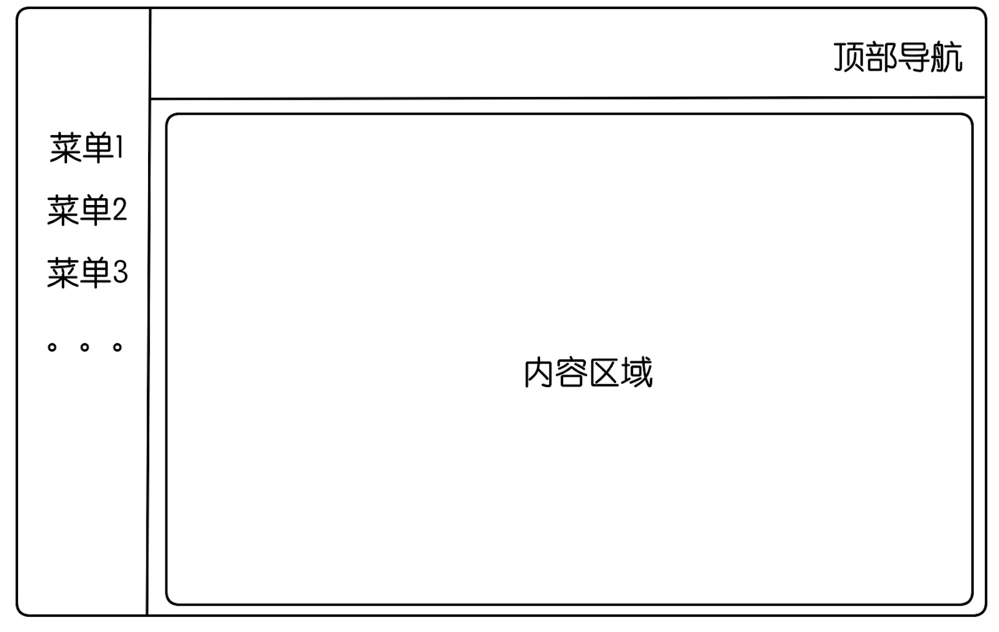
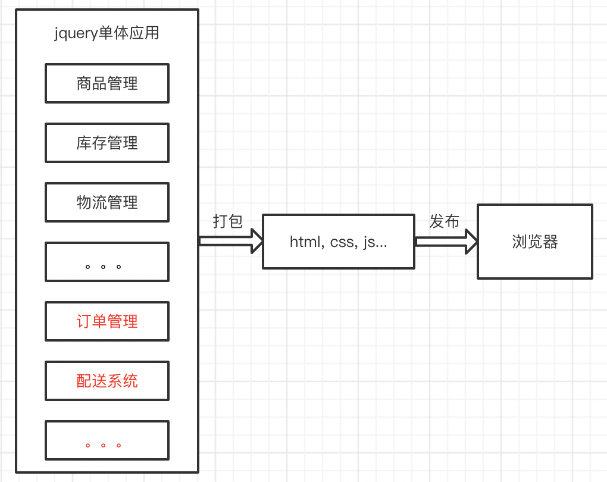
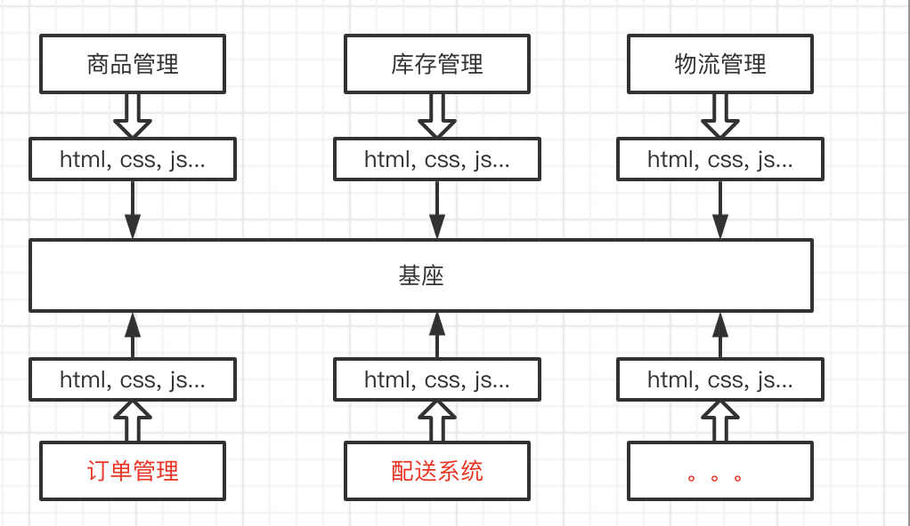
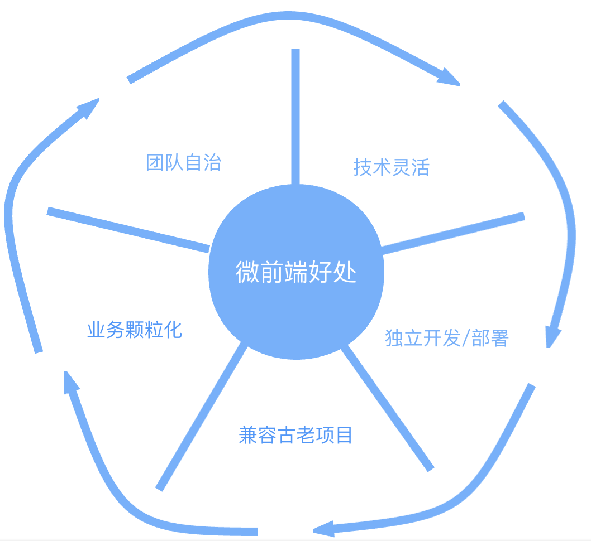

## 微前端实战

### 什么是微前端

微前端是指存在于浏览器中的微服务，其借鉴了微服务的架构理念，将微服务的概念扩展到了前端。

如果对微服务的概念比较陌生的话，可以简单的理解为微前端就是将一个大型的前端应用拆分成多个模块，每个微前端模块可以由不同的团队进行管理，并可以自主选择框架，并且有自己的仓库，可以独立部署上线。

一般呢，微前端多应用于企业中的中后台项目中，因为企业内部的中后台项目存活时间都比较长，动辄三五年或者更多，最后演变成一个巨石应用的概率往往高于其他类型的web应用。这就带来了**技术栈落后**、**编译部署慢**两个问题。



我们以常见的电商平台举例，某家已经存活了10年的电商平台的后台管理系统由几个模块构成，包括商品管理、库存管理、物流管理等模块，但是因为历史原因，这个项目一开始用jquery编写的，因为本着能跑就行的原则，这10年期间业务上一直没有太大改动所以就延续了下来，直到今天还是用的jquery维护的。

有一天，刚入职的小明被叫到办公室，老板和他说我们公司要开展新的业务，要开展生鲜配送服务，并且答应他说这个业务做大后公司就可以上市，就升你为公司的CTO，小明听了十分开心，想着自己马上就可以升职加薪迎娶白富美了，于是马上就打开某聘开始找简历招人了，但是跟人聊的时候一说要用jquery去写一个大型的后台系统的时候，很多人都放弃了，还遭到了候选人的讽刺：“都2202年了怎么还有人用jquery”。小明这个时候才明白，大清已经亡了，jquery早就已经没人用了。想到这，小明陷入了沉思，自己升职加薪的梦难到要破灭了吗。。。

这个时候，某聘上的一个候选人打来了电话，说他有一个好的方案可以不用jquery在原来的项目上堆积代码，而是将新的项目单独拿出来去写，并且实现独立部署，然后小明马上约了这个候选人当面聊聊。候选人到了公司跟小明聊了聊后，这时候小明才第一次听到微前端的这个概念，看着眼前的候选人，小明的眼眶都湿润了，于是当场就和他签了合同，给了每个月2千8的高薪，并且答应等业务做大以后就给他取个漂亮嫂子。听到这，候选人的眼眶也湿润了。。。

好了，故事讲完了，那么接下来我们来看看，微前端到底是怎么实现小明想要的功能呢？

- 之前的项目架构

  

- 引入微前端后

  

### 微前端的好处

##### 团队自治

在公司里面，一般团队都是按照业务去划分的，在没有微前端的时候，如果几个团队维护一个项目肯定会遇到一些冲突，比如合并代码的冲突，上线时间的冲突等。应用了微前端之后，就可以将项目根据业务模块拆分成几个小的模块，每个模块都由不同的团队去维护，单独开发，单独部署上线，这样团队直接就能实现自治，减少甚至不会出现和其他团队冲突的情况。

##### 兼容老项目

如果公司中有故事中存在的古老的jquery或者其他巨石项目的话，但是又不想用旧的技术栈去维护，选择使用微前端的方式去拆分项目是一个很好的选择。

##### 跨技术栈

根据我们上面的例子，如果我们的微前端系统中需要新增一个业务模块时，只需要单独的新建一个项目，至于项目采用什么技术栈，完全可以由团队自己去定义，即使和其他模块用的不同的技术栈也不会有任何的问题

##### 总结



### 现有的微前端方案

##### iframe

iframe大家都很熟悉，通过iframe实现的话就是每个子应用通过iframe标签来嵌入到父应用中，iframe具有天然的隔离属性，各个子应用之间以及子应用和父应用之间都可以做到互不影响。

但是iframe也有很多缺点：

1. url不同步，如果刷新页面，iframe中的页面的路由会丢失。
2. 全局上下文完全隔离，内存变量不共享。
3. UI不同步，比如iframe中的页面如果有带遮罩层的弹窗组件，则遮罩就不能覆盖整个浏览器，只能在iframe中生效。
4. 慢。每次子应用进入都是一次浏览器上下文重建、资源重新加载的过程。

##### single-spa

官网：https://zh-hans.single-spa.js.org/docs/getting-started-overview

single-spa是最早的微前端框架，可以兼容很多技术栈。

single-spa首先在基座中注册所有子应用的路由，当URL改变时就会去进行匹配，匹配到哪个子应用就会去加载对应的那个子应用。

相对于iframe的实现方案，single-spa中基座和各个子应用之间共享着一个全局上下文，并且不存在URL不同步和UI不同步的情况，但是single-spa也有以下的缺点：

1. 没有实现js隔离和css隔离
2. 需要修改大量的配置，包括基座和子应用的，不能开箱即用

##### qiankun

qiankun是阿里开源的一个微前端的框架，在阿里内部已经经过一批线上应用的充分检验及打磨了，所以可以放心使用。qiankun有什么优势呢？

- 基于single-spa封装的，提供了更加开箱即用的API
- 技术栈无关，任意技术栈的应用均可使用/接入，不论是 React/Vue/Angular/JQuery 还是其他等框架。
- HTML Entry的方式接入，像使用iframe一样简单
- 实现了single-spa不具备的样式隔离和js隔离
- 资源预加载，在浏览器空闲时间预加载未打开的微应用资源，加速微应用打开速度。

### 基于qiankun的微前端实战

这次课程我们选择qiankun进行实战开发，项目目录如下：

```less
├── micro-base     // 基座
├── sub-react       // react子应用，create-react-app创建的react应用，使用webpack打包
├── sub-vue  // vue子应用，vite创建的子应用
└── sub-umi    // umi脚手架创建的子应用
```

- 基座（主应用）：主要负责集成所有的子应用，提供一个入口能够访问你所需要的子应用的展示，尽量不写复杂的业务逻辑
- 子应用：根据不同业务划分的模块，每个子应用都打包成`umd`模块的形式供基座（主应用）来加载

#### 基座

基座用的是`create-react-app`脚手架加上`antd`组件库搭建的项目，也可以选择vue或者其他框架，一般来说，基座只提供加载子应用的容器，尽量不写复杂的业务逻辑。

##### 基座改造

1. 安装qiankun

```bash
// 安装qiankun
npm i qiankun // 或者 yarn add qiankun
```

2. 修改入口文件

```javascript
// 在src/index.tsx中增加如下代码
import { start, registerMicroApps } from 'qiankun';

// 1. 要加载的子应用列表
const apps = [
  {
    name: "sub-react", // 子应用的名称
    entry: '//localhost:8080', // 默认会加载这个路径下的html，解析里面的js
    activeRule: "/sub-react", // 匹配的路由
    container: "#sub-app" // 加载的容器
  },
]

// 2. 注册子应用
registerMicroApps(apps, {
  beforeLoad: [async app => console.log('before load', app.name)],
  beforeMount: [async app => console.log('before mount', app.name)],
  afterMount: [async app => console.log('after mount', app.name)],
})

start() // 3. 启动微服务
```

当微应用信息注册完之后，一旦浏览器的 url 发生变化，便会自动触发 qiankun 的匹配逻辑。 所有 activeRule 规则匹配上的微应用就会被插入到指定的 container 中，同时依次调用微应用暴露出的生命周期钩子。

- registerMicroApps(apps, lifeCycles?)

  注册所有子应用，qiankun会根据activeRule去匹配对应的子应用并加载

- start(options?)

  启动 qiankun，可以进行预加载和沙箱设置

至此基座就改造完成，如果是老项目或者其他框架的项目想改成微前端的方式也是类似。

#### react子应用

使用`create-react-app`脚手架创建，`webpack`进行配置，为了不eject所有的webpack配置，我们选择用`react-app-rewired`工具来改造webpack配置。

1. 改造子应用的入口文件

```javascript
let root: Root

// 将render方法用函数包裹，供后续主应用与独立运行调用
function render(props: any) {
  const { container } = props
  const dom = container ? container.querySelector('#root') : document.getElementById('root')
  root = createRoot(dom)
  root.render(
    <BrowserRouter basename='/sub-react'>
      <App/>
    </BrowserRouter>
  )
}

// 判断是否在qiankun环境下，非qiankun环境下独立运行
if (!(window as any).__POWERED_BY_QIANKUN__) {
  render({});
}

// 各个生命周期
// bootstrap 只会在微应用初始化的时候调用一次，下次微应用重新进入时会直接调用 mount 钩子，不会再重复触发 bootstrap。
export async function bootstrap() {
  console.log('react app bootstraped');
}

// 应用每次进入都会调用 mount 方法，通常我们在这里触发应用的渲染方法
export async function mount(props: any) {
  render(props);
}

// 应用每次 切出/卸载 会调用的方法，通常在这里我们会卸载微应用的应用实例
export async function unmount(props: any) {
  root.unmount();
}
```

2. 新增public-path.js

```js
if (window.__POWERED_BY_QIANKUN__) {
  // 动态设置 webpack publicPath，防止资源加载出错
  // eslint-disable-next-line no-undef
  __webpack_public_path__ = window.__INJECTED_PUBLIC_PATH_BY_QIANKUN__
}
```

3. 修改webpack配置文件

```javascript
// 在根目录下新增config-overrides.js文件并新增如下配置
const { name } = require("./package");

module.exports = {
  webpack: (config) => {
    config.output.library = `${name}-[name]`;
    config.output.libraryTarget = "umd";
    config.output.chunkLoadingGlobal = `webpackJsonp_${name}`;
    return config;
  }
};
```

#### vue子应用

##### 创建子应用

```bash
# 创建子应用，选择vue3+vite
npm create vite@latest
```

##### 改造子应用

1. 安装`vite-plugin-qiankun`依赖包

```bash
npm i vite-plugin-qiankun # yarn add vite-plugin-qiankun
```

2. 修改vite.config.js

```javascript
import qiankun from 'vite-plugin-qiankun';

defineConfig({
    base: '/sub-vue', // 和基座中配置的activeRule一致
    server: {
      port: 3002,
      cors: true,
      origin: 'http://localhost:3002'
    },
    plugins: [
      vue(),
      qiankun('sub-vue', { // 配置qiankun插件
        useDevMode: true
      })
    ]
})
```

3. 修改main.ts

```javascript
import { createApp } from 'vue'
import './style.css'
import App from './App.vue'
import { renderWithQiankun, qiankunWindow } from 'vite-plugin-qiankun/dist/helper';

let app: any;
if (!qiankunWindow.__POWERED_BY_QIANKUN__) {
  createApp(App).mount('#app');
} else {
  renderWithQiankun({
    // 子应用挂载
    mount(props) {
      app = createApp(App);
      app.mount(props.container.querySelector('#app'));
    },
    // 只有子应用第一次加载会触发
    bootstrap() {
      console.log('vue app bootstrap');
    },
    // 更新
    update() {
      console.log('vue app update');
    },
    // 卸载
    unmount() {
      console.log('vue app unmount');
      app?.unmount();
    }
  });
}
```

#### umi子应用

我们使用最新的umi4去创建子应用，创建好后只需要简单的配置就可以跑起来

1. 安装插件

```bash
npm i @umijs/plugins
```

2. 配置.umirc.ts

```javascript
export default {
  base: '/sub-umi',
  npmClient: 'npm',
  plugins: ['@umijs/plugins/dist/qiankun'],
  qiankun: {
    slave: {},
  }
};
```

完成上面两步就可以在基座中看到umi子应用的加载了。

如果想在qiankun的生命周期中做些处理，需要修改下入口文件

```js
export const qiankun = {
  async mount(props: any) {
    console.log(props)
  },
  async bootstrap() {
    console.log('umi app bootstraped');
  },
  async afterMount(props: any) {
    console.log('umi app afterMount', props);
  },
};
```

#### 小结

到这里，我们已经完成了应用的加载，已经覆盖了react和vue两大框架，并且选择了不同的脚手架还有打包工具，同理，angular和jquery的项目大家感兴趣可以自己尝试下。

### 补充

##### 样式隔离

qiankun实现了各个子应用之间的样式隔离，但是基座和子应用之间的样式隔离没有实现，所以基座和子应用之前的样式还会有冲突和覆盖的情况。

解决方法：

- 每个应用的样式使用固定的格式
-  通过`css-module`的方式给每个应用自动加上前缀

##### 子应用间的跳转

- 主应用和微应用都是 `hash` 模式，主应用根据 `hash` 来判断微应用，则不用考虑这个问题。
- `history`模式下微应用之间的跳转，或者微应用跳主应用页面，直接使用微应用的路由实例是不行的，原因是微应用的路由实例跳转都基于路由的 `base`。有两种办法可以跳转：
  1. history.pushState()
  2. 将主应用的路由实例通过 `props` 传给微应用，微应用这个路由实例跳转。

具体方案：在基座中复写并监听`history.pushState()`方法并做相应的跳转逻辑

```javascript
// 重写函数
const _wr = function (type: string) {
  const orig = (window as any).history[type]
  return function () {
    const rv = orig.apply(this, arguments)
    const e: any = new Event(type)
    e.arguments = arguments
    window.dispatchEvent(e)
    return rv
  }
}

window.history.pushState = _wr('pushState')

// 在这个函数中做跳转后的逻辑
const bindHistory = () => {
  const currentPath = window.location.pathname;
  setSelectedPath(
  	routes.find(item => currentPath.includes(item.key))?.key || ''
  )
}

// 绑定事件
window.addEventListener('pushState', bindHistory)
```

##### 公共依赖加载

场景：如果主应用和子应用都使用了相同的库或者包(antd, axios等)，就可以用`externals`的方式来引入，减少加载重复包导致资源浪费，就是一个项目使用后另一个项目不必再重复加载。

方式：

- 主应用：将所有公共依赖配置`webpack` 的`externals`，并且在`index.html`使用外链引入这些公共依赖

- 子应用：和主应用一样配置`webpack` 的`externals`，并且在`index.html`使用外链引入这些公共依赖，注意，还需要给子应用的公共依赖的加上 `ignore` 属性（这是自定义的属性，非标准属性），qiankun在解析时如果发现`igonre`属性就会自动忽略

以axios为例：

```js
// 修改config-overrides.js
const { override, addWebpackExternals } = require('customize-cra')

module.exports = override(
  addWebpackExternals ({
    axios: "axios",
  }),
)
```

```html
<!-- 注意：这里的公共依赖的版本必须一致 -->
<script ignore="true" src="https://unpkg.com/axios@1.1.2/dist/axios.min.js"></script>
```

##### 全局状态管理

一般来说，各个子应用是通过业务来划分的，不同业务线应该降低耦合度，尽量去避免通信，但是如果涉及到一些公共的状态或者操作，qiankun也是支持的。

qinkun提供了一个全局的`GlobalState`来共享数据，基座初始化之后，子应用可以监听到这个数据的变化，也能提交这个数据。

基座：

```js
// 基座初始化
import { initGlobalState } from 'qiankun';
const actions = initGlobalState(state);
// 主项目项目监听和修改
actions.onGlobalStateChange((state, prev) => {
  // state: 变更后的状态; prev 变更前的状态
  console.log(state, prev);
});
actions.setGlobalState(state);
```

子应用：

```js
// 子项目监听和修改
export function mount(props) {
  props.onGlobalStateChange((state, prev) => {
    // state: 变更后的状态; prev 变更前的状态
    console.log(state, prev);
  });
  props.setGlobalState(state);
}
```


