# day07-前端基础CSS第五天


> 学习目标：
>
> ​	了解  PS切图
>
> ​	掌握  CSS属性书写顺序
>
> ​	掌握  学成在线案例
>


## 1. PS 切图

### 1.1. 常见的图片格式

| 序号 | 格式 | 特点和常用的用途                                             |
| ---- | ---- | ------------------------------------------------------------ |
| 1    | jpg  | JPEG（.JPG）对色彩的信息保留较好，高清，颜色较多，我们**产品类的图片** 经常用jpg格式的 |
| 2    | gif  | GIF格式最多只能储存256色，所以通常用来显示简单图形及字体，但是可以保存透明背景和动画效果, 实际 **经常用于一些图片小动画效果** |
| 3    | png  | png图像格式，是一种新兴的网络图形格式，结合了GIF和JPEG的优点，具有存储形式丰富的特点，能够保持透明背景. 如果想要切成 **背景透明的图片** ,请选择png格式. |
| 4    | psd  | PSD图像格式，Photoshop的专用格式，里面可以存放图层、通道、遮罩等多种设计稿. **对我们前端人员来说,最大的优点,我们可以直接从上面复制文字,获得图片,还可以测量大小和距离**. |


PS 有很多的切图方式：图层切图、切片切图、PS 插件切图等。 

### 1.2. 图层切图

简单版步骤：

​	① 使用**移动工具**，点击需要的图片

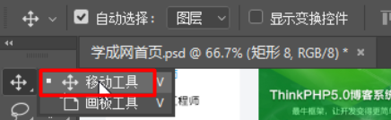

​	② 查看右侧，找到图片对应的图层，右击图层 → 快速导出为 PNG

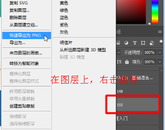


但是很多情况下,我们需要合并图层再导出:

步骤：

​	① 选中需要的若干个图层：选择一个图层，再按住shift键，继续选第二个图层:  

​	② 图层菜单 → 合并图层(ctrl+e)   

​	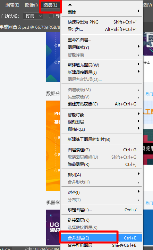

​	③ 查看右侧生成的新图层，在合并后的图层上，右击 →  快速导出为 PNG


### 1.3. 切片切图

步骤：

​	① 利用切片选中图片 ：利用切片工具手动划出

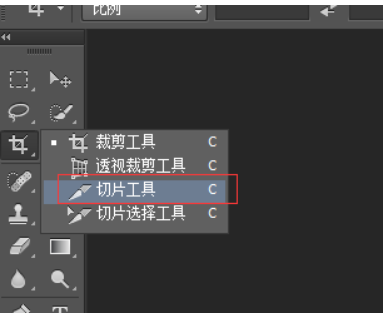 

​	② 导出选中的图片：文件菜单  →  导出  → 存储为 web 设备所用格式  →  选择我们要的图片格式 →  存储 。


​	注意：保存的时候，要选“选中的切片”：

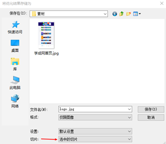 

### 1.4. 插件切图

#### 1.4.1. 介绍

Cutterman是一款运行在photoshop中的插件，能够自动将你需要的图层进行输出， 以替代传统的手工 "导出web所用格式" 以及使用切片工具进行挨个切图的繁琐流程。 

它支持各种各样的图片尺寸、格式、形态输出，方便你在pc、ios、Android等端上使用。 它不需要你记住一堆的语法、规则，纯点击操作，方便、快捷，易于上手。


#### 1.4.2. 安装

注意： **cutterman插件要求你的ps 必须是完整版**，不能是绿色版，所以大家需要从新安装完整版本。

查看 “窗口菜单”里面的“扩展功能”：

​	① 如果是扩展功能的是灰色的，表示就是绿色版的，需要重新安装PS

​	② 如果是扩展功能右侧是可以使用的，表示就是完整版的，可以安装cutterman插件快速切图

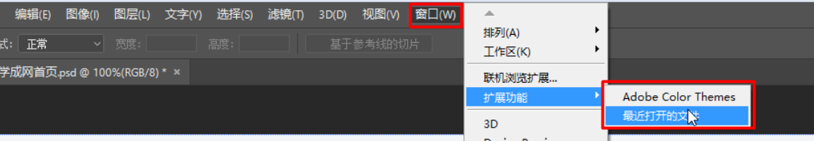


官网: http://www.cutterman.cn/zh/cutterman

当cutterman 安装完成后，重启PS，会发现扩展功能里面多了一个cutterman工具：

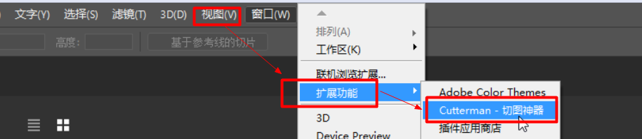


1.4.3 使用步骤

​	① 选择需要的图层

​	② 选择web端，点击web下面的下拉三角

​	③ 选择需要的图片格式

​	④ 设置好存储路径

​	⑤ 点击 “导出选中图层” 按钮

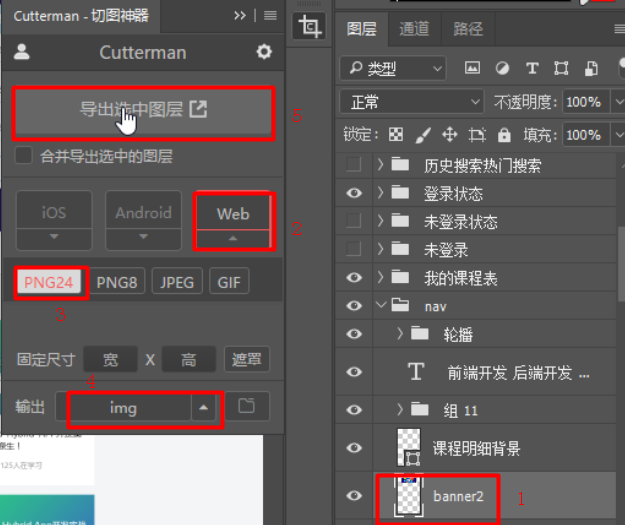 

示意图：

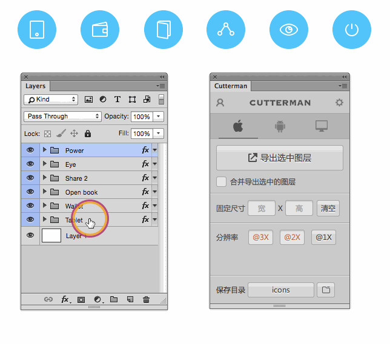 


## 2. CSS属性书写顺序（重点）

**生活中衡量一个人有气质：**

​	穿着打扮  举止言行  等等  

**编程中如何衡量一个人的代码能力**：

​	规范标准  优雅高质量 等等   一个词形容   专业    从代码中看出是否有经验..


建议遵循以下顺序：

1. **布局定位属性**：display / position / float / clear / visibility / overflow（建议 display 第一个写，毕竟关系到模式）
2. **自身属性**：width / height / margin / padding / border / background
3. **文本属性**：color / font / text-decoration / text-align / vertical-align / white- space / break-word
4. **其他属性（CSS3）**：content / cursor / border-radius / box-shadow / text-shadow / background:linear-gradient …

**举例：**

```css
 .jdc {
    display: block;
    position: relative;
    float: left;
    width: 100px;
    height: 100px;
    margin: 0 10px;
    padding: 20px 0;
    font-family: Arial, 'Helvetica Neue', Helvetica, sans-serif;
    color: #333;
    background: rgba(0,0,0,.5);
    border-radius: 10px;
 } 
```


## 3. 学成在线页面制作

页面展示：


学成在线，是典型的企业级网站。

学习学成网的目的，是为了整体感知企业级网站布局流程，带着大家复习以前的知识。


### 3.1.  前期准备素材

- 学成在线PSD源文件
- 开发工具  =  PS（切图） +  sublime（代码） + chrome（测试）

### 3.2.  前期准备工作

先把我们的前期准备工作做好， 我们本次采取结构与样式相分离思想。

1. 创建 study 目录文件夹 (用于存放我们这个页面的相关内容)。

2. 用vscode打开study目录文件夹.

3. study 目录内新建 images 文件夹，用于保存图片。

4. 新建首页文件 index.html（以后我们的网站**首页**统一命名规定为 **index.html** )。

5. 新建 style.css 样式文件。我们本次采用外链样式表。

6. 将样式引入到我们的 HTML 页面文件中。

7. 样式表写入清除内外边距的样式，来检测样式表是否引入成功。

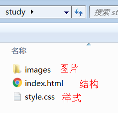 

### 3.3. 页面布局整体思路

为了提高网页制作的效率，布局时通常有以下的整体思路，具体如下：

​	1.必须确定页面的**版心**（可视区），我们**测量**可得知。

​	2.分析页面中的行模块，以及每个行模块中的列模块。其实页面布局第一准则.

​	3.一行中的列模块经常浮动布局, 先确定每个列的大小,之后确定列的位置.  页面布局第二准则

​	4.制作 HTML 结构。我们还是遵循，先有结构，后有样式的原则。结构永远最重要.

​	5.所以, 先理清楚**布局结构**,再写代码尤为重要. 这需要我们多写多积累.

### 3.4. 页面制作

**确定版心**：

​	这个页面的版心是 1200像素  ，每个版心都要水平居中对齐，所以，我们可以定义版心为公共类：

```css
.w {
    width: 1200px;
    margin: auto;
}
```

#### 3.4.1. header头部制作

**结构图如下：**

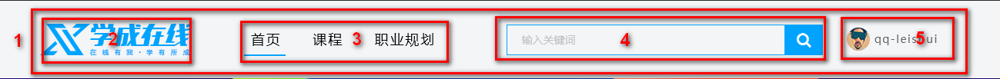

- 1号是版心盒子 **header**  1200 *  42 的盒子水平居中对齐, 上下给一个margin值就好了。
- 版心盒子 里面包含 2号盒子 **logo** 图标
- 版心盒子 里面包含 3号盒子 **nav** 导航栏
- 版心盒子 里面包含 4号盒子 **search** 搜索框
- 版心盒子 里面包含 5号盒子 **user** 个人信息
- 注意，要求里面的 **4个子盒子 必须都浮动**


**导航栏注意点:**

实际开发中，**重要的导航栏**，我们不会直接用链接a ，而是**用 li  包含链接(li+a)的做法**

​	1.li+a 语义更清晰，一看这就是有条理的列表型内容。

​	2.如果直接用a，搜索引擎容易辨别为有堆砌关键字嫌疑（故意堆砌关键字容易被搜索引擎有降权的风险），从而影响网站排名

**注意:** 

​	1.让导航栏一行显示, 给 li 加浮动, 因为 li 是块级元素, 需要一行显示.

​	2.这个nav导航栏可以不给宽度,将来可以继续添加其余文字

​	3.因为导航栏里面文字不一样多,所以最好给链接 a 左右padding 撑开盒子,而不是指定宽度 

**4号盒子search的细节：**

​	search 搜索框的意思:  一个 search 大盒子里面包含 2个 表单

​	技巧：input和button都，属于行内块元素，会有缝隙，使用浮动，可以去缝隙。

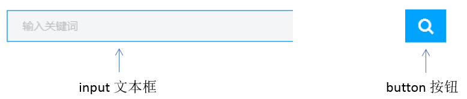

#### 3.4.2. banner制作

结构图如下：

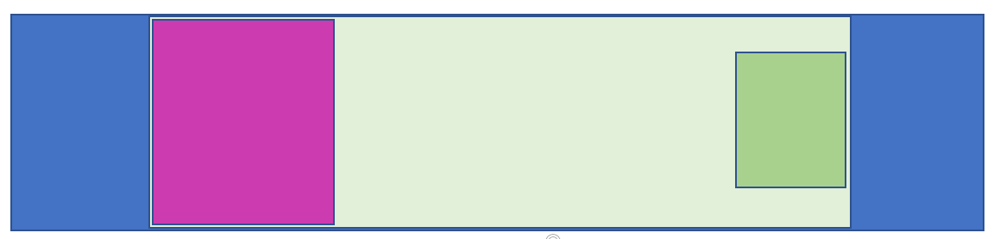

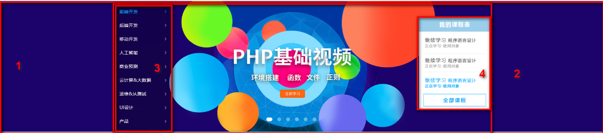


- 1号盒子是通栏的大盒子**banner**， 不给宽度，给高度，给一个蓝色背景。
- 2号盒子是版心 **w**， 要水平居中对齐。
- 3号盒子版心内，左对齐 **subnav** 侧导航栏。
- 4号盒子版心内，右对齐  **course** 课程。

##### 3.4.2.1  subnav 侧导航栏 (左侧的)

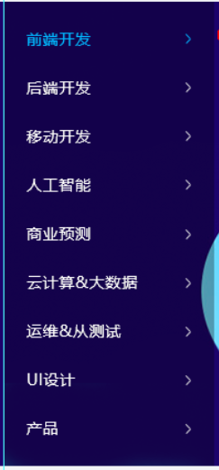   

- subnav 盒子 背景色 黑色半透明
- 重要的导航栏，li 包 a ，行高45px
- a里面包含文字和span，span右浮动
- 当鼠标经过a ，a里面的内容（文字和span）变蓝色


##### 3.4.2.2  course课程表模块 (右侧的)

结构图如下：

 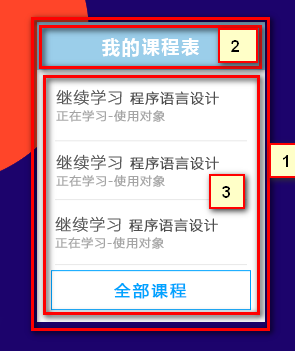

- 1号盒子 是  228 * 300 的盒子 右浮动  **注意 浮动的元素 不会有外边距塌陷的问题**
- 1号盒子内 分为 上下 两个 子盒子
- 2号子盒子是 上部分  我们命名为 course-hd    (hd  是  head  的简写 头部的意思，我们经常用)
- 3号子盒子是 下部分  我们命名为 course-bd    (bd  是  body  的简写 主体的意思，我们经常用)

#### 3.4.3. 精品推荐小模块

结构图如下：

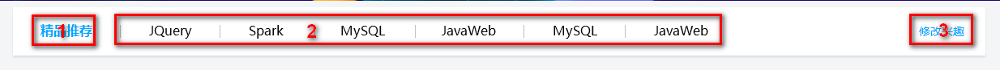

- **复习点：**  因为里面三个盒子都要垂直居中，我们利用 继承性，给 最大的盒子 一个垂直居中的代码就好了，还记得 那些 样式可以继承吗？？？ font-  line-  text- color

  

- 大盒子水平居中 goods  精品 ，注意此处有个盒子阴影

- 1号盒子是标题 H3  左侧浮动

- 2号盒子 里面放链接  左侧浮动  goods-item    距离可以控制链接的 左右外边距（注意行内元素只给左右内外边距）

- 3号盒子 右浮动 mod 修改

#### 3.4.4. 精品推荐大模块

结构图如下：

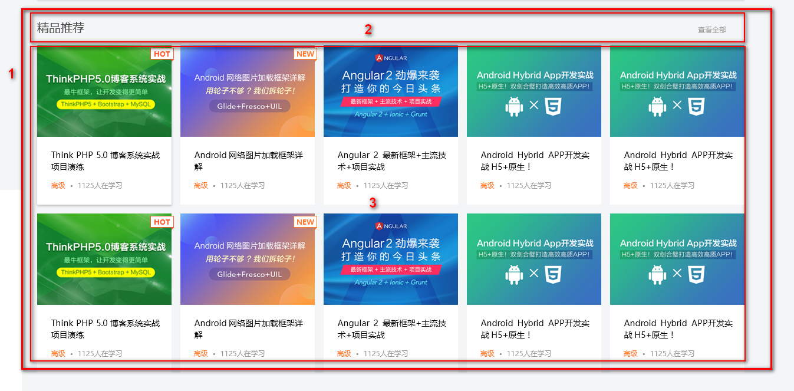

- 1号盒子为最大的盒子 **box**  版心水平居中对齐
- 2号盒子为上面部分 **box-hd**  -- 里面   左侧标题H3 左浮动   右侧 链接 a 右浮动
- 3号盒子为底下部分 **box-bd** --- 里面是无序列表 有 10个 小li 组成
- 小li 外边距的问题， 这里有个小技巧。  给box-hd 宽度为 1215 就可以一行装开5个 li了
- 复习点：我们用到清除浮动，因为 box-hd 里面的盒子个数不一定是多少，所以我们就不给高度了，但是里面的盒子浮动会影响下面的布局，因此需要清除浮动。

#### 3.4.5.  底部模块制作

结构图如下：

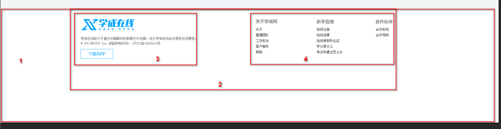

- 1号盒子通栏大盒子 底部 **footer**  给高度  底色是白色

- 2号盒子版心水平居中

- 3号盒子版权 **copyright**  左对齐 

- 4号盒子 链接组 **links**  右对齐

  

### 