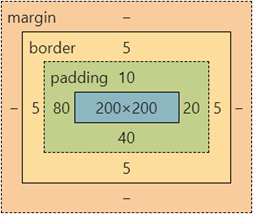
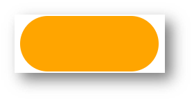
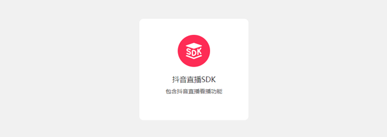

# day05-盒子模型

> 目标：掌握盒子模型组成部分，使用盒子模型布局网页区域

## 01-选择器

### 结构伪类选择器 

### 基本使用

作用：根据元素的**结构关系**查找元素。 


```css
li:first-child {
  background-color: green;
}
```

### :nth-child(公式) 


> 提示：公式中的n取值从 **0** 开始。 

### 伪元素选择器 

作用：创建**虚拟元素**（伪元素），用来**摆放装饰性的内容**。 


```css
div::before {
  content: "before 伪元素";
}
div::after {
  content: "after 伪元素";
}
```

注意点：

* 必须设置 **content: ””属性**，用来 设置伪元素的内容，如果没有内容，则**引号留空**即可
* 伪元素默认是**行内**显示模式
* **权重和标签选择器相同**

## 02-PxCook 

PxCook（像素大厨） 是一款切图设计工具软件。支持PSD文件的文字、颜色、距离自动智能识别。

* 开发面板（自动智能识别）
* 设计面板（手动测量尺寸和颜色）

使用方法：创建项目 → 输入 项目名称、项目类型 Web → 单击按钮【创建项目】 → 单击按钮【添加】，导入设计稿 


## 03-盒子模型

作用：布局网页，摆放盒子和内容。

### 盒子模型-组成

* 内容区域 – width & height
* 内边距 – padding（出现在内容与盒子边缘之间）
* 边框线 – border 
* 外边距 – margin（出现在盒子外面）

```css
div {
  margin: 50px;
  border: 5px solid brown;
  padding: 20px;
  width: 200px;
  height: 200px;
  background-color: pink;
}
```


### 边框线

#### 四个方向

属性名：**border**（bd）

属性值：边框线粗细  线条样式  颜色（不区分顺序）


```css
div {
  border: 5px solid brown;
  width: 200px;
  height: 200px;
  background-color: pink;
}
```

#### 单方向边框线 

属性名：**border-方位名词**（bd+方位名词首字母，例如，bdl）

属性值：边框线粗细  线条样式  颜色（不区分顺序）

```css
div {
  border-top: 2px solid red;
  border-right: 3px dashed green;
  border-bottom: 4px dotted blue;
  border-left: 5px solid orange;
  width: 200px;
  height: 200px;
  background-color: pink;
}
```

### 内边距 

作用：设置 内容 与 盒子边缘 之间的距离。

* 属性名：padding / padding-方位名词

```css
div {
  /* 四个方向 内边距相同 */
  padding: 30px;
  /* 单独设置一个方向内边距 */
  padding-top: 10px;
  padding-right: 20px;
  padding-bottom: 40px;
  padding-left: 80px;
  width: 200px;
  height: 200px;
  background-color: pink;
}
```

> 提示：添加 padding 会撑大盒子。

* padding 多值写法


> 技巧：从**上**开始**顺时针**赋值，当前方向没有数值则与**对面取值相同**。 

### 尺寸计算



默认情况：盒子尺寸 = 内容尺寸 + border 尺寸 + 内边距尺寸

结论：给盒子加 border / padding 会撑大盒子

解决：

* 手动做减法，减掉 border / padding 的尺寸
* 內减模式：**box-sizing: border-box**

### 外边距 

作用：拉开两个盒子之间的距离

属性名：**margin**

提示：与 padding 属性值写法、含义相同

### 版心居中


左右 margin 值 为 auto（盒子要有宽度）

```css
div {
  margin: 0 auto;
  width: 1000px;
  height: 200px;
  background-color: pink;
}
```

### 清除默认样式 


清除标签默认的样式，比如：默认的内外边距。 


```css
/* 清除默认内外边距 */
* {
  margin: 0;
  padding: 0;
  box-sizing: border-box;
}
/* 清除列表项目符号 */
li {
  list-style: none;
}
```

### 元素溢出

作用：控制溢出元素的内容的显示方式。

属性名：**overflow**


### 外边距问题

#### 合并现象

场景：**垂直**排列的兄弟元素，上下 **margin** 会**合并**

现象：取两个 margin 中的**较大值生效**


```css
.one {
  margin-bottom: 50px;
}
.two {
  margin-top: 20px;
}
```

#### 外边距塌陷

场景：父子级的标签，子级的添加 **上外边距** 会产生**塌陷**问题

现象：**导致父级一起向下移动**

```css
.son {
  margin-top: 50px;
  width: 100px;
  height: 100px;
  background-color: orange;
}
```


解决方法：

* 取消子级margin，父级设置padding
* 父级设置 overflow: hidden
* 父级设置 border-top

### 行内元素 – 内外边距问题 

场景：行内元素添加 margin 和 padding，无法改变元素垂直位置

解决方法：给行内元素添加 **line-height** 可以改变垂直位置

```css
span {
  /* margin 和 padding 属性，无法改变垂直位置 */
  margin: 50px;
  padding: 20px;
  /* 行高可以改变垂直位置 */
  line-height: 100px;
}
```

### 圆角

作用：设置元素的外边框为圆角。

属性名：**border-radius**

属性值：数字+px / 百分比

提示：属性值是圆角半径


* 多值写法


> 技巧：从左上角开始顺时针赋值，当前角没有数值则与对角取值相同。 

* 正圆形状：给正方形盒子设置圆角属性值为 **宽高的一半 / 50%**

```css
img {
  width: 200px;
  height: 200px;
  
  border-radius: 100px;
  border-radius: 50%;
}
```


* 胶囊形状：给长方形盒子设置圆角属性值为 盒子高度的一半 

```css
div {
  width: 200px;
  height: 80px;
  background-color: orange;
  border-radius: 40px;
}
```



### 盒子阴影（拓展）

作用：给元素设置阴影效果

属性名：**box-shadow**

属性值：X 轴偏移量  Y 轴偏移量  模糊半径  扩散半径  颜色  内外阴影

注意： 

* X 轴偏移量 和 Y 轴偏移量 必须书写
* 默认是外阴影，内阴影需要添加 inset

```css
div {
  width: 200px;
  height: 80px;
  background-color: orange;
  box-shadow: 2px 5px 10px 0 rgba(0, 0, 0, 0.5) inset;
}
```

## 04-综合案例-产品卡片



CSS 书写顺序：

1. 盒子模型属性
2. 文字样式
3. 圆角、阴影等修饰属性

### HTML标签

```html
<div class="product">
  
  <h4>抖音直播SDK</h4>
  <p>包含抖音直播看播功能</p>
</div>
```


### CSS样式

```html
<style>
  * {
    margin: 0;
    padding: 0;
    box-sizing: border-box;
  }

  body {
    background-color: #f1f1f1;
  }

  .product {
    margin: 50px auto;
    padding-top: 40px;

    width: 270px;
    height: 253px;
    background-color: #fff;
    text-align: center;

    border-radius: 10px;
  }

  .product h4 {
    margin-top: 20px;
    margin-bottom: 12px;
    font-size: 18px;
    color: #333;
    font-weight: 400;
  }

  .product p {
    font-size: 12px;
    color: #555;
  }
</style>
```

## 05-综合案例二 – 新闻列表 


### 整体布局

```html
<style>
* {
  margin: 0;
  padding: 0;
  box-sizing: border-box;
}

li {
  list-style: none;
}

a {
  text-decoration: none;
}

.news {
  margin: 100px auto;
  width: 360px;
  height: 200px;
  /* background-color: pink; */
}
</style>

<div class="news"></div>
```

### 标题区域

```html
<style>
.news .hd {
  height: 34px;
  background-color: #eee;
  border: 1px solid #dbdee1;
  border-left: 0;
}

.news .hd a {
  /* -1 盒子向上移动 */
  margin-top: -1px;
  display: block;
  border-top: 3px solid #ff8400;
  border-right: 1px solid #dbdee1;
  width: 48px;
  height: 34px;
  background-color: #fff;

  text-align: center;
  line-height: 32px;
  font-size: 14px;
  color: #333;
}
</style>

<div class="hd"><a href="#">新闻</a></div>
```

### 内容区域

```html
<style>
.news .bd {
  padding: 5px;
}

.news .bd li {
  padding-left: 15px;
  background-image: url(./images/square.png);
  background-repeat: no-repeat;
  background-position: 0 center;
}

.news .bd li a {
  padding-left: 20px;
  background: url(./images/img.gif) no-repeat 0 center;

  font-size: 12px;
  color: #666;
  line-height: 24px;
}

.news .bd li a:hover {
  color: #ff8400;
}
</style>

<div class="bd">
  <ul>
    <li><a href="#">点赞“新农人” 温暖的伸手</a></li>
    <li><a href="#">在希望的田野上...</a></li>
    <li><a href="#">“中国天眼”又有新发现 已在《自然》杂志发表</a></li>
    <li><a href="#">急！这个领域，缺人！月薪4万元还不好招！啥情况？</a></li>
    <li><a href="#">G9“带货”背后：亏损面持续扩大，竞争环境激烈</a></li>
    <li><a href="#">多地力推二手房“带押过户”，有什么好处？</a></li>
  </ul>
</div>
```


