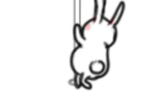
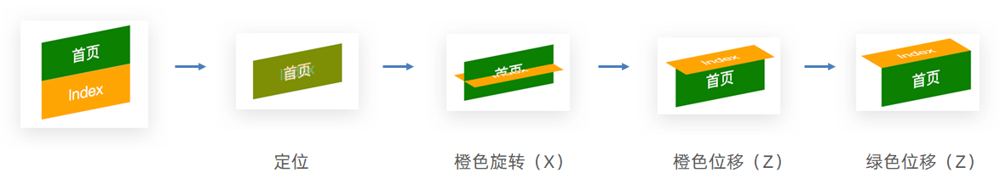
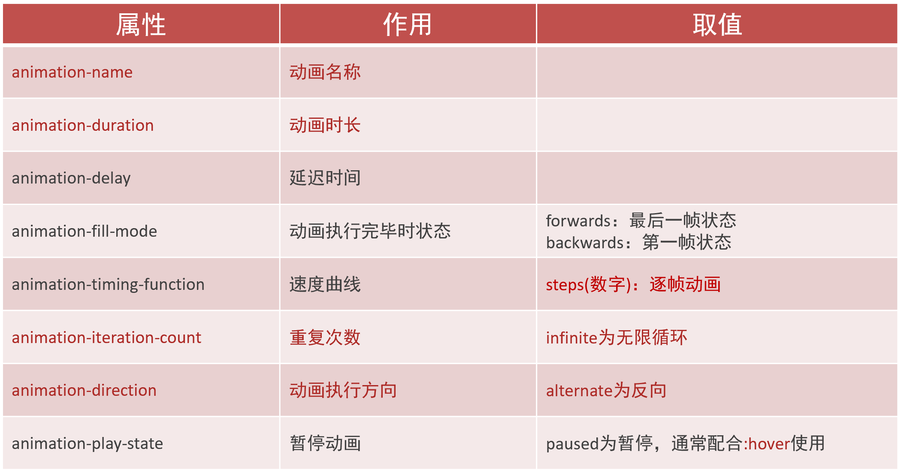
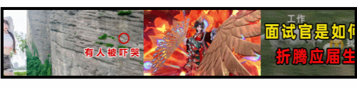

# 移动 Web 第一天

## 01-空间转换

###  空间转换简介

* 空间：是从坐标轴角度定义的 X 、Y 和 Z 三条坐标轴构成了一个立体空间，Z 轴位置与视线方向相同。
* 空间转换也叫 3D转换
* 属性：transform


### 平移

 ```css
transform: translate3d(x, y, z);
transform: translateX();
transform: translateY();
transform: translateZ();
 ```

> 取值与平面转换相同
>
> 默认情况下，Z 轴平移没有效果，原因：电脑屏幕默认是平面，无法显示 Z 轴平移效果

### 视距

作用：指定了观察者与 Z=0 平面的距离，为元素添加透视效果

透视效果：近大远小、近实远虚

属性：(添加给父级，取值范围 800-1200)

```css
perspective: 视距;
```


### 旋转

* Z 轴：rotateZ()


* X 轴：rotateX()


* Y 轴：rotateY()



### 左手法则

作用：根据旋转方向确定取值正负

使用：左手握住旋转轴, 拇指指向正值方向, 其他四个手指弯曲方向为旋转正值方向 


### rotate3d-了解

* rotate3d(x, y, z, 角度度数) ：用来设置自定义旋转轴的位置及旋转的角度
* x，y，z 取值为0-1之间的数字

### 立体呈现

作用：设置元素的子元素是位于 3D 空间中还是平面中

属性名：transform-style

属性值：

* flat：子级处于平面中
* preserve-3d：子级处于 3D 空间

### 案例-3d导航


案例步骤：

1. 搭建立方体
   1. 绿色是立方体的前面
   2. 橙色是立方体的上面
2. 鼠标悬停，立方体旋转




```css
.nav li {
  position: relative;
  width: 100px;
  height: 40px;
  line-height: 40px;
  transition: all 0.5s;

  transform-style: preserve-3d;

  /* 为了看到橙色和绿色的移动过程，给立方体添加旋转 */
  /* transform: rotateX(-20deg) rotateY(30deg); */
}

.nav li a {
  position: absolute;
  left: 0;
  top: 0;
  display: block;
  width: 100%;
  height: 100%;
  text-align: center;
  text-decoration: none;
  color: #fff;
}

/* 立方体每个面都有独立的坐标轴，互不影响 */
.nav li a:first-child {
  background-color: green;
  transform: translateZ(20px);
}

.nav li a:last-child {
  background-color: orange;
  transform: rotateX(90deg) translateZ(20px);
}

.nav li:hover {
  transform: rotateX(-90deg);
}
```

### 缩放

```css
transform: scale3d(x, y, z);
transform: scaleX();
transform: scaleY();
transform: scaleZ();
```


## 02-动画

* 过渡：实现两个状态间的变化过程
* 动画：实现多个状态间的变化过程，动画过程可控（重复播放、最终画面、是否暂停）

### 动画实现步骤

1. 定义动画

```css
/* 方式一 */
@keyframes 动画名称 {
  from {}
  to {}
}

/* 方式二 */
@keyframes 动画名称 {
  0% {}
  10% {}
  ......
  100% {}
}
```

2. 使用动画

```css
animation: 动画名称 动画花费时长;
```

### animation复合属性


提示：

* 动画名称和动画时长必须赋值
* 取值不分先后顺序
* 如果有两个时间值，第一个时间表示动画时长，第二个时间表示延迟时间

### animation拆分写法



### 案例-走马灯



* HTML 结构

```html
<li></li>
<li></li>
<li></li>
<li></li>
<li></li>
<li></li>
<li></li>
<!-- 替身：填补显示区域的露白 -->
<li></li>
<li></li>
<li></li>
```

* CSS 样式

```css
.box {
  width: 600px;
  height: 112px;
  border: 5px solid #000;
  margin: 100px auto;
  overflow: hidden;
}

.box ul {
  display: flex;
  animation: move 6s infinite linear;
}

/* 定义位移动画；ul使用动画；鼠标悬停暂停动画 */
@keyframes move {
  0% {
    transform: translate(0);
  }
  100% {
    transform: translate(-1400px);
  }
}

.box:hover ul {
  animation-play-state: paused;
}
```

> 无缝动画原理：复制开头图片到结尾位置（图片累加宽度 = 区域宽度） 

### 精灵动画

* 核心


* 制作步骤

  1.准备显示区域

  盒子尺寸与一张精灵小图尺寸相同

  2.定义动画

  移动背景图（移动距离 = 精灵图宽度）

  3.使用动画

  steps(N)，N 与精灵小图个数相同 

```css
div {
  width: 140px;
  height: 140px;
  border: 1px solid #000;
  background-image: url(./images/bg.png);
  animation: run 1s steps(12) infinite;
}

@keyframes run {
  from {
    background-position: 0 0;
  }
  to {
    background-position: -1680px 0;
  }
}
```

### 多组动画

```css
animation: 
  动画一,
  动画二,
  ... ...
;
```


## 03-综合案例-全名出游


### 背景

```css
/* 大背景 */
/* 默认状态HTML和body的高度是0，所以导致cover缩放背景图不成功 */
html {
  height: 100%;
}
body {
  height: 100%;
  background: url(../images/f1_1.jpg) no-repeat center 0 / cover;
  /* background-size: cover; */
}
```

### 云彩位置和动画

* HTML 结构

```html
<!-- 云 -->
<div class="cloud">
  
  
  
</div>
```

* CSS 样式

```css
/* 云 */
.cloud img {
  position: absolute;
  left: 50%;
}

.cloud img:nth-child(1) {
  margin-left: -250px;
  top: 20px;
  animation: cloud 1s infinite alternate linear;
}
.cloud img:nth-child(2) {
  margin-left: 400px;
  top: 100px;
  animation: cloud 1s infinite alternate linear 0.4s;
}
.cloud img:nth-child(3) {
  margin-left: -550px;
  top: 200px;
  animation: cloud 1s infinite alternate linear 0.6s;
}

@keyframes cloud {
  100% {
    transform: translate(20px);
  }
}
```

### 文字动画

* HTML 结构

```html
<!-- 文字 -->
<div class="text">
  
</div>
```

* CSS 样式

```css
/* 文字 */
.text img {
  position: absolute;
  left: 50%;
  top: 50%;
  transform: translate(-50%, -50%);
  animation: text 1s;
}

/* 默认 → 小 → 大 → 小 → 默认 */
@keyframes text {
  0% {
    transform: translate(-50%, -50%) scale(1);
  }
  20% {
    transform: translate(-50%, -50%) scale(0.1);
  }
  40% {
    transform: translate(-50%, -50%) scale(1.4);
  }
  70% {
    transform: translate(-50%, -50%) scale(0.8);
  }
  100% {
    transform: translate(-50%, -50%) scale(1);
  }
}
```

