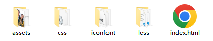

# 移动 Web 第四天

## 01-vw适配方案

### vw和vh基本使用

vw和vh是相对单位，相对视口尺寸计算结果

* vw：viewport width（1vw = 1/100视口宽度 ）
* vh：lviewport height ( 1vh = 1/100视口高度 )

### vw布局

vw单位的尺寸 = px 单位数值 / ( 1/100 视口宽度 ) 

### vh问题

vh是1/100视口高度，全面屏视口高度尺寸大，如果混用可能会导致盒子变形 

## 02-综合案例-酷我音乐 


### 准备工作



* HTML 结构

```html
<link rel="stylesheet" href="./iconfont/iconfont.css">
<link rel="stylesheet" href="./css/index.css">
```

* less 样式

```less
// out: ../css/

@import "./base";
```

### 头部布局

* HTML 结构

```html
<!-- 头部 -->
<header>
  <div class="left">left</div>
  <a href="#">下载APP</a>
</header>
```

* less 样式

```less
body {
  background-color: #f9fafb;
}

@vw:3.75vw;

// 头部
header {
  display: flex;
  justify-content: space-between;
  align-items: center;
  padding: 0 (15 / @vw);
  height: (50 / @vw);
  background-color: #fff;
}
```

### 头部内容

* less 样式

```less
header {
  // 左边
  .left {
    width: (235 / @vw);
    height: (50 / @vw);
    background-image: url(../assets/head.png);
    background-size: contain;
    background-repeat: no-repeat;
  }
  a {
    width: (80 / @vw);
    height: (30 / @vw);
    background-color: #ffe31b;
    border-radius: (15 / @vw);
    text-align: center;
    line-height: (30 / @vw);
    font-size: (14 / @vw);
  }
}
```

### 搜索区域

* HTML 结构

```html
<!-- 搜索 -->
<div class="search">
  <div class="txt">
    <span class="iconfont icon-sousuo"></span>
    <span>搜索你想听的歌曲</span>
  </div>
</div>
```

* less 样式

```less
// 搜索
.search {
  padding: (10 / @vw) (15 / @vw);
  height: (52 / @vw);
  // background-color: pink;
  .txt {
    height: (32 / @vw);
    background-color: #f2f4f5;
    border-radius: (16 / @vw);
    text-align: center;
    line-height: (32 / @vw);
    color: #a1a4b3;
    font-size: (14 / @vw);
    .iconfont {
      font-size: (16 / @vw);
    }
  }
}
```

### banner 区域

* HTML 结构

```html
<!-- banner -->
<div class="banner">
  <ul>
    <li><a href="#"></a></li>
  </ul>
</div>
```

* less 样式

```less
// banner
.banner {
  padding: 0 (15 / @vw);
  height: (108 / @vw);
  // background-color: pink;
  ul {
    li {
      width: (345 / @vw);
      height: (108 / @vw);
      img {
        width: 100%;
        height: 100%;
        // cover完全覆盖
        // 缩放img，图片比例跟父级盒子比例不同，避免图片挤压变形
        object-fit: cover;
        border-radius: (5 / @vw);
      }
    }
  }
}
```

### 标题公共样式

* HTML 结构

```html
<!-- 排行榜 -->
<div class="list">
  <!-- 标题 -->
  <div class="title">
    <h4>酷我排行榜</h4>
    <a href="#">更多<span class="iconfont icon-right"></span></a>
  </div>
</div>
```

* less 样式

```less
// 排行榜
.list {
  margin-top: (20 / @vw);
  padding: 0 (15 / @vw);
}

// 标题 → 公共样式
.title {
  display: flex;
  justify-content: space-between;
  margin-bottom: (16 / @vw);
  line-height: (25 / @vw);
  h4 {
    font-size: (20 / @vw);
  }
  a {
    font-size: (12 / @vw);
    color: #a1a4b3;
  }
}
```

### 排行榜内容

* HTML 结构

```html
<!-- 内容 -->
<div class="content">
  <ul>
    <li>
      <div class="pic"></div>
      <div class="txt">
        <a href="#" class="more">酷我热歌榜<span class="iconfont icon-right"></span></a>
        <a href="#">1.樱花树下的约定（完整版） - 旺仔小乔</a>
        <a href="#">2.就让这大雨全都落下 - 容祖儿</a>
        <a href="#">3.缺氧 - 轩姨（相信光）</a>
      </div>
    </li>
    <li>
      <div class="pic"></div>
      <div class="txt">
        <a href="#" class="more">酷我新歌榜<span class="iconfont icon-right"></span></a>
        <a href="#">1.樱花树下的约定（完整版） - 旺仔小乔</a>
        <a href="#">2.就让这大雨全都落下 - 容祖儿</a>
        <a href="#">3.缺氧 - 轩姨（相信光）</a>
      </div>
    </li>
    <li>
      <div class="pic"></div>
      <div class="txt">
        <a href="#" class="more">酷我飙升榜<span class="iconfont icon-right"></span></a>
        <a href="#">1.樱花树下的约定（完整版） - 旺仔小乔</a>
        <a href="#">2.就让这大雨全都落下 - 容祖儿</a>
        <a href="#">3.缺氧 - 轩姨（相信光）</a>
      </div>
    </li>
  </ul>
</div>
```

* less 样式

```less
// 排行榜
.list {
  margin-top: (20 / @vw);
  padding: 0 (15 / @vw);
  li {
    display: flex;
    margin-bottom: (16 / @vw);
    height: (105 / @vw);
    background-color: #fff;
    border-radius: (10 / @vw);
    .pic {
      margin-right: (20 / @vw);
      img {
        width: (105 / @vw);
        height: (105 / @vw);
        border-radius: (10 / @vw);
      }
    }
    .txt {
      a {
        display: block;
        font-size: (12 / @vw);
        color: #a1a4b3;
        line-height: 1.8;
      }

      .more {
        font-size: (14 / @vw);
        color: #333;
        .iconfont {
          font-size: (16 / @vw);
        }
      }
    }
  }
}
```

### 推荐歌单布局

* HTML 结构

```html
<!-- 推荐歌单 -->
<div class="recommend">
  <!-- 标题 -->
  <div class="title">
    <h4>推荐歌单</h4>
    <a href="#">更多<span class="iconfont icon-right"></span></a>
  </div>
  <!-- 内容 -->
  <div class="content">
    <ul>
      <li>1</li>
      <li>1</li>
      <li>1</li>
      <li>1</li>
      <li>1</li>
      <li>1</li>
    </ul>
  </div>
</div>
```

* less 样式

```less
// 推荐歌单
.recommend {
  padding: 0 (15 / @vw);
  ul {
    display: flex;
    flex-wrap: wrap;
    justify-content: space-between;
    li {
      margin-bottom: (16 / @vw);
      width: (105 / @vw);
      height: (143 / @vw);
      background-color: pink;
    }
  }
}
```

### 推荐歌单内容

* HTML 结构

```html
<li>
  <div class="pic">
    
    <div class="cover">18.2W</div>
  </div>
  <div class="txt">抖音嗨爆DJ！劲爆旋律萦绕双耳</div>
</li>
<li>
  <div class="pic">
    
    <div class="cover">18.2W</div>
  </div>
  <div class="txt">抖音嗨爆DJ！劲爆旋律萦绕双耳</div>
</li>
<li>
  <div class="pic">
    
    <div class="cover">18.2W</div>
  </div>
  <div class="txt">抖音嗨爆DJ！劲爆旋律萦绕双耳</div>
</li>
<li>
  <div class="pic">
    
    <div class="cover">18.2W</div>
  </div>
  <div class="txt">抖音嗨爆DJ！劲爆旋律萦绕双耳</div>
</li>
<li>
  <div class="pic">
    
    <div class="cover">18.2W</div>
  </div>
  <div class="txt">抖音嗨爆DJ！劲爆旋律萦绕双耳</div>
</li>
<li>
  <div class="pic">
    
    <div class="cover">18.2W</div>
  </div>
  <div class="txt">抖音嗨爆DJ！劲爆旋律萦绕双耳</div>
</li>
```

* less 样式

```less
// 图片
.pic {
  position: relative;
  width: (105 / @vw);
  height: (105 / @vw);
  img {
    width: 100%;
    height: 100%;
    object-fit: cover;
    border-radius: (10 / @vw);
  }
  .cover {
    position: absolute;
    left: 0;
    bottom: 0;
    width: (70 / @vw);
    height: (28 / @vw);
    background-color: rgba(0,0,0,0.8);
    border-radius: 0 (10 / @vw) 0 (10 / @vw);
    text-align: center;
    line-height: (28 / @vw);
    color: #fff;
    font-size: (14 / @vw);
  }
}
// 文字
.txt {
  font-size: (14 / @vw);
}
```

### 下载区域

* HTML 结构

```html
<!-- 安装，下载 -->
<div class="download">
  
  <p>安装酷我音乐 发现更多好音乐</p>
  <span class="iconfont icon-right"></span>
</div>
```

* less 样式

```less
// 下载
.download {
  position: fixed;
  left: (15 / @vw);
  bottom: (30 / @vw);

  display: flex;
  align-items: center;
  padding: 0 (10 / @vw) 0 (15 / @vw);
  width: (345 / @vw);
  height: (45 / @vw);
  background-color: #fff;
  border-radius: (22 / @vw);
  img {
    margin-right: (10 / @vw);
    width: (36 / @vw);
    height: (36 / @vw);
  }
  p {
    flex: 1;
    font-size: (14 / @vw);
  }
  span {
    width: (32 / @vw);
    height: (32 / @vw);
    background-color: #f2f3f5;
    border-radius: 50%;
    text-align: center;
    line-height: (32 / @vw);
    font-size: (16 / @vw);
  }
}
```

### 头部固定

* less 样式

```less
// 头部
header {
  position: fixed;
  left: 0;
  top: 0;
  display: flex;
  justify-content: space-between;
  align-items: center;
  padding: 0 (15 / @vw);
  // 固定定位的盒子，宽度靠内容撑开，希望宽度100%
  width: 100%;
  height: (50 / @vw);
  background-color: #fff;
}

// 搜索
.search {
  // 头部固定定位，脱标不占位，搜索去最顶了，加上外边距挤下来即可
  margin-top: (50 / @vw);
  padding: (10 / @vw) (15 / @vw);
  height: (52 / @vw);
}
```

