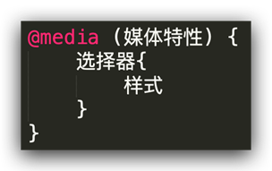
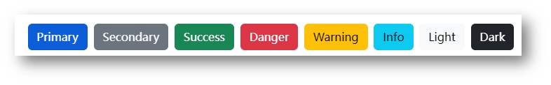
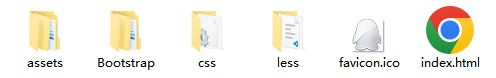

# 移动 Web 第五天

响应式布局方案

* 媒体查询
* Bootstrap框架

## 01-媒体查询

### 基本写法



* max-width：最大宽度（小于等于）
* min-width：最小宽度（大于等于）

### 书写顺序

* min-width（从小到大）
* max-width（从大到小）

### 案例-左侧隐藏

需求：网页宽度小于等于768px则隐藏左侧区域


* HTML 结构

```css
<div class="box">
  <div class="left">left</div>
  <div class="main">
    响应式网页效果响应式网页效果响应式网页效果响应式网页效果响应式网页效果响应式网页效果响应式网页效果响应式网页效果响应式网页效果响应式网页效果响应式网页效果响应式网页效果响应式网页效果响应式网页效果响应式网页效果响应式网页效果响应式网页效果响应式网页效果响应式网页效果响应式网页效果响应式网页效果响应式网页效果响应式网页效果响应式网页效果响应式网页效果响应式网页效果响应式网页效果响应式网页效果响应式网页效果响应式网页效果响应式网页效果响应式网页效果响应式网页效果响应式网页效果响应式网页效果响应式网页效果响应式网页效果响应式网页效果响应式网页效果响应式网页效果响应式网页效果响应式网页效果响应式网页效果响应式网页效果响应式网页效果响应式网页效果响应式网页效果响应式网页效果
  </div>
</div>
```

* CSS 样式

```css
.box {
  display: flex;
}

.left {
  width: 300px;
  height: 500px;
  background-color: pink;
}

.main {
  flex: 1;
  height: 500px;
  background-color: skyblue;
}

@media (max-width: 768px) {
  .left {
    display: none;
  }
}
```

### 媒体查询-完整写法


#### 关键词 / 逻辑操作符

* and
* only
* not

#### 媒体类型

媒体类型用来区分设备类型

* screen：屏幕设备
* 打印预览：print
* 阅读器：speech
* 不区分类型：all

#### 媒体特性

* 视口宽高：width / height
* 视口最大宽高：max-width ；max-height
* 视口最小宽高：min-width；min-height
* 屏幕方向：orientation
  * protrait：竖屏
  * landscape：横屏

### 媒体查询-外部CSS


## 02-Bootstrap

### 简介

Bootstrap 是由 Twitter 公司开发维护的前端 UI 框架，它提供了大量编写好的 CSS 样式，允许开发者结合一定 HTML 结构及JavaScript，快速编写功能完善的网页及常见交互效果。 

中文官网: <https://www.bootcss.com/> 

### 使用步骤

#### 下载

下载：Bootstrap V5中文文档 → 进入中文文档 → 下载 →下载 Bootstrap 生产文件


#### 使用

1. 引入 Bootstrap CSS 文件

```html
<link rel="stylesheet" href="./Bootstrap/css/bootstrap.min.css">
```

2. 调用类名： container 响应式布局版心类

```html
<div class="container">测试</div>
```

### 栅格系统

作用：响应式布局

栅格化是指将整个网页的宽度分成12等份，每个盒子占用的对应的份数

例如：一行排4个盒子，则每个盒子占 3份 即可（12 / 4 = 3）


* row 类：行，可以让内容在一行排（flex布局）

### 全局样式

#### 按钮



类名

* btn：默认样式
* btn-success：成功
* btn-warning：警告
* ……
* 按钮尺寸：btn-lg / btn-sm

#### 表格


表格类：

* table：默认样式
* table-striped：隔行变色
* table-success：表格颜色
* ……

### 组件

1.引入样式表

2.引入 js 文件

3.复制结构，修改内容

### 字体图标

#### 下载

导航 / Extend：图标库 → 安装 → 下载安装包 → [bootstrap-icons-1.X.X.zip](https://github.com/twbs/icons/releases/download/v1.10.3/bootstrap-icons-1.10.3.zip)

#### 使用

1. 复制 fonts 文件夹到项目目录
2. 网页引入 bootstrap-icons.css 文件
3. 调用 CSS 类名（图标对应的类名）

```html
<i class="bi-android2"></i>
```

## 03-综合案例-alloyTeam

### 准备工作



* HTML 结构

```html
<title>腾讯全端</title>
<link rel="shortcut icon" href="favicon.ico" type="image/x-icon">
<!-- 层叠性：咱们的css 要 层叠 框架的 -->
<link rel="stylesheet" href="./Bootstrap/css/bootstrap.min.css">
<link rel="stylesheet" href="./Bootstrap/font/bootstrap-icons.css">
<link rel="stylesheet" href="./css/index.css">


<script src="./Bootstrap/js/bootstrap.min.js"></script>
```

* less 样式

```less
// out: ../css/
```

### 头部导航

* HTML 结构

```html
<!-- 导航 -->
<nav class="navbar navbar-expand-lg bg-body-tertiary fixed-top">
  <div class="container">
    <a class="navbar-brand" href="#"></a>
    <button class="navbar-toggler" type="button" data-bs-toggle="collapse" data-bs-target="#navbarNav" aria-controls="navbarNav" aria-expanded="false" aria-label="Toggle navigation">
      <span class="navbar-toggler-icon"></span>
    </button>
    <div class="collapse navbar-collapse" id="navbarNav">
      <ul class="navbar-nav">
        <li class="nav-item">
          <a class="nav-link active" aria-current="page" href="#">首页</a>
        </li>
        <li class="nav-item">
          <a class="nav-link" href="#">博客</a>
        </li>
        <li class="nav-item">
          <a class="nav-link" href="#">Github</a>
        </li>
        <li class="nav-item">
          <a class="nav-link" href="#">TWeb Conf</a>
        </li>
        <li class="nav-item">
          <a class="nav-link" href="#">SuperStar</a>
        </li>
        <li class="nav-item">
          <a class="nav-link" href="#">Web前端导航</a>
        </li>
        <li class="nav-item">
          <a class="nav-link" href="#">关于</a>
        </li>
      </ul>
    </div>
  </div>
</nav>
```

* less 样式

```less
// 导航
.bg-body-tertiary {
  background-color: transparent !important;
  .navbar-collapse {
    flex-grow: 0;
  }
}
```

### 轮播图图片

* HTML 结构

```html
<!-- 轮播图 -->
<div id="carouselExampleIndicators" class="carousel slide">
  <div class="carousel-indicators">
    <button type="button" data-bs-target="#carouselExampleIndicators" data-bs-slide-to="0" class="active" aria-current="true" aria-label="Slide 1"></button>
    <button type="button" data-bs-target="#carouselExampleIndicators" data-bs-slide-to="1" aria-label="Slide 2"></button>
    <button type="button" data-bs-target="#carouselExampleIndicators" data-bs-slide-to="2" aria-label="Slide 3"></button>
    <button type="button" data-bs-target="#carouselExampleIndicators" data-bs-slide-to="3" aria-label="Slide 4"></button>
  </div>
  <div class="carousel-inner">
    <div class="carousel-item active">
      
    </div>
    <div class="carousel-item">
      
    </div>
    <div class="carousel-item">
      
    </div>
    <div class="carousel-item">
      
    </div>
  </div>
  <button class="carousel-control-prev" type="button" data-bs-target="#carouselExampleIndicators" data-bs-slide="prev">
    <span class="carousel-control-prev-icon" aria-hidden="true"></span>
    <span class="visually-hidden">Previous</span>
  </button>
  <button class="carousel-control-next" type="button" data-bs-target="#carouselExampleIndicators" data-bs-slide="next">
    <span class="carousel-control-next-icon" aria-hidden="true"></span>
    <span class="visually-hidden">Next</span>
  </button>
</div>
```

* less 样式

```less
.carousel {
  .carousel-item {
    height: 500px;
    background-size: cover;
    background-position: center 0;
  }
  .carousel-item:nth-child(1) {
    background-image: url(../assets/uploads/banner_1.jpg);
  }
  .carousel-item:nth-child(2) {
    background-image: url(../assets/uploads/banner_2.jpg);
  }
  .carousel-item:nth-child(3) {
    background-image: url(../assets/uploads/banner_3.jpg);
  }
  .carousel-item:nth-child(4) {
    background-image: url(../assets/uploads/banner_4.jpg);
  }
}
```

### 轮播图响应式

* less 样式

```less
// 轮播图: 小于768图片高度250 max；大于等于768图片高度400 min；大于等于992图片高度500
.carousel {
  // 响应式 → 媒体查询
  @media (max-width: 768px) {
    .carousel-item {
      height: 250px;
    }
  }

  @media (min-width: 768px) {
    .carousel-item {
      height: 400px;
    }
  }
  @media (min-width: 992px) {
    .carousel-item {
      height: 500px;
    }
  }


  .carousel-item {
    // height: 500px;
    background-size: cover;
    background-position: center 0;
  }
}
```

### 开源项目响应式

* HTML 结构

```html
<!-- 开源项目 -->
<div class="project container">
  <div class="title">
    <h2>OpenSource / 开源项目</h2>
    <p>种类众多的开源项目，让你爱不释手</p>
  </div>
  <div class="content">
    <div class="row">
      <div class="col-lg-3 col-md-6">1</div>
      <div class="col-lg-3 col-md-6">2</div>
      <div class="col-lg-3 col-md-6">3</div>
      <div class="col-lg-3 col-md-6">4</div>
    </div>
  </div>
</div>
```

* less 样式

```less
// 开源项目
// 视口宽度大于992；一行排4个盒子  col-lg-3
// 视口宽度大于768；一行排2个盒子  col-md-6
.project {
  margin-top: 60px;
  text-align: center;
}
```

### 开源项目内容布局

* HTML 结构

```html
<!-- 开源项目 -->
<div class="project container">
  <div class="title">
    <h2>OpenSource / 开源项目</h2>
    <p>种类众多的开源项目，让你爱不释手</p>
  </div>
  <div class="content">
    <div class="row">
      <div class="col-lg-3 col-md-6"><a href="#">1</a></div>
      <div class="col-lg-3 col-md-6"><a href="#">1</a></div>
      <div class="col-lg-3 col-md-6"><a href="#">1</a></div>
      <div class="col-lg-3 col-md-6"><a href="#">1</a></div>
    </div>
  </div>
</div>
```

* less 样式

```less
.project {
  margin-top: 60px;
  text-align: center;
  .row {
    div {
      margin-bottom: 10px;
      height: 200px;
      // background-color: pink;
      a {
        // 块级的宽度和父级一样大
        display: block;
        height: 200px;
        background-color: green;
        border-radius: 4px;
      }

      &:nth-child(1) a {
        background-color: #70c3ff;
      }
      &:nth-child(2) a {
        background-color: #fd6a7f;
      }
      &:nth-child(3) a {
        background-color: #7f8ea0;
      }
      &:nth-child(4) a {
        background-color: #89d04f;
      }
    }
  }
}
```

