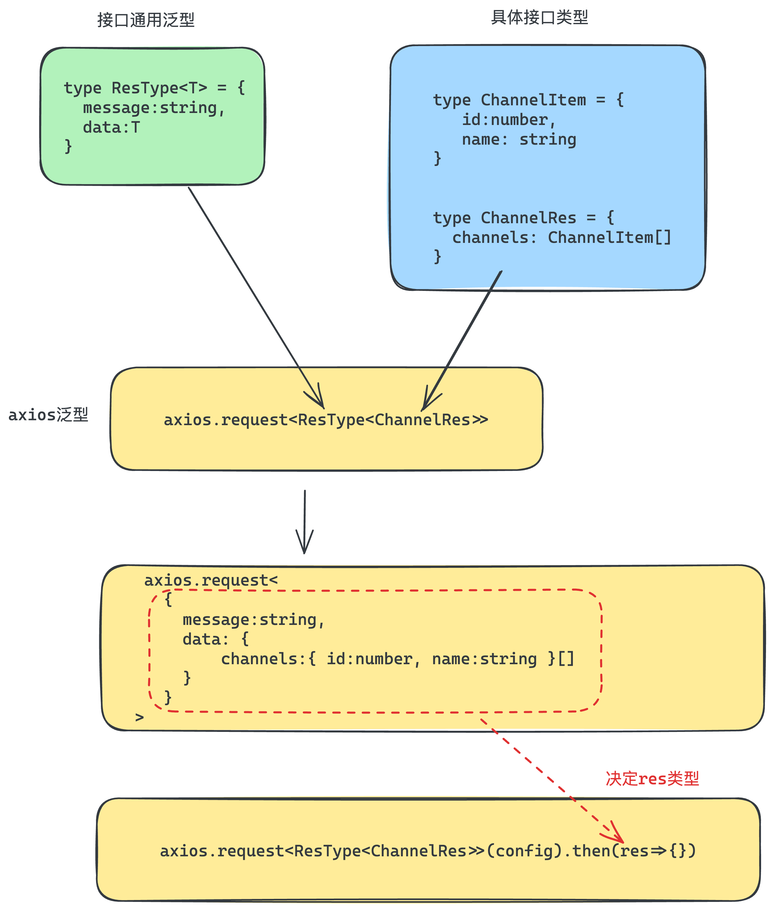

# 初始化项目
```bash
npm create vite@latest react-jike-mobile -- --template react-ts
```
## 安装依赖包
```bash
npm i 
```
## 清理项目目录结构

# 安装 antd-mobile
```bash
npm install --save antd-mobile
```
## 测试组件
```bash
import { Button } from 'antd-mobile'

function App() {
  return (
    <>
      <Button>click me </Button>
    </>
  )
}

export default App
```

# 初始化路由
## 安装路由
```bash
npm i react-router-dom
```

## 配置基础路由
```tsx
const List = () => {
  return <div>this is List</div>
}

export default List
```

```tsx
const Detail = () => {
  return <div>this is Detail</div>
}

export default Detail
```

```tsx
import { createBrowserRouter } from 'react-router-dom'
import List from '../pages/List'
import Detail from '../pages/Detail'

const router = createBrowserRouter([
  {
    path: '/',
    element: <List />,
  },
  {
    path: '/detail',
    element: <Detail />,
  },
])

export default router
```

```tsx
import ReactDOM from 'react-dom/client'
import { RouterProvider } from 'react-router-dom'
import router from './router/index.tsx'

ReactDOM.createRoot(document.getElementById('root')!).render(
  <RouterProvider router={router} />
)
```
# 配置路径别名
## 修改vite配置
```javascript
import { defineConfig } from 'vite'
import react from '@vitejs/plugin-react'
import path from 'path'

// https://vitejs.dev/config/
export default defineConfig({
  plugins: [react()],
  resolve: {
    alias: {
      '@': path.resolve(__dirname, './src'),
    },
  },
})

```
## 安装node类型包
```bash
npm i @types/node -D
```
## 修改tsconfig.json文件
```json
{
  "baseUrl": ".",
  "paths": {
    "@/*": [
      "src/*"
    ]
  },
}
```
# axios安装配置
## 安装axios
```bash
npm i axios
```
## 简易封装
```typescript
import axios from 'axios'

const requestInstance = axios.create({
  baseURL: 'http://geek.itheima.net/v1_0',
  timeout: 5000,
})

requestInstance.interceptors.request.use(
  (config) => {
    return config
  },
  (error) => {
    return Promise.reject(error)
  }
)

requestInstance.interceptors.response.use(
  (response) => {
    return response
  },
  (error) => {
    return Promise.reject(error)
  }
)

export default requestInstance
```

```typescript
import requestInstance from './http'

export { requestInstance as http }
```
# API模块测试使用

## 封装泛型
[获取-所有频道列表 - 黑马前端](https://apifox.com/apidoc/shared-fa9274ac-362e-4905-806b-6135df6aa90e/api-23348775)
```typescript
export type ResType<T> = {
  message: string
  data: T
}
```
## 封装请求函数
```tsx
import { http } from '@/utils'
import type { ResType } from './shared'

type ChannelRes = {
  channels: { id: number; name: string }[]
}

export function fetchChannelAPI() {
  return http.request<ResType<ChannelRes>>({
    url: '/channels',
  })
}
```
## 测试API函数
```typescript
fetchChannelAPI().then((res) => {
  console.log(res.data.data.channels)
})
```
