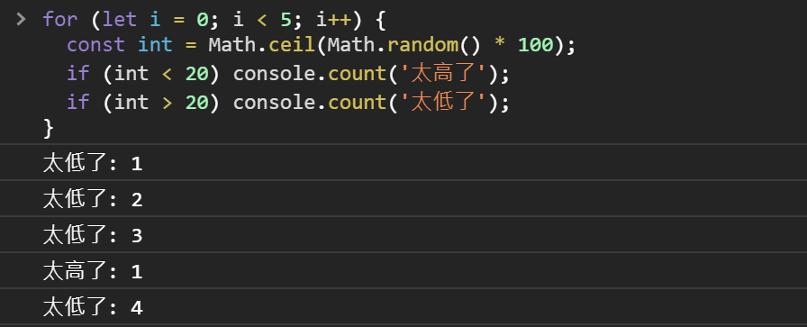
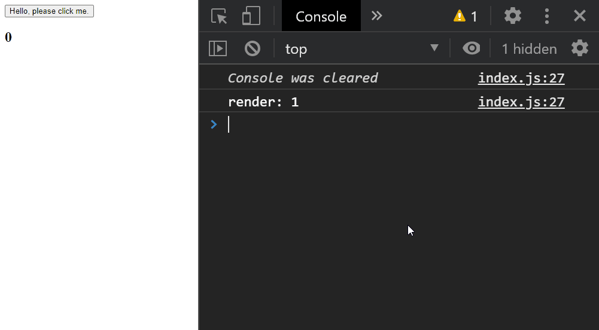
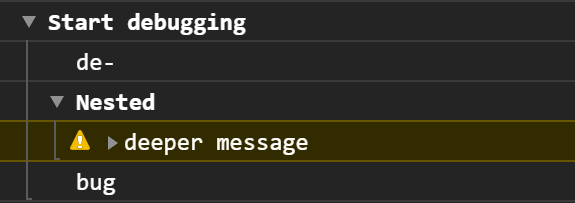
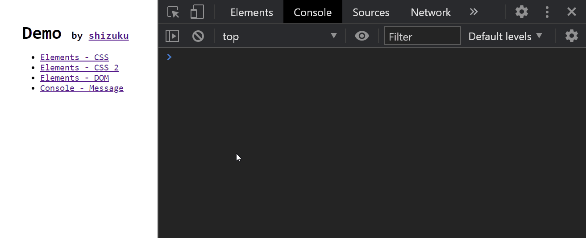
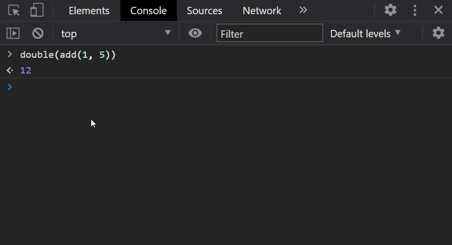
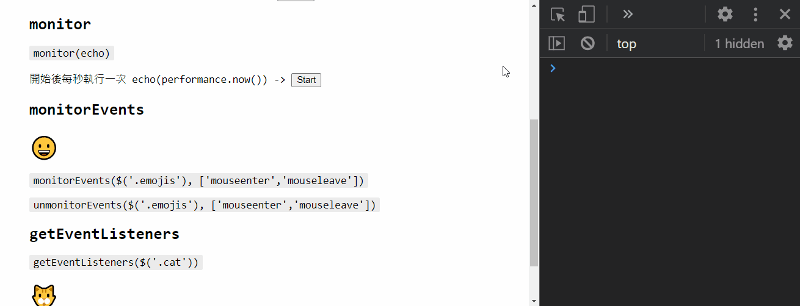
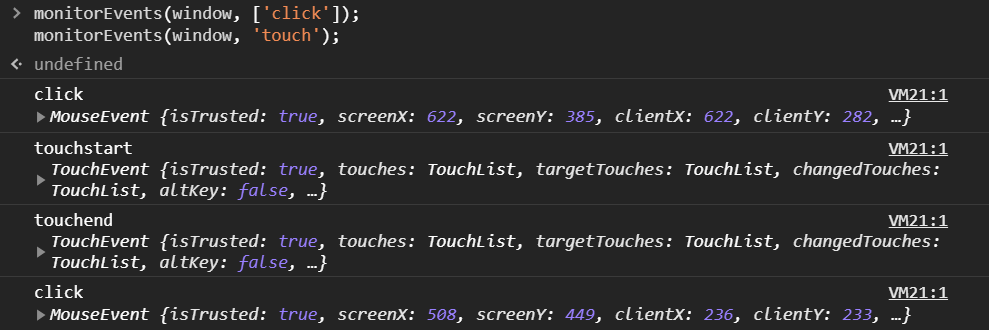
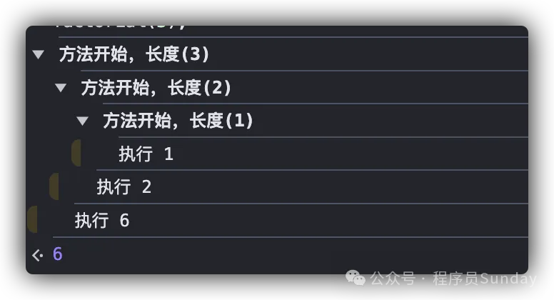

[Chrome DevTool](https://developer.chrome.com/docs/devtools/)

* https://blog.csdn.net/weixin_41229588/article/details/93743118

* https://blog.csdn.net/weixin_41229588/article/details/95169104


# 快捷键

## 打开Chrome DevTools

* F12
* 右键 -> 检查
* `Command+Option+I`  打开『DevTools』
* `Command+Option+J` 打开『DevTools』的『控制台』
* `Command+Option+C`  打开『DevTools』的审查元素模式


## DevTools面板直接切换

* `Command + [`  
* `Command + ]` 


# Console API

## console.log

Console message 有分成四种Level：

- Verbose
    - `console.debug('A verbose message.');`
- Info
    - `console.log('A info message.');`
- Warning
    - `console.warn('A warning message.');`
- Error
    - `console.error('A error message.');`


## console.assert

它的作用和`console.log`差不多，最大的差别是当第一个参数是`false`时才会作用。

```js
[false, null, undefined, 0, -0, 0n, NaN, ""]

eg:
console.assert(user.name, '哪邊出錯了QQ', user);
```


## console.count

`console.count(label)`会印出这个标签被执行了几次，预设值是`default`，可以用在快速的计数。

可以用以下的程式码试试`console.count`的效果：

```js
for (let i = 0; i < 5; i++) {
  const int = Math.ceil(Math.random() * 100);
  if (int < 20) console.count('太高了');
  if (int > 20) console.count('太低了');
}
```




## console.countReset

与`count`相生，用来归零，可用在计算单次行为的触发的计数，

```js
function App() {
  const [count, setCount] = React.useState(0);
  const [count2, setCount2] = React.useState(0);
  const [asyncCount, setAsyncCount] = React.useState(0);
  const [asyncCount2, setAsyncCount2] = React.useState(0);
  const onClick = () => {
    console.countReset('render'); // 計算前先把 'render' 歸零
    setCount(count + 1); // 1
    setCount2(count2 + 1); // 1
    Promise.resolve().then(() => {
      setAsyncCount(asyncCount + 1); // 2
      setAsyncCount2(asyncCount2 + 1); // 3
    })
  }
  console.count('render');
  return (
    <div onClick={onClick}>
      <h1>Hello, please click me.</h1>
      <h2>{count}</h2>
    </div>
  );
}
```




## console.group

用`console.group`可以自订Message group 的标签也可以多层嵌套，并用 来`console.groupEnd`关闭Group：

```js
console.group('Start debugging');
console.log('de-');
console.group('Nested');
console.warn('deeper message');
console.groupEnd();
console.log('bug');
console.groupEnd();
```




## console.groupCollapsed

另外还有Group 的兄弟`console.groupCollapsed`，只差在预设Gourp 是闭合的需要手动展开。


## console.table

```
const rows = [
  {
    "name": "Frozen yoghurt",
    "calories": 159,
    "fat": 6,
    "carbs": 24,
    "protein": 4
  },
  {
    "name": "Ice cream sandwich",
    "calories": 237,
    "fat": 9,
    "carbs": 37,
    "protein": 4.3
  },
  {
    "name": "Eclair",
    "calories": 262,
    "fat": 16,
    "carbs": 24,
    "protein": 6
  }
];
```


**同场佳映：**

当物件内容较深的时候，`JSON.stringify(animal, null, 2)`也是不错的选择，直接将物件转为JSON 字串全部显示。


## console.time

**老方法**

想要测量如使用者行为或是Function 执行的时间的话，很常看到一种方式-- 算数学：

```javascript
const t0 = performance.now();
alert('Hello World!');
const t1 = performance.now();
alert('Another Hello World!');
console.log(`Spent: ${t1 - t0} ms`);
const t2 = performance.now();
console.log(`Spent: ${t2 - t0} ms`);
```


**新方法**

想要快速测试时间还写了这堆程式码实在有点恼人，用 来`console.time`改写一下，和`console.group`一样可以传入标签参数来识别计时器：

```javascript
console.time('Spent');
alert('Hello World!');
console.timeLog('Spent');
alert('Another Hello World!');
console.timeEnd('Spent');
```




## console.trace

如果出问题的部分和其他套件有关系，尤其是一个Function 会在多处被使用的时候，有别于 只能得知`console.log`执行当下程式码的位置，`console.trace`会印出Call stack 并直接展开，能更快速看出问题：

```js
function a() {
  console.trace();
}
function b() {
  a();
}
function c() {
  b();
}
b()
c()
```


# Console Utilities Function

## $_

`$_` 會儲存的執行結果，在 Console 測試 JavaScript 行為的時候通常都會逐步確認，正是使用 `$_` 的好時機：





## **$**  与  $$

```
$(selector[, element])
$$(selector[, element])
```

`$` 和 `$$` 分別就是 `document.querySelector` 和 `document.querySelectorAll` 的縮寫，來源就是大家熟知的 JQuery。

第二個參數可以放入起始的元素。搭配 `$0` 就可以先 Inspect 一個元素，再從它開始搜尋。

```javascript
$('.btn', $0)
```


筆者常用 `$$` 來快速測試一些行為，例如印出個人 GitHub 頁面的所有 Repository 名稱：


## debug

```js
debug(function)

undebug(function)
```

參數為一個 Function，只要執行到該 Function 就會觸發 Debugger，可以用 `undebug(fn)` 來取消：

```javascript
function a() {
  console.log(1);
}

debug(a);
// undebug(a);
```

其效果相當於：

```javascript
function a() {
  console.log(1);
}
a = (function() {
  const origin = a;
  return function() {
    debugger;
    origin();
  }
})();
```


## monitor

```js
monitor(function)

unmonitor(function)
```

用法和 `debug` 很像，`monitor` 的 Function 被執行時會印出 Function 名稱和參數，

可用 `unmonitor(function)` 來停止，不過無法用在 Arrow function，需要監聽 Arrow function 的執行就只能手動覆寫了。




## monitorEvents

```js
monitorEvents(element[, eventType])

unmonitorEvents(element[, eventType])
```

可以在監聽並印出元素的特定事件，比較特別的是除了能監聽單一事件，還能監聽事件類型，例如印出 `window` 的點擊事件和所有 `touch` 類別的事件：




效果和以下 JavaScript 相同：

```javascript
window.addEventListener('click', console.log)
window.addEventListener('touchstart', console.log)
window.addEventListener('touchmove', console.log)
window.addEventListener('touchend', console.log)
window.addEventListener('touchcancel', console.log)
```

另外可用 `unmonitorEvents(element[, eventType])` 來停止監聽。


## getEventListeners

```
getEventListeners(element)
```

印出已註冊在元素上的監聽器，以剛剛的例子來說，輸入 `monitorEvents(element)` 後再輸入 `getEventListeners(element)` 就會看到所有事件都被註冊了一輪：


展開的話可以看到監聽器的各種屬性：

- listener -- 觸發事件執行的 Function
- once -- 該監聽器只會觸發一次
- passive -- 不能執行 event.preventDefault()，常用在提升監聽器的效能如 `scroll`
- type -- 監聽事件類型
- useCapture -- 監聽器會在 [Capture](https://developer.mozilla.org/en-US/docs/Web/API/Event/eventPhase) 階段攔截事件

上述的屬性都是能在執行 `addEventListener` 時提供的參數，記得在 `removeEventListener` 時也要填入相同的參數才能移除監聽器。

```javascript
const options: {
  capture: true,
  passive: true,
  once: false
}
window.addEventListener('click', console.log, options);
// window.removeEventListener('click', console.log, options);
```


## queryObjects

```
queryObjects(object)
```

官方文件說明是返回 Constructor 產生的所有 Instances，不過筆者認為應該解釋為：印出所有原型鍊包含該原型的物件。


## copy

```js
copy(object)
```

`copy` 能夠把 DOM、物件複製到剪貼簿，例如筆者有時候會用 `copy` 把物件轉為 JSON，貼到對話框來討論 API Spec，或是用 Console 來快速建立、修改假資料。


## keys, values

```js
keys(object)

values(object)
```

印出物件**自身**的所有 key 或 value，效果和 `Object.keys(object)`、`Object.values(object)` 相同，為何強調自身呢？如果是用 `in` 來遍歷物件的各個屬性，就會把 Protoype 鍊上的屬性全都拿出來跑一遍：

```javascript
const object = Object.create({ foo: 1});
object.bar = 2;
for (let key in object) {
  console.log(key)
}
// bar
// foo
```

> 除了是自身的 key，還要 [enumerable](https://developer.mozilla.org/en-US/docs/Web/JavaScript/Reference/Global_Objects/Object/defineProperty#:~:text=Enumerable attribute,keys() or not.)。

如果想要確認屬性是否是定義在物件自身可以用 `Object.prototype.hasOwnProperty`：

```javascript
for (let key in object) {
  if (Object.prototype.hasOwnProperty.call(object, key)) {
    console.log(key);
  }
}
// bar
```

至於為什麼不用 `object.hasWonProperty(key)`，請參考下方程式碼：

```javascript
const object1 = {
  hasOwnProperty: function() {
    return false;
  },
};
const object2 = Object.create(null);

object1.key = 'key';
object2.key = 'key';

object1.hasOwnProperty('key'); // ?
object2.hasOwnProperty('key'); // ?
```


## clear

```
clear()
```

雖然按下左上角的 ? 就能把 Console 清乾淨，但筆者還是習慣用 `clear()`，就像在 terminal 輸入 `clear` 一樣。


注意在 `Preserve log` 開啟的狀況下 `clear` 並不會清空 Console。


# Sources

Sources - Source Map & File Editing

Sources - Workspace

Sources - Breakpoints

Sources - Step-by-Step Execution

Sources - JavaScript Debugging


# 参考

第 12 屆 iT 邦幫忙鐵人賽系列文章 Demo 網站。
👉 [Demo 網站連結](https://sh1zuku.csie.io/demo)

- [[Day 01\] 既然天天都要 Debug，何不從 Debug 技能著手呢?](https://ithelp.ithome.com.tw/articles/10236769)
- [[Day 02\] 你所知道的 Chrome DevTools](https://ithelp.ithome.com.tw/articles/10237339)
- [[Day 03\] Elements - CSS](https://ithelp.ithome.com.tw/articles/10238150)
- [[Day 04\] Elements - CSS 之 2](https://ithelp.ithome.com.tw/articles/10238903)
- [[Day 05\] Elements - DOM](https://ithelp.ithome.com.tw/articles/10239614)
- [[Day 06\] Console - Messages & Settings](https://ithelp.ithome.com.tw/articles/10240275)
- [[Day 07\] Console - API](https://ithelp.ithome.com.tw/articles/10240826)
- [[Day 08\] Console - Utilities Function](https://ithelp.ithome.com.tw/articles/10241598)
- [[Day 09\] Console - Run JavaScript](https://ithelp.ithome.com.tw/articles/10242319)
- [[Day 10\] Sources - Source Map & File Editing](https://ithelp.ithome.com.tw/articles/10242922)
- [[Day 11\] Sources - Workspace](https://ithelp.ithome.com.tw/articles/10243538)
- [[Day 12\] Sources - Breakpoints](https://ithelp.ithome.com.tw/articles/10244199)
- [[Day 13\] Sources - Step-by-Step Execution](https://ithelp.ithome.com.tw/articles/10244199)
- [[Day 14\] Sources - JavaScript Debugging](https://ithelp.ithome.com.tw/articles/10245161)
- [[Day 15\] Network - Overview & Settings](https://ithelp.ithome.com.tw/articles/10245891)
- [[Day 16\] Network - Filter & Search Requests](https://ithelp.ithome.com.tw/articles/10246590)
- [[Day 17\] Network - Analyze Requests](https://ithelp.ithome.com.tw/articles/10247206)
- [[Day 18\] Performance - Overview](https://ithelp.ithome.com.tw/articles/10247709)
- [[Day 19\] Performance - Web Vitals](https://ithelp.ithome.com.tw/articles/10248039)
- [[Day 20\] Performance - Critical Rendering Path](https://ithelp.ithome.com.tw/articles/10248286)
- [[Day 21\] Performance - How Rendering Works](https://ithelp.ithome.com.tw/articles/10248720)
- [[Day 22\] Performance - Rendering Optimization](https://ithelp.ithome.com.tw/articles/10249554)
- [[Day 23\] Performance - Analyze Paint & Layers](https://ithelp.ithome.com.tw/articles/10249933)
- [[Day 24\] Performance - Analyze Memory](https://ithelp.ithome.com.tw/articles/10250174)
- [[Day 25\] Performance - Analyze Runtime Activities](https://ithelp.ithome.com.tw/articles/10250669)
- [[Day 26\] Cookies - SameSite Attribute](https://ithelp.ithome.com.tw/articles/10251288)
- [[Day 27\] Cross-Origin Resource Sharing (CORS)](https://ithelp.ithome.com.tw/articles/10251693/)
- [[Day 28\] Device Simulation & Remote Debugging](https://ithelp.ithome.com.tw/articles/10252037/)
- [[Day 29\] Optimize images](https://ithelp.ithome.com.tw/articles/10252501/)
- [[Day 30\] Tips for Lazy Loading Images](https://ithelp.ithome.com.tw/articles/10252723/)


# 额外

[不要过度使用console.log啦！我们有更好的调试方式！](https://mp.weixin.qq.com/s/-Lg5KLMyP6CXItvrUEJx-w)

[调试只会console.log？来看一看这 6 种惊艳的调试技巧！](https://mp.weixin.qq.com/s?__biz=MzkxNjUxMDg4Ng==&mid=2247490819&idx=1&sn=99e50fcc55a590966fac3aa1543cb435&chksm=c14f9ccaf63815dc1637f9452bf2fcca2d031b516826fcda773739d7c7a8aa692b2edba6619c&token=760951566&lang=zh_CN&scene=21&key=daf9bdc5abc4e8d09c493e77f0d9ca09de41d688d7a18cada489aa30a3345e1caa169b0acb5612c96a3923464e5d901aef512e5dd42e74c68a0c9f87c47d21bcf01424c64b642321ff0ad32d4a198f67edb6ae8f20305651e24df47298f9444420314ea4eaffedd95547492d896c68315040f15f1cc14ad8bfd3e14370a02edf&ascene=0&uin=OTUyODY5NDIz&devicetype=iMac+Macmini8%2C1+OSX+OSX+13.2+build(22D49)&version=13070110&nettype=WIFI&countrycode=CN&fontScale=100&exportkey=n_ChQIAhIQmltlWKaeNbHqvZR2nHl1qxKCAgIE97dBBAEAAAAAALz7L8uQPW4AAAAOpnltbLcz9gKNyK89dVj0TO%2B7Hh8GkhB%2BLNj3zMf3kSahqaPSMz7A4Qz6s0sNkp60ZptQmzCPUU6T12LvZBTMd%2BSdzWfIqsCEfxNfPxa4f0aUfTzVFhpQKFlA61zuW7FDpdaBLr3GZwhcIhuv4vF4wtQkAgCxpVsIWFH2QCwCC5bVrj0dyGxQd%2BLlv9Ll2wpCCJV%2BmgROOlVOxsj8M1OK2KglQQ2HkTyr%2B7OX2HJy5fUhUknUEl%2FQAdJwo4C4K%2F2JCWlwTl11BHvC68OTOJ6EdLsWT4N28kCqdLPh0jgAZ8vMJdw7yCZBGH9lbw%3D%3D&acctmode=0&pass_ticket=jecZ4Ja37yvI2bIvairwS2ufAnH%2BwQpYkWoXMab%2FF10dNRQrjN6fJthH4TEaxpYA&wx_header=0&nwr_flag=1#wechat_redirect)

[前端 Chrome 调试技巧最全汇总](https://mp.weixin.qq.com/s?__biz=Mzg3MTYxNDQwMA==&mid=2247497160&idx=1&sn=ab478b35b35b8910bdbef6a95c9d08a1&chksm=cf20c396c63190cf1be6264132fc41da8ce1f20164492c9b9e3d7940840cfd3381f82c179800&scene=126&sessionid=1730266201&subscene=90&clicktime=1730266230&enterid=1730266230&ascene=3&devicetype=iOS16.2&version=1800352c&nettype=WIFI&abtest_cookie=AAACAA%3D%3D&lang=zh_CN&countrycode=CN&fontScale=100&exportkey=n_ChQIAhIQ3LCBcTDFS4vAK1Q9AIY0OxLfAQIE97dBBAEAAAAAAHdeECKiHdkAAAAOpnltbLcz9gKNyK89dVj0Va0zj1ILFgVt6qZ3%2BjtF1ap8wCRrG7czNJEjidhIRruYoqbVhBxzKGRPX8RMshoZ%2F7L%2BZWkwvUQ6c7DoOasibs6Ax9lf88%2FLd%2BYAOUf0LpuS90WsL07Yvkv2526VijQ01wH%2FPXB0Yu5a2paGKDFgYfpAKn%2FsQlgi9bs0Fvd4WY98AyHQ9VFsvsh8w1ug5KepNDSvXWlZYl8MyiHzpY3uHwdZufviEpDyrXKGDrltFAP2GSu4oMGeS7Y%3D&pass_ticket=unOX6t%2BvJzIKHaBRaW5Jf%2Fz9JxqhqZlpAZfUDBmhWKH8uUtaxwcFajn2w2lxD2Mn&wx_header=3&nwr_flag=1#wechat_redirect)


# 一、之前文章 - 《调试技巧_模拟环境》


# 二、前端冷知识，妙用「浏览器地址栏」

## 1. 弹框

```
javascript:alert('I am wscats :)');

javascript:alert(3+4-6);

javascript:alert(355/113);void(0);

javascript:alert("本网址域名为:" + location.protocol + "//" + location.hostname + "/" + "\n此时浏览的地址为:" + location.href + "\n" + "\n注意：如果域名对不上，就赶紧关掉噢");
```


## 2. textarea框

```
data:text/html, <textarea style="font-size: 1.5em; width: 100%; height: 100%;" autofocus />

data:text/html,<button onClick="SaveTextArea()">Save</button> <script language="javascript" type="text/javascript"> function SaveTextArea() { window.location = "data:application/octet-stream," + escape(txtBody.value); } </script> <textarea id="txtBody" style="font-size: 1.5em; width: 100%; height: 100%; boarder: none; outline: none" autofocus> </textarea>
```


## 3. 其他的用法如下

1. data:,<文本数据>
2. data:text/plain,<文本数据>
3. data:text/html,<HTML代码>
4. data:text/html;base64,<base64编码的HTML代码>
5. data:text/css,<CSS代码>
6. data:text/css;base64,<base64编码的CSS代码>
7. data:text/javascript,<Javascript代码>
8. data:text/javascript;base64,<base64编码的Javascript代码>
9. data:image/gif;base64,base64编码的gif图片数据
10. data:image/png;base64,base64编码的png图片数据
11. data:image/jpeg;base64,base64编码的jpeg图片数据
12. data:image/x-icon;base64,base64编码的icon图片数据


# 三、console更多用法

## **01. console.table**

使用 console.table 可视化复杂的对象和数组：

```js
const myData = [
  { name: "程序员Sunday", age: 30 },
  { name: "Sunday", age: 25 }
];
console.table(myData);
```

打印结果如下：


## **02. console.trace**

使用 console.trace 可以明确函数的调用逻辑关系：

```js
function fn() {
  function test() {
    console.trace("这是一个利用trace的测试打印"); 
  }
  test();
}
fn();
```

打印结果如下：


## **03. console.time && console.timeEnd**

使用 console.time && console.timeEnd 来记录代码的执行耗时：

```js
console.time('js 耗时')  // key对应
const vNodes = []
for (let i = 0; i < 10000; i++) {
  const vNode = {
    type: 'div'
  }
  vNodes.push(vNode)
}
console.timeEnd('js 耗时')
```

打印结果如下：


## **04. console.assert**

使用 console.assert **断言**你的判断逻辑。

如果断言为假，它抛出一个你指定的错误：

```js
const myArray = []
console.assert(myArray.length > 0, "myArray 是空的!");
```

打印结果如下：


## **05. console.clear**

在很多时候，我们的控制台可能会打印非常多的内容。所以，可以让代码在执行到某一个特定的时机时，**利用 console.clear() 清空控制台**

```js
console.clear()
```

执行之后会打印这个：


## **06. console.error**

使用 console.error 直接打印一个错误级别的描述：

```js
console.error('错误信息')
```

打印结果如下：


## 07. console.dir

`console.dir()` 是一个专门打印 **对象** 的 API。


## 08. console.group && console.groupEnd

使用 console.group() 控制打印组

这在 **嵌套函数、递归** 中非常有用，配合 `console.groupEnd()` 可以帮助我们完成分组打印。

```js
function factorial(n) {
    console.group(`方法开始，长度(${n})`);
    if (n <= 1) {
        console.log("执行 1");
        console.groupEnd();
        return 1;
    } else {
        let result = n * factorial(n - 1);
        console.log(`执行 ${result}`);
        console.groupEnd();
        return result;
    }
}

factorial(3);
```




