* [VSCode官网 - Launch configurations](https://code.visualstudio.com/docs/editor/debugging#_launch-configurations)
* [官网 - Node.js debugging in VS Code](https://code.visualstudio.com/docs/nodejs/nodejs-debugging)
* [官网 - Debugging Node.js](https://nodejs.org/en/learn/getting-started/debugging#debugging-nodejs)
* [Node.js 调试一路走来经历了什么](https://mp.weixin.qq.com/s/5d5yiDpQ_gUTWGyx2lcCYQ)
* [新手向：前端程序员必学基本技能——调试JS代码](https://mp.weixin.qq.com/s?__biz=MzA5MjQwMzQyNw==&mid=2650758814&idx=1&sn=3814b9c13cc14f33f6c73caff565ff96&chksm=88665d12bf11d404f93b9701dbe68ca80bf81ff6d630d0b378c58cb3b987b3fc4901a837dd25&cur_album_id=1342211915371675650&scene=21#wechat_redirect)

* [前端容易忽略的 debugger 调试技巧](https://mp.weixin.qq.com/s?__biz=MzA5MjQwMzQyNw==&mid=2650752621&idx=1&sn=a85474788f1013f14c7ebb38e300b529&scene=21#wechat_redirect)

* [《你不知道的 Chrome 调试技巧》](https://juejin.cn/book/6844733783166418958/section)
    * [FrontendWingman](https://github.com/dendoink/FrontendWingman)

* [慕课网调试课程](https://www.imooc.com/learn/1164)
* [慕课网 nodejs 调试入门](https://www.imooc.com/learn/1093)

* [Vuejs 官方文档调试](https://cn.vuejs.org/v2/cookbook/debugging-in-vscode.html)

* [Devtools 老师傅养成[1] - Chrome Devtools介绍](http://mp.weixin.qq.com/s?__biz=MzA5NjM5MjM1Nw==&mid=2650283991&idx=1&sn=fe705b94387e86f3d601231e613a8f08&chksm=88bc7a1dbfcbf30b98a7239ecd33596ce6b41f2bd6367e754b3569ec425703a471f4682d583c&scene=21#wechat_redirect)
* [Devtools 老师傅养成[2] - Elements 面板](http://mp.weixin.qq.com/s?__biz=MzA5NjM5MjM1Nw==&mid=2650283991&idx=2&sn=bc26537538c17ff5a4c5f4feebe889fb&chksm=88bc7a1dbfcbf30b82d976e29108656fba4cd68bfac1812b97e0361d359453a1bdb3a397e442&scene=21#wechat_redirect)
* [Devtools 老师傅养成[3] - Console 面板](http://mp.weixin.qq.com/s?__biz=MzA5NjM5MjM1Nw==&mid=2650284020&idx=1&sn=93087d5a03cc5d293a9fd8df3752252f&chksm=88bc7a3ebfcbf328aaa40fc2c2f6820ee2ea379b21d8a0f046ca7e8c8040d57d1f8b00919225&scene=21#wechat_redirect)
* [2022年了，该学会用VSCode debug了](https://juejin.cn/post/7080135520902184997)
* https://juejin.cn/post/6992976045213220878#heading-0


[Node.js 调试一路走来经历了什么](https://mp.weixin.qq.com/s/5d5yiDpQ_gUTWGyx2lcCYQ)

[VSCode 启动 Node.js 调试的几种方式](https://juejin.cn/post/6992976045213220878#heading-9)


# 一、Auto Attach

总要编辑 launch.json 多少有些麻烦，如果能在执行脚本时自动启动调试就好了。

这就是 Auto Attach 的作用，然而 Auto Attach 功能仅能作用于在 **VSCode 集成终端** 启动的进程。

Auto Attach 有四种可选模式，命令面板输入 `Toggle Auto Attach` 选择菜单中罗列几种模式：

- Always：在内置终端启动的所有进程都会自动接上调试器
- Smart：排除 node_modules 目录下的执行脚本（例如 `tsc build`）。排除范围可在 `debug.javascript.autoAttachSmartPattern` 指定
- Only With Flag：只会对带 `--inspect` 或 `--inspect-brk` 启动的进程有效果
- Disable：禁用自动对接功能

Auto Attach 依托于集成终端，因此每次切换后都需要 **重启终端** 才能生效。

在命令面板选择将直接作用于 VSCode 全局环境，如要为工作区定制，可以设置 `.vscode/settings.json`。


## 1. 设置『禁用』『智能』

* 若设置『Disabled』，**在『终端』运行时，遇到断点不会停止！！！**
* 若设置『Smart』，**在『终端』运行时，遇到断点就可以自动识别！！！**

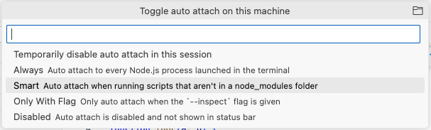

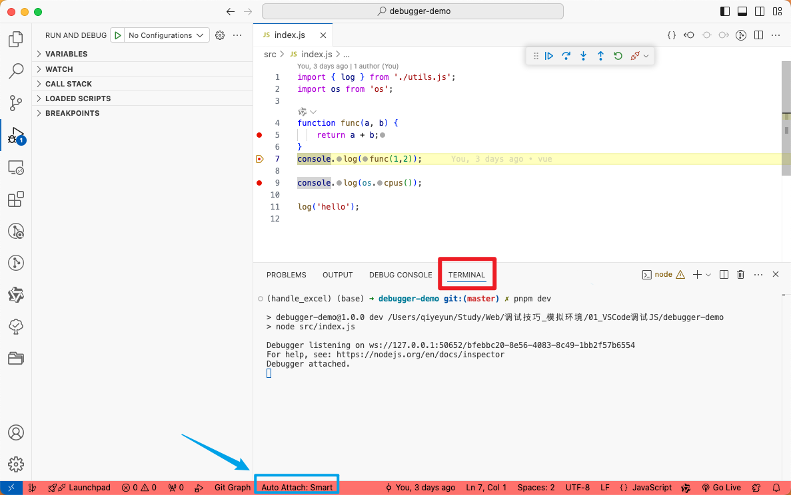


# 二、JavaScript Debug Terminal

或许你不想全局启用 Auto Attach，只想在需要的时候调用一下。

使用 JavaScript Debug Terminal 创建一个新的终端窗口，把 Auto Attach 作用范围限制在这个终端窗口内。这就是 JavaScript Debug Termial，局部的 Auto Attach。

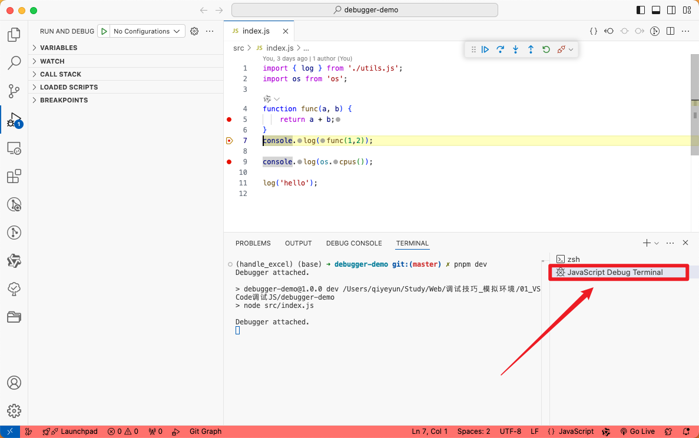


# 三、Inspector Protocol

Node.js 提供 [Inspector Protocol](https://link.juejin.cn/?target=https%3A%2F%2Fchromedevtools.github.io%2Fdebugger-protocol-viewer%2Fv8%2F) 调试协议来支持调试。

简单来说，在运行 Node.js 程序时开启一个进程来监听调试请求，默认的监听端口是 **9229**。每个监听进程都被分配了唯一的 UUID，调试客户端通过 `ws://{host}:{port}/{UUID}` 和监听进程建立 websocket 通信。

Node.js 开启调试服务被动等待，调试客户端主动发起对接。

> *Inspector 更确切的称呼是 “检查器”，由于理解习惯，文章内将其称为 “调试器”*


## 1. 使用 Node.js 内置命令行调试器

1. **启动调试器**： 要启动 Node.js 的内置调试器，可以在运行应用程序时加上 `inspect` 标志：

    ```sh
    $ node inspect src/index.js
    ```

2. **调试器启动**： 使用上述命令启动后，Node.js 会在第一个可执行的代码行暂停，等待用户输入调试命令。你将看到一个交互式调试器提示符 `>`。

3. **常用调试命令**： 内置调试器提供了一些基本的调试命令来帮助你检查和控制代码执行流程。

    - **`c` 或 `cont`**：继续执行代码，直到遇到下一个断点或结束。
    - **`n` 或 `next`**：执行下一行代码。
    - **`s` 或 `step`**：单步进入函数调用。
    - **`o` 或 `out`**：跳出当前函数并停在调用此函数的下一行。
    - **`repl`**：进入 REPL 模式，你可以在该模式下运行 JavaScript 表达式并查看变量值。
    - **`bt`**：显示当前的调用堆栈。
    - **`watch(expr)`**：将表达式加入监视列表。
    - **`unwatch(expr)`**：将表达式从监视列表中移除。
    - **`list`**：列出当前正在执行的代码片段。

4. **退出调试器**： 输入 `Ctrl + C` 两次或使用 `quit` 命令可以退出调试器。


### a. Node.js REPL 调试模式

内置调试器还允许你在调试模式下进入 `REPL`，你可以实时执行表达式和查看变量的值。

- 输入 `repl` 进入 REPL 模式，在其中可以直接输入 JavaScript 表达式。
- 输入 `.exit` 退出 REPL 模式并返回到调试器。

**实用示例**

假设你有一个简单的 `app.js`：

```js
function add(a, b) {
  return a + b;
}

function main() {
  let result = add(2, 3);
  console.log('Result:', result);
}

main();
```

运行调试器：

```sh
$ node inspect app.js
```


## 2. ws调试服务

### a. `--inspect` 启用调试模式

#### Ⅰ.『启动时』开启调试服务

Node.js 调试服务默认关闭，需要通过 `--inspect` 或 `--inspect-brk` 标识符开启，服务的默认端口和地址也可通过 `node --inspect=[host:port]` 指定。

- `node --inspect index.js`：开启调试服务，端口为 9229
- `node --inspect=3003 index.js`：开启调试服务，端口为 3003
- `node --inspect=192.168.0.101`：开启调试服务，地址为 192.168.0.101:9229
- `node --inspect=192.168.0.101:3003`：开启调试服务，连接地址为 192.168.0.101:3003

那么，`--inspect` 和 `--inspect-brk` 有什么不同？

> `--inspect-brk` 会在代码执行前停住。

- `--inspect` 启动调试服务，跑完程序就退出。除非是有异步任务在，不然完全不给调试器对接的机会。
- `--inspect-brk` 启动完调试服务就停在开头，等着调试器接入，接入后断在第一行代码等待下一步操作。


#### Ⅱ.『运行时』开启调试服务

实际上，除了跟随程序启动，还可以在已运行的程序上开启调试服务

```bash
$ kill -s SIGUSR1 49026
```

上述命令的作用是给进程 id 是 49026 的进程发送 `SIGUSR1` 信号，当 Node.js 进程收到 `SIGUSR1` 时，将启动调试服务。


### b. 调试客户端 - 可视化调试器

Node 内置命令行调试器，通过 `node inspect` 命令执行，通过输入命令来描述行为不如可视化操作高效，可视化调试器必不可少。

目前主流的 IDE 几乎都已经内置 Node.js 调试客户端，例如前端领域最常用的 VSCode、WebStorm、Chrome DevTool。

Chrome DevTools 会根据地址列表自动检查调试服务启动情况，默认地址有本地的 9229 和 9222 端口。`chrome://inspect` 面板负责调试管理。

#### Ⅰ. Chrome DevTools

* [chrome://inspect/](chrome://inspect/)


#### Ⅱ. VSCode - `Launch Configuration` - `Attach`

同 《四、Launch Program - Attach模块》


### c. 远程调试

Inspector 协议支持远程调试，允许开发者在不同设备或容器中调试 Node.js 应用程序。

如果你在服务器或容器中运行 Node.js 应用程序，并希望在本地调试，可以启用 `--inspect=0.0.0.0:9229` 来指定监听所有网络接口。

```sh
$ node --inspect=0.0.0.0:9229

$ node --inspect-brk=0.0.0.0:9229
```


### d. 实操

Demo地址：./debugger-demo

* `package.json`

```json
"scripts": {
    "test": "echo \"Error: no test specified\" && exit 1",
    "dev": "node src/index.js",
    "dev:inspect": "node --inspect src/index.js",
    "dev:inspect-brk": "node --inspect-brk src/index.js"
  },
```

* 运行 `pnpm dev:inspect-brk`


* Chrome客户端链接


# 四、Launch Configuration

launch.json 虽然传统，但仍是最全面的自定义入口。即使是自动化也需要通过部分的配置项来实现自定义。

VSCode 提供了两种启动模式：

- `launch` 启动程序并接上调试器
- `attach` 调试器接入正在运行的程序

基于这两种模式以及其他配置字段，VSCode 能支持多种调试场景。


## 1、启动程序并允许调试 - `Launch`

### a. `Launch Program` - 直接运行程序入口文件

* 创建 `launch.json` 

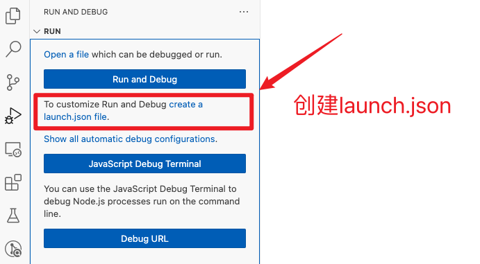

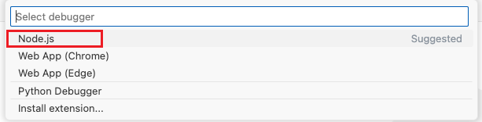

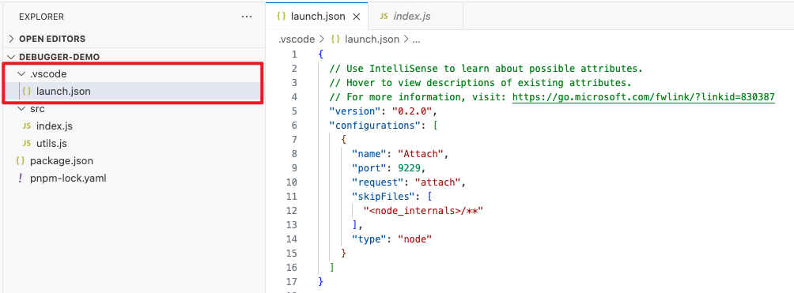


* 创建 `Launch Program` 

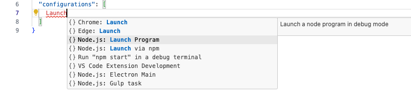

```json
{
  // Use IntelliSense to learn about possible attributes.
  // Hover to view descriptions of existing attributes.
  // For more information, visit: https://go.microsoft.com/fwlink/?linkid=830387
  "version": "0.2.0",
  "configurations": [
    // 1. Launch Program
    {
      "type": "node",
      "request": "launch",
      "name": "Launch Program",
      "skipFiles": [
        "<node_internals>/**"
      ],
      "program": "${workspaceFolder}/src/index.js"  // 程序入口文件
    }
  ]
}
```

* 运行

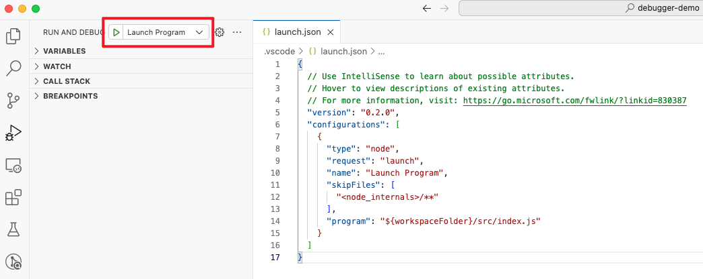


### b. `Launch via NPM` - 脚本跑起程序

```json
{
  // Use IntelliSense to learn about possible attributes.
  // Hover to view descriptions of existing attributes.
  // For more information, visit: https://go.microsoft.com/fwlink/?linkid=830387
  "version": "0.2.0",
  "configurations": [
    // 2.Launch via NPM
    {
      "name": "Launch via NPM",
      "request": "launch",
      "runtimeArgs": [
        "run-script",
        "dev" // 这里修改为脚本名
      ],
      "runtimeExecutable": "npm",  // or pnpm yarn
      "args": [],
      "skipFiles": [
        "<node_internals>/**"
      ],
      "type": "node"
    }
  ]
}
```

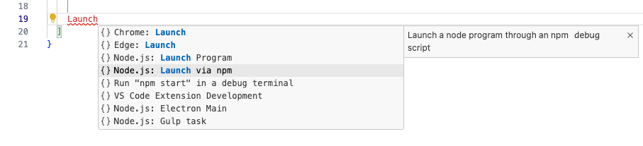

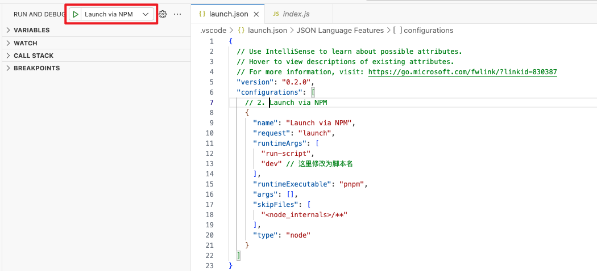


## 2、调试正在运行的程序 - `Attach`

比较常规的操作是 `node --inspect-brk` 启动程序，launch.json 配置 `Node.js: Attach`

启动程序

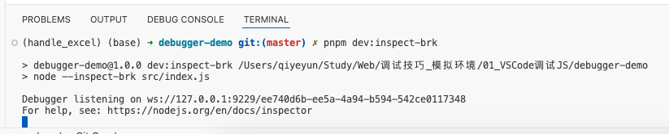


### a. `Attach` - 通过监听地址接入

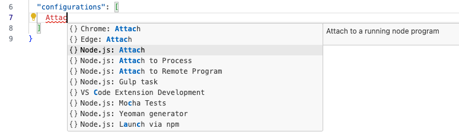

```json
{
  // Use IntelliSense to learn about possible attributes.
  // Hover to view descriptions of existing attributes.
  // For more information, visit: https://go.microsoft.com/fwlink/?linkid=830387
  "version": "0.2.0",
  "configurations": [
    {
      "name": "Attach",
      "address": "localhost",  // IP地址，默认为localhost，可删除，or 127.0.0.1
      "port": 9229, // 端口号
      "request": "attach",
      "skipFiles": [
        "<node_internals>/**"
      ],
      "type": "node"
    }
  ]
}
```

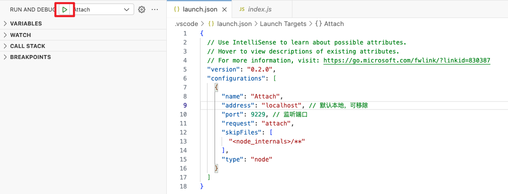


### b.  `Attach to Process` - 当前正在运行的进程

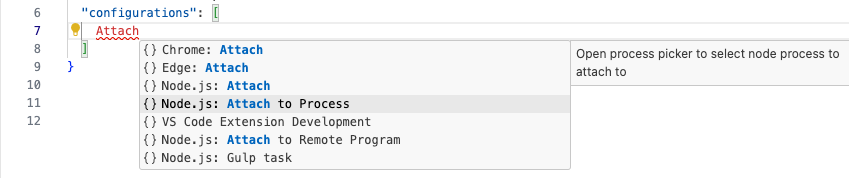

```json
{
  // Use IntelliSense to learn about possible attributes.
  // Hover to view descriptions of existing attributes.
  // For more information, visit: https://go.microsoft.com/fwlink/?linkid=830387
  "version": "0.2.0",
  "configurations": [
    {
      "name": "Attach by Process ID",
      "processId": "${command:PickProcess}",
      "request": "attach",
      "skipFiles": [
        "<node_internals>/**"
      ],
      "type": "node"
    }
  ]
}
```

* 运行，选择当前正在运行的进程。

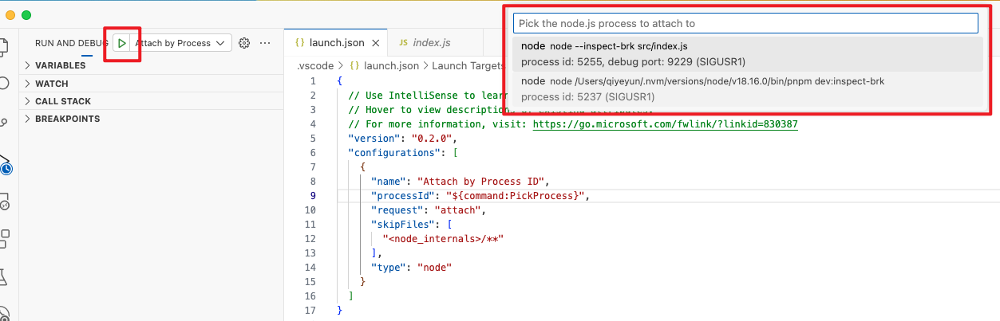


### c. 命令面板 - `Attach to Node Process` （同b）

* **命令面板 - `Attach to Node Process`  等价于  `Launch Configuration` 中的 `Attach to Process`**

VSCode 以 Action 的形式为 `Attach to Node Process` 提供了一个快捷入口。命令面板输入 `Attach to Node Procees`，下拉菜单会罗列出正在运行的所有 Node 进程。选择其一便可接上调试器。等同于上面c中的配置。

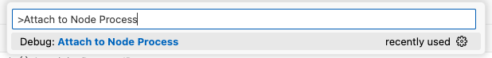

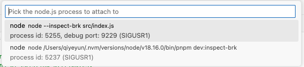


### d. `Attach to Remote Program` - 未尝试

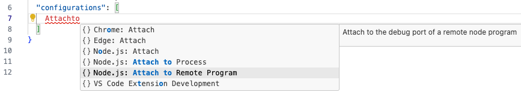

```json
{
  // Use IntelliSense to learn about possible attributes.
  // Hover to view descriptions of existing attributes.
  // For more information, visit: https://go.microsoft.com/fwlink/?linkid=830387
  "version": "0.2.0",
  "configurations": [
    {
      "address": "TCP/IP address of process to be debugged",
      "localRoot": "${workspaceFolder}",
      "name": "Attach to Remote",
      "port": 9229,
      "remoteRoot": "Absolute path to the remote directory containing the program",
      "request": "attach",
      "skipFiles": [
        "<node_internals>/**"
      ],
      "type": "node"
    }
  ]
}
```


# 五、Run And Debug

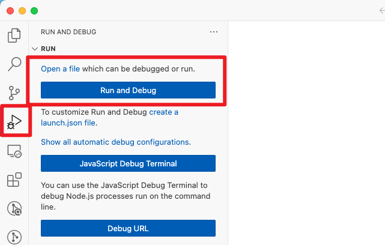


