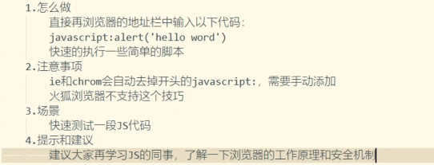

* [bilibili - 【完结】前端开发中41个实用小技巧，学完轻松拿捏996，建议收藏关注！](https://www.bilibili.com/video/BV1ey421q7Py?p=1&vd_source=dc55c355e9f5b6174832aacfb5d8b6aa)
* [额外 - 文章](https://github.com/Wscats/articles/issues/2)


# 1. 浏览器输入框运行js代码




```
javascript:alert('hello')


data:text/html, <html contenteditable>


```


## [P4技巧四：HTML5新特性解析：一行代码使整个页面成为你的编辑领域！](https://www.bilibili.com/video/BV1ey421q7Py?p=4)

控制台输入 `document.body.contentEditable='true'`


[P5技巧五：JS小技巧：利用a标签轻松解析URL，轻松提取所需信息！](https://www.bilibili.com/video/BV1ey421q7Py?p=5)


