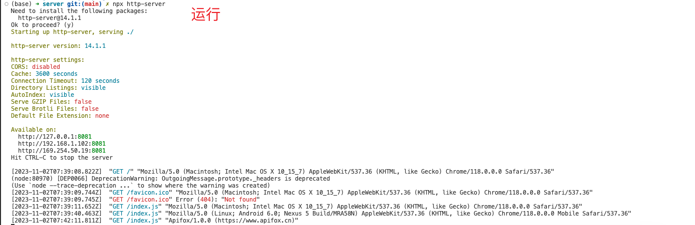

# 安装 http-server

```sh
# 全局安装
$ pnpm add http-server -g

# 查看
$ pnpm list -g
```


# 使用 npx http-server 命令快速的开启一个静态服务器

```bash
$ npx serve .

# 默认 8080端口
$ npx http-server

# 当然也可以指定端口号 
$ npx http-server -p 3000
```



