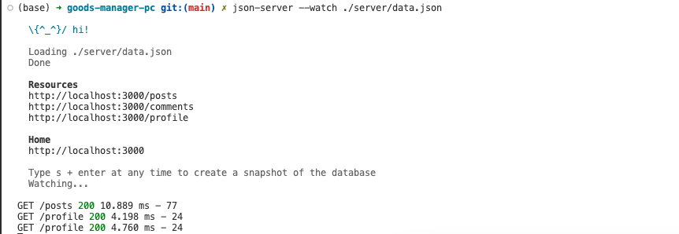

* [json-server](https://github.com/typicode/json-server)


# 一、全局安装

```bash
# 命令
$ pnpm install -g json-server

# 报错
ERR_PNPM_NO_GLOBAL_BIN_DIR  Unable to find the global bin directory

Run "pnpm setup" to create it automatically, or set the global-bin-dir setting, or the PNPM_HOME env variable. The global bin directory should be in the PATH.

# 原因
pnpm升级了

# 解决
$ pnpm setup
$ source /Users/qiyeyun/.zshrc
```

```bash
# 验证
$ json-server -v                                                                                                                                                                                 
0.17.3
```


# 二、初体验

1. 全局安装 `json-server`

```sh
# 全局安装
$ npm install -g json-server
```


2. Create a `db.json` file with some data

```json
{
  "posts": [
    { "id": 1, "title": "json-server", "author": "typicode" }
  ],
  "comments": [
    { "id": 1, "body": "some comment", "postId": 1 }
  ],
  "profile": { "name": "typicode" }
}
```


3. Start JSON Server

```sh
# 运行
$ json-server --watch db.json
```


4. Now if you go to http://localhost:3000/posts/1, you'll get

```json
{ "id": 1, "title": "json-server", "author": "typicode" }
```


## 2.1 实操



```shell
$ json-server --watch db.json

  \{^_^}/ hi!

  Loading db.json
  Done

  Resources
  http://localhost:3000/posts
  http://localhost:3000/comments
  http://localhost:3000/profile

  Home
  http://localhost:3000

  Type s + enter at any time to create a snapshot of the database
  Watching...


GET /posts 200 10.225 ms - 77
GET /profile 200 4.043 ms - 24
GET /db 200 0.428 ms - 243
GET /__rules 404 2.619 ms - 2
GET /comments 200 3.295 ms - 68
```


# 三、json-server介绍 - GPT

`json-server` 是一个基于 Node.js 的工具，可以快速创建一个模拟 REST API 服务。它允许你使用一个简单的 JSON 文件作为数据源，并提供了常用的 RESTful API 接口，比如 `GET`、`POST`、`PUT`、`DELETE`。这对于前端开发人员在后端 API 尚未完成时进行开发和测试非常有帮助。

## 1. 特点

- **快速设置**：使用一个 JSON 文件就可以启动一个完整的 REST API 服务器。
- **支持多种 HTTP 方法**：包括 `GET`、`POST`、`PUT`、`PATCH` 和 `DELETE`。
- **支持查询参数**：可以使用查询参数过滤数据。
- **中间件**：支持添加自定义中间件扩展功能。

## 2. 安装

你需要确保系统上已安装 Node.js 和 npm（Node 包管理器）。可以通过以下命令全局安装 `json-server`：

```bash
npm install -g json-server
```

## 3. 使用方法

### a. 创建 JSON 数据文件

首先，你需要创建一个 JSON 文件，例如 `db.json`。以下是一个示例 `db.json` 文件：

```json
{
  "posts": [
    { "id": 1, "title": "Hello World", "author": "John Doe" },
    { "id": 2, "title": "Another Post", "author": "Jane Doe" }
  ],
  "comments": [
    { "id": 1, "body": "Nice post!", "postId": 1 },
    { "id": 2, "body": "Thanks for sharing!", "postId": 2 }
  ],
  "profile": { "name": "John Doe" }
}
```

### b. 启动服务器

在包含 `db.json` 文件的目录中运行以下命令启动 `json-server`：

```bash
json-server --watch db.json
```

这将在默认的端口（3000）上启动一个 HTTP 服务器。

### c. 访问 API

一旦服务器启动，你可以通过以下端点访问 API：

- 获取所有帖子：`GET /posts`
- 获取单个帖子：`GET /posts/1`
- 创建新帖子：`POST /posts`
- 更新帖子：`PUT /posts/1`
- 删除帖子：`DELETE /posts/1`
- 获取所有评论：`GET /comments`
- 获取单个评论：`GET /comments/1`

你也可以使用查询参数进行过滤，例如：

- 根据作者过滤帖子：`GET /posts?author=John Doe`
- 根据帖子 ID 过滤评论：`GET /comments?postId=1`

## 4. 示例命令

1. **启动服务器并指定端口**：
  
   ```bash
   json-server --watch db.json --port 4000
   ```
   
2. **指定数据文件和根 URL**：
   ```bash
   json-server --watch db.json --routes routes.json
   ```
   你可以创建一个 `routes.json` 文件来自定义路由，例如：
   ```json
   {
     "/api/": "/"
   }
   ```
   这会将所有 API 路径前缀添加 `/api`。

3. **使用中间件**：
   你可以创建一个 `server.js` 文件，使用 Express 中间件扩展 `json-server` 功能：
   ```javascript
   const jsonServer = require('json-server')
   const server = jsonServer.create()
   const router = jsonServer.router('db.json')
   const middlewares = jsonServer.defaults()
   
   server.use(middlewares)
   server.use((req, res, next) => {
     if (req.method === 'POST') {
       req.body.createdAt = Date.now()
     }
     next()
   })
   server.use(router)
   server.listen(3000, () => {
     console.log('JSON Server is running')
   })
   ```
   然后运行：
   ```bash
   node server.js
   ```

## 5. 总结

`json-server` 是一个强大且易用的工具，能够帮助开发人员在没有后端服务的情况下快速创建和测试 REST API。通过简单的配置和灵活的扩展，你可以在开发过程中更有效地进行前后端分离开发。


