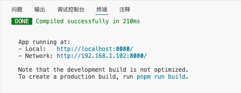
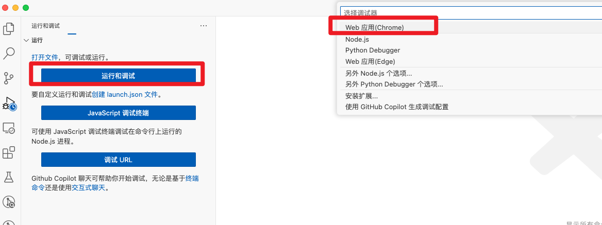
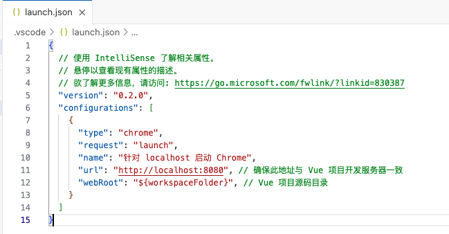
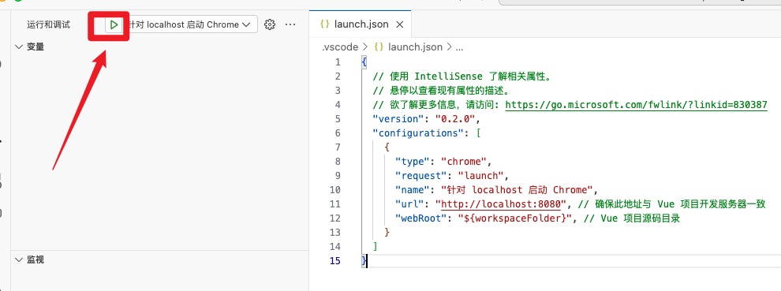
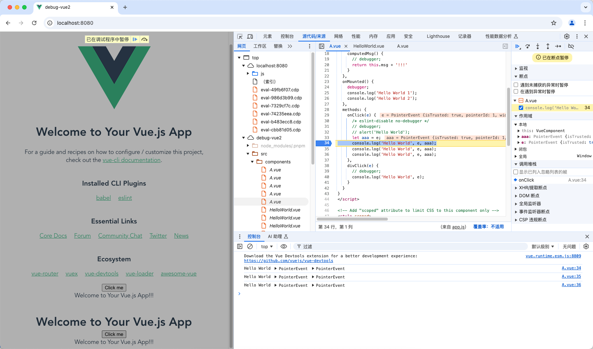
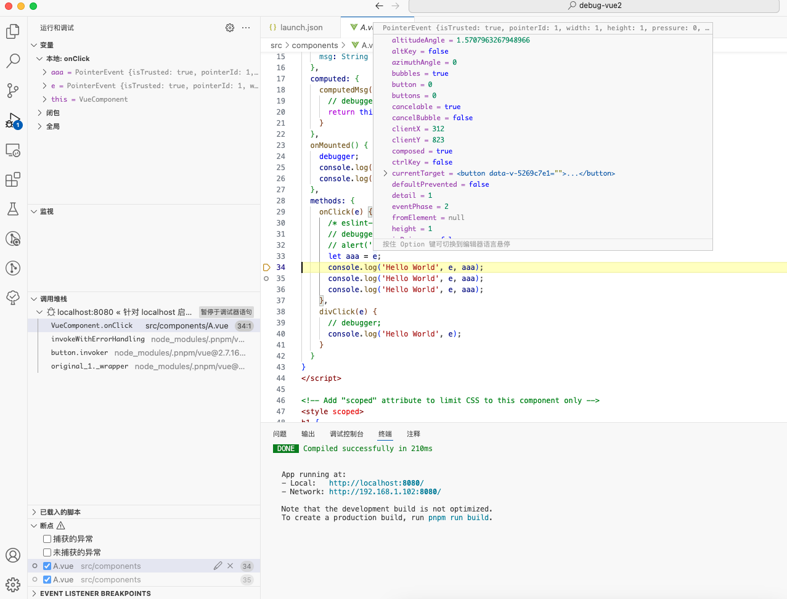

* [Vue2官网 - 在 VS Code 中调试](https://v2.cn.vuejs.org/v2/cookbook/debugging-in-vscode.html)

* [在浏览器中展示源代码](https://v2.cn.vuejs.org/v2/cookbook/debugging-in-vscode.html#在浏览器中展示源代码)


https://juejin.cn/post/7446578471901872180#heading-2

https://blog.csdn.net/z475299765/article/details/129793403

https://blog.csdn.net/qq_45763682/article/details/130983785


- 源代码中增加 debugger 或者 `console.log`
- 在 Chrome 浏览器 Sources 中加断点
- VSCode 中直接调试，对源码定位准确直观（*下面阐述该种方式*）


# 一、VSCode 调试 Vue2

## 1. 前期准备

### a. 开启source-map

在开发的时候，由于webpack打包的问题，会造成无法定位到指定的源代码内容。

我们断点到的代码后面带有一串哈希值，访问的路径也是webpack处理后的路径，对应不到本地vscode内的源代码地址。要想开启

vscode内代码调试，那么必须将vscode内的代码与浏览器中运行的代码关联起来。所以首先需要开启sourcemap，让浏览器访问的地址

与代码的实际路径关联起来。


开启开发环境下的source-map，在vue.config.js文件中，添加如下配置:

```js
const { defineConfig } = require('@vue/cli-service')
module.exports = defineConfig({
  ......
  configureWebpack: {
    devtool: 'source-map'
  }
})
```


## 2. 运行项目




## 3. Debug








## 4. 断点 - 同步到项目






