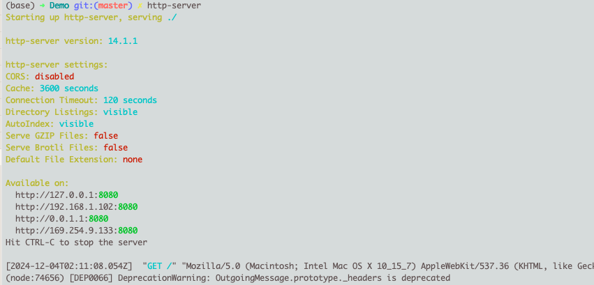
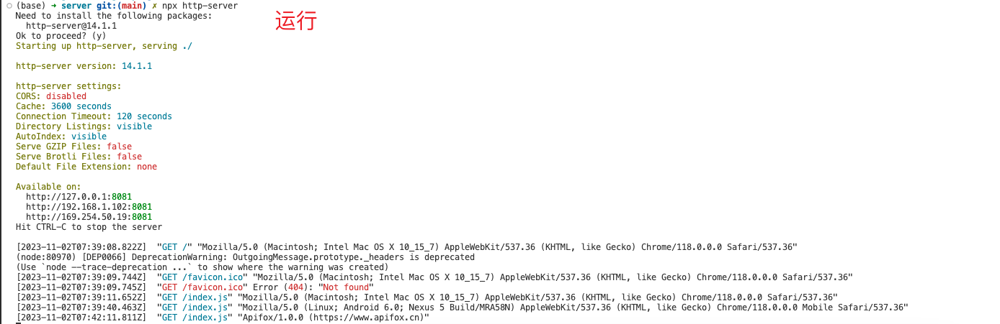

#一、http-server 介绍

## **什么是 `http-server`？**

`http-server` 是一个轻量级、零配置的命令行工具，用于快速创建一个 **静态文件服务器**。它基于 Node.js 构建，适合本地开发和简单的静态网站托管。

## **适用场景**

- **本地开发**：快速预览静态网页，无需设置复杂的服务器。
- **静态资源测试**：用于验证 HTML、CSS、JavaScript 资源。
- **简单文件共享**：将本地文件通过局域网分享。

## **局限性**

- 不支持动态内容（如后端 API）。
- 仅适合简单的开发环境或内部测试。


# 二、实战使用

## 1. 全局安装 http-server

```sh
# 全局安装
$ npm i http-server -g

# 查看
$ npm list -g
```

### a. 使用 `$ http-server` 运行

* 前往当前目录 `Demo` 下
* 终端运行 `$ http-server`




### b. **常用参数**

- **`-p <port>`**：指定端口（默认 8080）。

    ```sh
    $ http-server -p 3000
    ```

- **`-a <address>`**：绑定特定 IP 地址。

    ```sh
    $ http-server -a 127.0.0.1
    ```

- **`-S` 和 `-C`**：启用 HTTPS 并指定 SSL 证书和密钥。

- **`-c-1`**：禁用缓存。


## 2. 局部安装 http-server

如果没有进行全局安装，只是在项目中安装，运行则需要 npx。

```sh
# 全局安装
$ npm i http-server -D
```

### a. 使用 `$ npx http-server` 运行

```bash
$ npx serve .

# 默认 8080端口
$ npx http-server

# 当然也可以指定端口号 
$ npx http-server -p 3000
```




# 三、GPT

`http-server` 是一个简单、零配置的命令行HTTP服务器，通常用于快速启动一个本地服务器以便在开发过程中进行测试和调试。它可以用来提供**静态文件服务**，非常适合用于开发阶段的静态文件查看和测试。

## 1. 特点

- **轻量级**：无需复杂的配置即可启动。
- **零依赖**：只需要Node.js环境即可运行。
- **跨平台**：适用于Windows、MacOS和Linux系统。

## 2. 安装

你需要确保系统上已安装Node.js和npm（Node包管理器）。可以通过以下命令来安装`http-server`：

```bash
npm install -g http-server
```

这将全局安装`http-server`，使其可以在命令行中作为全局命令使用。

## 3. 使用方法

### a. 启动服务器

1. **在当前目录启动服务器**：
   打开命令行终端，导航到你希望提供服务的静态文件目录，然后运行：
   
   ```bash
   http-server
   ```
   
   这将在默认的端口（8080）上启动一个HTTP服务器。
   
2. **指定端口**：
   你可以通过添加 `-p` 选项来指定不同的端口。例如，要在端口3000上启动服务器：
   ```bash
   http-server -p 3000
   ```

3. **指定主机名**：
   默认情况下，`http-server`监听所有可用的网络接口。你可以使用 `-a` 选项指定一个特定的主机名。例如，只监听本地主机（localhost）：
   ```bash
   http-server -a localhost
   ```

4. **设置缓存控制**：
   你可以使用 `-c` 选项设置缓存控制头。例如，禁用缓存：
   ```bash
   http-server -c-1
   ```

### b. 示例

假设你有一个目录结构如下：

```
/my-website
  ├── index.html
  ├── about.html
  └── css
      └── styles.css
```

你可以导航到`my-website`目录并启动服务器：

```bash
cd /path/to/my-website
http-server
```

打开浏览器并访问 `http://localhost:8080`，你将看到`index.html`文件的内容。

## 4. 常用选项

- `-p` 或 `--port`：指定端口，默认是8080。
- `-a` 或 `--address`：指定主机名，默认是 `0.0.0.0`。
- `-c` 或 `--cache`：设置缓存控制，默认是 `3600` 秒。使用 `-1` 禁用缓存。
- `-o` 或 `--open`：启动服务器后自动在默认浏览器中打开主页。
- `-s` 或 `--silent`：禁止日志输出。
- `-S` 或 `--ssl`：启用HTTPS。
- `-C` 或 `--cert`：SSL证书文件路径（需要启用HTTPS）。
- `-K` 或 `--key`：SSL密钥文件路径（需要启用HTTPS）。

## 5. 示例命令

1. 启动服务器并指定端口为3000：
   ```bash
   http-server -p 3000
   ```

2. 启动服务器并自动在浏览器中打开：
   ```bash
   http-server -o
   ```

3. 启用HTTPS并指定SSL证书和密钥：
   ```bash
   http-server -S -C /path/to/cert.pem -K /path/to/key.pem
   ```

通过这些简单的命令，你可以快速启动一个本地服务器，方便地测试和查看你的静态文件。
