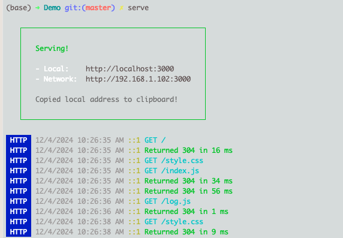

# 静态文件服务器 - serve


## 1. **什么是 `serve`？**

`npx serve` 是一个通过 `npx` 运行的静态文件服务器工具。它是 **`serve`** 包的一部分，可以快速托管静态文件（如 HTML、CSS、JavaScript），并生成一个本地或局域网的 HTTP 服务器。


## 2. 全局安装

```sh
# 全局安装
$ npm i serve -g

# 查看
$ npm ls -g
```


# 实战

## 1. 运行

* 进入指定文件夹 `Demo`
* 全局安装，运行：`$ serve`
* 局部安装，运行：`$ npx serve`




## 2. **常用参数**

- **`-p <port>`**：指定端口。

    ```
    bash
    
    
    复制代码
    npx serve -p 5000
    ```

- **`-s`**：启动单页面应用模式（将所有路由重定向到 `index.html`）。

    ```
    bash
    
    
    复制代码
    npx serve -s
    ```

- **`--ssl-cert` 和 `--ssl-key`**：启用 HTTPS。


