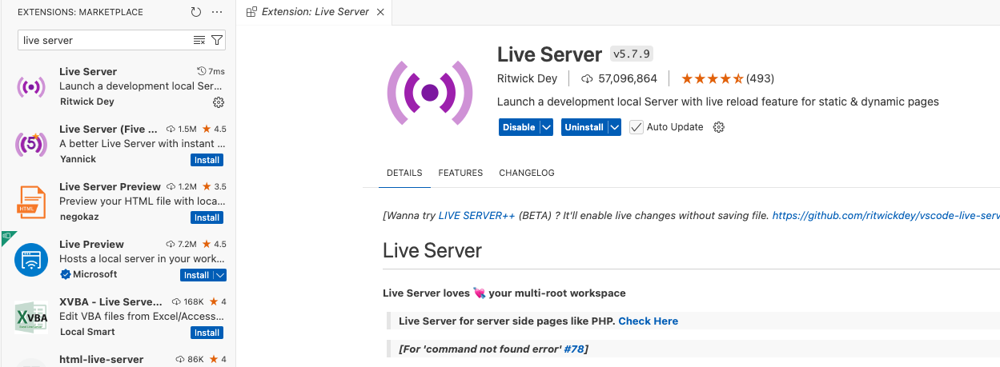
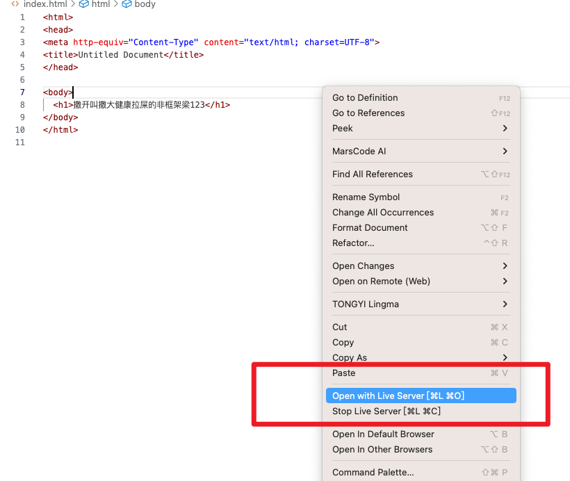

# Live Server 介绍

**Live Server** 是一个用于前端开发的 Visual Studio Code 扩展。它可以在本地启动一个开发服务器，并具有自动刷新（Live Reload）的功能，让开发者在修改 HTML、CSS、JavaScript 文件时，浏览器会自动更新页面，而无需手动刷新。

### **主要功能**

1. **实时预览**
    当你在编辑 HTML、CSS 或 JavaScript 文件时，Live Server 会自动刷新浏览器，方便查看实时效果。
2. **支持多种文件类型**
    除了 HTML 和 CSS，还支持其他前端文件，如 JavaScript、图像文件等。
3. **自定义端口和路径**
    你可以通过配置，使用自定义的端口号或根目录来启动服务器。
4. **HTTPS 支持**
    可选启用 HTTPS 来增强本地开发的安全性。
5. **嵌套页面支持**
    支持在项目的子文件夹中运行 HTML 文件。

### **安装和使用**

#### **1. 安装**

- 在 Visual Studio Code 中打开扩展市场。
- 搜索 **Live Server** 并安装。

#### **2. 使用**

- 在 VS Code 中打开一个 HTML 文件。
- 右键点击页面，选择“Open with Live Server”。
- 浏览器会自动打开，并显示页面内容。
- 之后，每当你修改并保存文件，页面会自动刷新。

