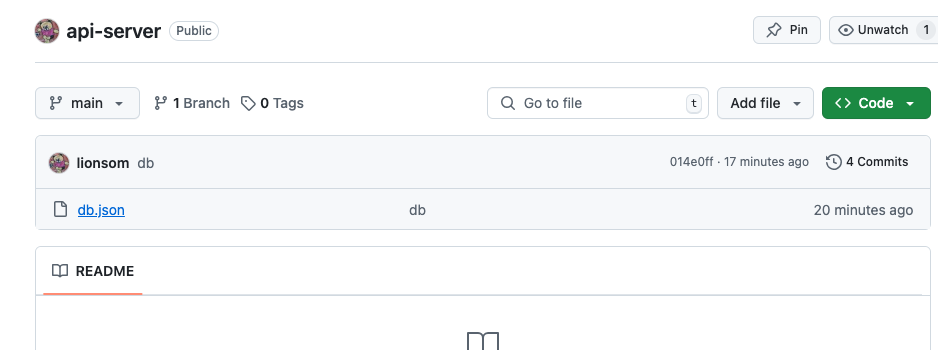
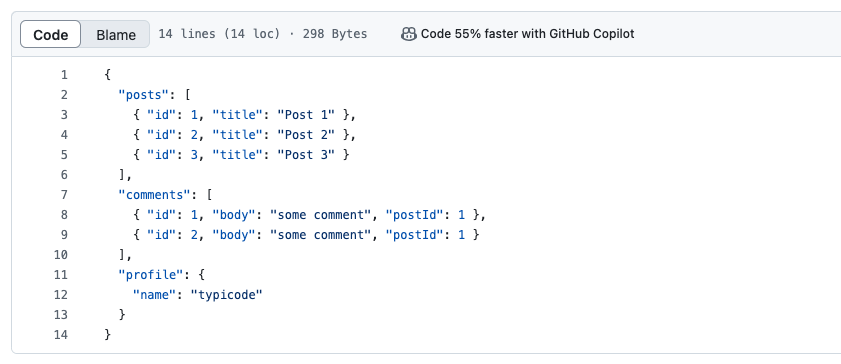
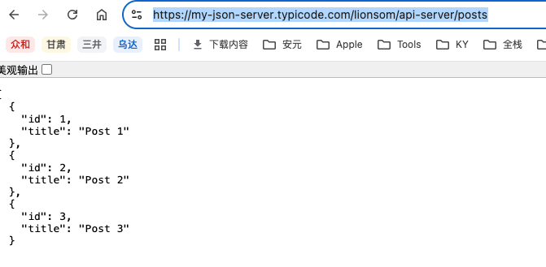

* [JSONPlaceholder](https://jsonplaceholder.typicode.com/)
* [my-json-server](https://my-json-server.typicode.com/)
    * [demo guide](https://my-json-server.typicode.com/typicode/demo)
    * Github: https://github.com/typicode/demo
    * Try it: https://my-json-server.typicode.com/typicode/demo/posts


# 实操

## 1. 创建仓库

https://github.com/lionsom/api-server




## 2. 写入db.json

```json
{
  "posts": [
    { "id": 1, "title": "Post 1" },
    { "id": 2, "title": "Post 2" },
    { "id": 3, "title": "Post 3" }
  ],
  "comments": [
    { "id": 1, "body": "some comment", "postId": 1 },
    { "id": 2, "body": "some comment", "postId": 1 }
  ],
  "profile": {
    "name": "typicode"
  }
}
```




## 3. 打开

https://my-json-server.typicode.com/lionsom/api-server/posts




