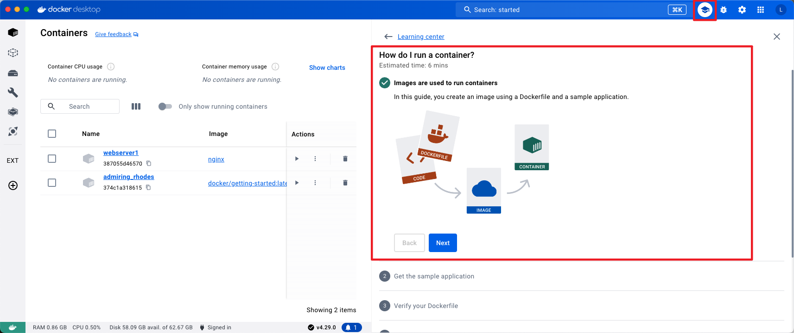
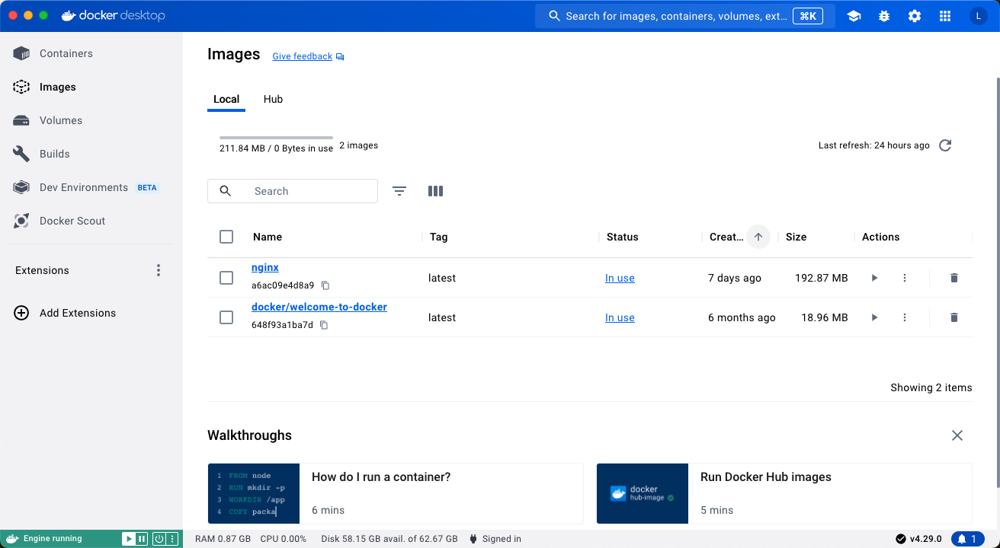
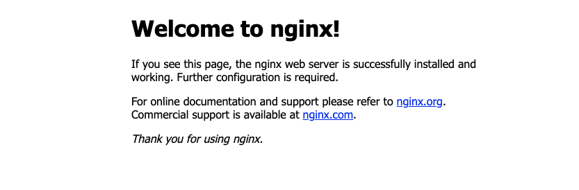
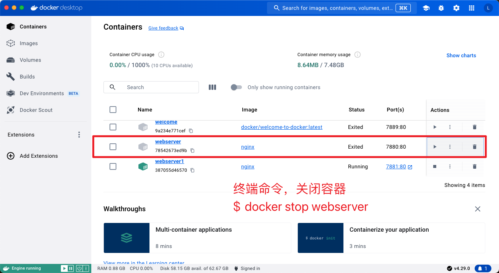

* 官方
    * [Docker 官网](https://www.docker.com/)
    * [Docker 官方文档](https://docs.docker.com/)
        * [Install Docker Desktop on Mac](https://docs.docker.com/desktop/install/mac-install/)
        * [Docker Desktop release notes](https://docs.docker.com/desktop/release-notes/)

    * [Docker Hub官网（安装docker镜像的仓库）](https://hub.docker.com)


* 视频
    * [哔哩哔哩 - 尚硅谷Docker实战教程（docker教程天花板）](https://www.bilibili.com/video/BV1gr4y1U7CY?p=1&vd_source=dc55c355e9f5b6174832aacfb5d8b6aa)
    * [哔哩哔哩-黑马Docker快速入门](https://www.bilibili.com/video/BV1HP4118797/?spm_id_from=333.337.search-card.all.click&vd_source=dc55c355e9f5b6174832aacfb5d8b6aa)

* 教程

    * [菜鸟教程 - MacOS Docker 安装](https://www.runoob.com/docker/macos-docker-install.html)

    * [Docker — 从入门到实践](https://yeasy.gitbook.io/docker_practice)
        * [macOS](https://yeasy.gitbook.io/docker_practice/install/mac)


# 一、Mac安装Docker Desktop

## 1. What’s Docker Desktop?

> **The fastest way to containerize applications.**
>
> Docker Desktop is secure, out-of-the-box containerization software offering developers and teams a robust, hybrid toolkit to build, share, and run applications anywhere.

容器化应用程序的最快方法

Docker Desktop是安全的，开箱即用的容器化软件，为开发人员提供了一个强大的混合工具包，可在任何地方构建，共享和运行应用程序。


## 2. 系统要求

* 系统越新越好

- At least 4 GB of RAM.


## 3. 两种安装方式

### a. 使用 Homebrew 安装

```sh
$ brew install --cask docker

# or
$ brew install --cask --appdir=/Applications docker
```


### b. 手动下载安装

首先打开Docker官网并下载 [Docker Desktop](https://www.docker.com/products/docker-desktop/)，选择Apple Chip下载。


打开Docker Desktop应用


启动终端后，通过命令可以检查安装后的 Docker 版本。

```sh
$ docker --version
Docker version 26.0.0, build 2ae903e

# or
$ docker info

# 其他
$ docker-compose --version
$ docker-machine --version
```


# 二、镜像加速

* [Docker — 从入门到实践 -- 镜像加速器](https://yeasy.gitbook.io/docker_practice/install/mirror)

国内从 Docker Hub 拉取镜像有时会遇到困难，此时可以配置镜像加速器。国内很多云服务商都提供了国内加速器服务，例如：

- [阿里云加速器(点击管理控制台 -> 登录账号(淘宝账号) -> 左侧镜像工具 -> 镜像加速器 -> 复制加速器地址)](https://cr.console.aliyun.com/cn-hangzhou/instances)
- [网易云加速器 `https://hub-mirror.c.163.com`](https://www.163yun.com/help/documents/56918246390157312)
- [百度云加速器 `https://mirror.baidubce.com`](https://cloud.baidu.com/doc/CCE/s/Yjxppt74z#使用dockerhub加速器)

**由于镜像服务可能出现宕机，建议同时配置多个镜像。各个镜像站测试结果请到** [**docker-practice/docker-registry-cn-mirror-test**](https://github.com/docker-practice/docker-registry-cn-mirror-test/actions) **查看。**


## 1. macOS

对于使用 macOS 的用户，在任务栏点击 Docker Desktop 应用图标 -> `Settings...`，在左侧导航菜单选择 `Docker Engine`，在右侧像下边一样编辑 json 文件。修改完成之后，点击 `Apply & restart` 按钮，Docker 就会重启并应用配置的镜像地址了。

复制

```
{
  "registry-mirrors": [
    "https://hub-mirror.c.163.com",
    "https://mirror.baidubce.com"
  ]
}
```


## 2. 检查加速器是否生效

执行 `$ docker info`，如果从结果中看到了如下内容，说明配置成功。

```sh
$ docker info
.......
Registry Mirrors:
  https://hub-mirror.c.163.com/
  https://mirror.baidubce.com/
```


# 三、Docker Desktop教程中心




# 四、简单运行 Nginx

## 1. 命令行操作

如果 `docker version`、`docker info` 都正常的话，可以尝试运行一个 [Nginx 服务器](https://hub.docker.com/_/nginx/)：

```sh
# 初次安装
$ docker run -d -p 7880:80 --name webserver nginx

Unable to find image 'nginx:latest' locally
latest: Pulling from library/nginx
26070551e657: Pull complete
cd17d01e1374: Pull complete
ef0e643bf248: Pull complete
87875ca4aaca: Pull complete
2b81c8fa4150: Pull complete
e9f795af5c8b: Pull complete
ca43e9145418: Pull complete
Digest: sha256:0463a96ac74b84a8a1b27f3d1f4ae5d1a70ea823219394e131f5bf3536674419
Status: Downloaded newer image for nginx:latest
78542673ed9b2964d8f1a279f7c22d69ed97ccf550ee6841f01c9de36ee0da3d

# 再次安装，修改 port 和 name
$ docker run -d -p 7881:80 --name webserver1 nginx
387055d465708e28147892e88e49812f17c85485ba046dd54f563728c9104917
```

在终端中执行，发现本地没有 `nginx:latest` 镜像，所以先下载镜像，然后再创建一个名为 `webserver` 的容器，端口号7880。

再创建一个名为 `webserver1`  的新容器，端口号7881。


在 docker desktop 的 image 可以看到我们刚刚下载到的 `iginx` 镜像。




在 docker desktop 容器中 可以看到，我们在终端中创建的 `webserver` 和 `webserver1` 两个容器。


分别打开 http://localhost:7880/ 与 http://localhost:7881/



成功！！！


要停止 Nginx 服务器并删除执行下面的命令：

```sh
# 停止容器运行
$ docker stop webserver

# 删除容器
$ docker rm webserver
```



**【以上操作在docker desktop的页面中都可操作！！！！】**


## 2. 在Docker Desktop页面上操作

简单，不展示！！


## 3. 推荐 - 入门镜像

### 1. docker/getting-started

```sh
$ docker pull docker/getting-started

$ docker run -d -p 8081:80 docker/getting-started
```

### 2. docker/welcome-to-docker

```sh
$ docker pull docker/welcome-to-docker

$ docker run -d -p 8088:80 --name welcome-to-docker docker/welcome-to-docker
```


# 五、常用命令

## 1. 查看基本信息

```sh
# 查看docker安装路径
$ whick docker
/usr/local/bin/docker
# or
$ where docker
/usr/local/bin/docker

# 查看docker版本
$ docker --version
Docker version 26.0.0, build 2ae903e

# 查看docker详情
$ docker info
```


## 2. 镜像操作命令

```sh
# 搜索某个镜像
$ docker search nginx
```

```sh
# 拉取某个镜像
$ docker pull nginx
```

```sh
# 查看本地所有的镜像
$ docker image ls
$ docker images   # [缩写]
REPOSITORY                     TAG       IMAGE ID       CREATED         SIZE
multi-container-app-todo-app   latest    d02a2230eecb   2 days ago      224MB
welcome-to-docker111           latest    499823d5df3d   2 days ago      223MB
welcome-to-docker              latest    3dcfde2d2b73   2 days ago      223MB
mongo                          6         462e60a3a0cd   9 days ago      660MB
nginx                          latest    a6ac09e4d8a9   11 days ago     193MB
docker/welcome-to-docker       latest    648f93a1ba7d   5 months ago    19MB
docker/getting-started         latest    289dc403af49   16 months ago   46.5MB
```

```sh
# 删除某个镜像
$ docker image rm welcome-to-docker111:latest
# or
$ docker rmi welcome-to-docker111:latest
Untagged: welcome-to-docker111:latest
Deleted: sha256:499823d5df3d2cd5aea643fed88f6a9024104afccc6f09f6366d6fc4c596190b 

#【注意】：若存在容器使用的镜像，无法删除
$ docker image rm welcome-to-docker111:latest
Error response from daemon: conflict: unable to remove repository reference "welcome-to-docker111:latest" (must force) - container 7f4576c676bb is using its referenced image 499823d5df3d
```


## 3. 容器操作命令

```sh
# 查看目前运行的容器
$ docker ps
CONTAINER ID   IMAGE          COMMAND                   CREATED      STATUS         PORTS                  NAMES
7665ea9790bb   nginx:latest   "/docker-entrypoint.…"   2 days ago   Up 3 seconds   0.0.0.0:3355->80/tcp   my-nginx
```

```sh
# 查看所有容器
$ docker ps -a
....
```

```sh
# 创建一个新的容器
$ docker run --name mynginx -d nginx:latest
503d71e77a7a6dc60018ddeb9fd683bda39245bf4195663ec63eb65ef6fe1c1a
```

```sh
# 删除容器，-f 强制删除正在运行的容器
$ docker rm -f my-nginx-2
```


# 六、Docker 命令大全

## 1. 容器生命周期管理

- [run](https://www.runoob.com/docker/docker-run-command.html)
- [start/stop/restart](https://www.runoob.com/docker/docker-start-stop-restart-command.html)
- [kill](https://www.runoob.com/docker/docker-kill-command.html)
- [rm](https://www.runoob.com/docker/docker-rm-command.html)
- [pause/unpause](https://www.runoob.com/docker/docker-pause-unpause-command.html)
- [create](https://www.runoob.com/docker/docker-create-command.html)
- [exec](https://www.runoob.com/docker/docker-exec-command.html)

## 2. 容器操作

- [ps](https://www.runoob.com/docker/docker-ps-command.html)
- [inspect](https://www.runoob.com/docker/docker-inspect-command.html)
- [top](https://www.runoob.com/docker/docker-top-command.html)
- [attach](https://www.runoob.com/docker/docker-attach-command.html)
- [events](https://www.runoob.com/docker/docker-events-command.html)
- [logs](https://www.runoob.com/docker/docker-logs-command.html)
- [wait](https://www.runoob.com/docker/docker-wait-command.html)
- [export](https://www.runoob.com/docker/docker-export-command.html)
- [port](https://www.runoob.com/docker/docker-port-command.html)
- [stats](https://www.runoob.com/docker/docker-stats-command.html)

## 3. 容器rootfs命令

- [commit](https://www.runoob.com/docker/docker-commit-command.html)
- [cp](https://www.runoob.com/docker/docker-cp-command.html)
- [diff](https://www.runoob.com/docker/docker-diff-command.html)

## 4. 镜像仓库

- [login](https://www.runoob.com/docker/docker-login-command.html)
- [pull](https://www.runoob.com/docker/docker-pull-command.html)
- [push](https://www.runoob.com/docker/docker-push-command.html)
- [search](https://www.runoob.com/docker/docker-search-command.html)

## 5. 本地镜像管理

- [images](https://www.runoob.com/docker/docker-images-command.html)
- [rmi](https://www.runoob.com/docker/docker-rmi-command.html)
- [tag](https://www.runoob.com/docker/docker-tag-command.html)
- [build](https://www.runoob.com/docker/docker-build-command.html)
- [history](https://www.runoob.com/docker/docker-history-command.html)
- [save](https://www.runoob.com/docker/docker-save-command.html)
- [load](https://www.runoob.com/docker/docker-load-command.html)
- [import](https://www.runoob.com/docker/docker-import-command.html)

## 6. info|version

- [info](https://www.runoob.com/docker/docker-info-command.html)
- [version](https://www.runoob.com/docker/docker-version-command.html)


