# 一、盒子模型

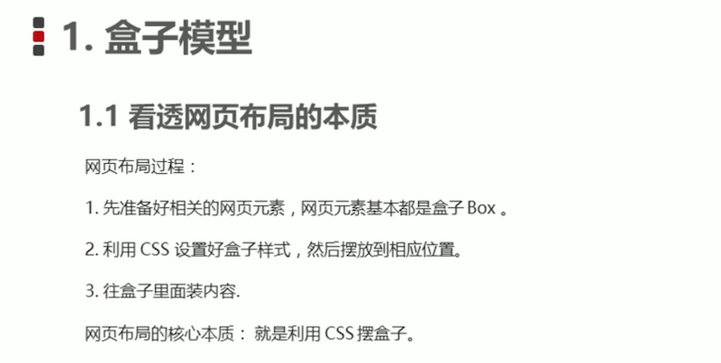

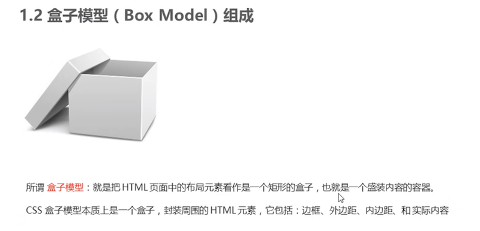

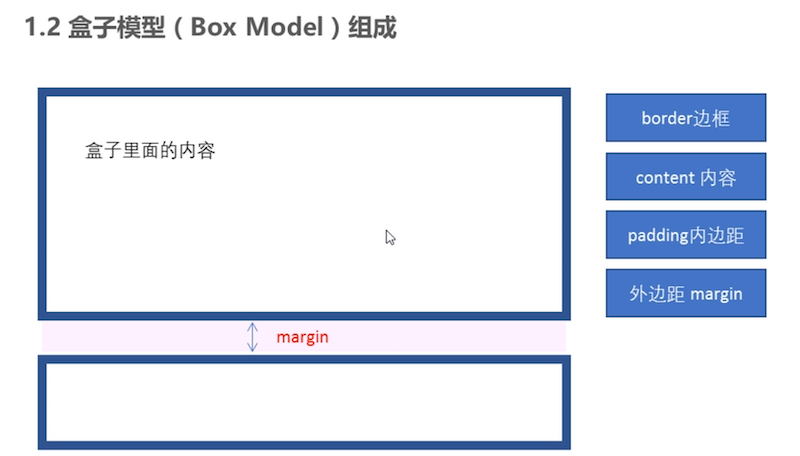

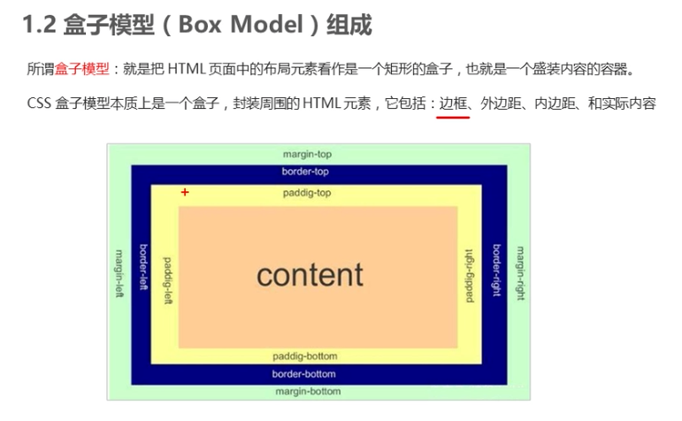


## 1.1 边框 - border

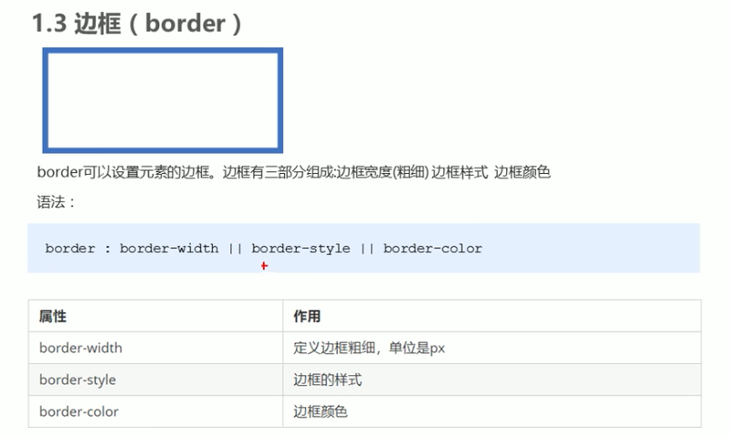

```html
<style>
    div {
        width: 300px;
        height: 200px;
        /* border-width 边框的粗细  一般情况下都用 px */
        border-width: 5px;

        /* border-style 边框的样式  solid 实线边框   dashed 虚线边框  dotted 点线边框*/
        border-style: solid;

        /* border-color 边框的颜色 */
        border-color: pink;
    }
</style>
```


### 1. 复合写法

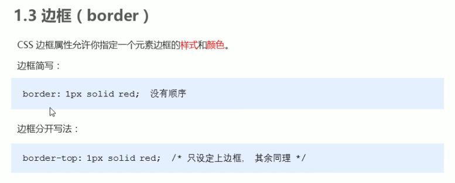

```
<style>
    div {
        width: 300px;
        height: 200px;

        /* 边框的复合写法 简写:  */
        border: 5px solid pink;

        /* 上边框 */
        border-top: 5px solid pink;

        /* 下边框 */
        border-bottom: 10px dashed purple;
    }
</style>
```


### 2. 表格边框

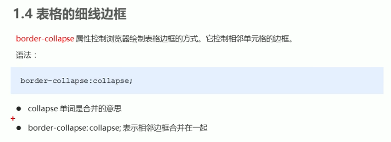

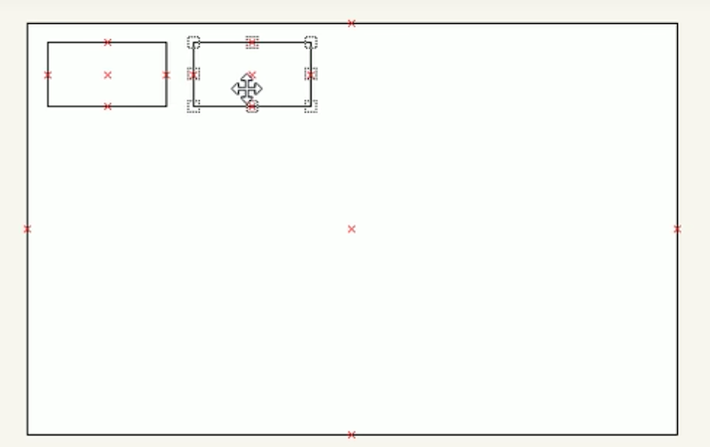

```
<style>
    table {
        width: 500px;
        height: 249px;
    }
    th {
        height: 35px;
    }
    table,
    td, th {
        border: 1px solid pink;
        /* 合并相邻的边框 */
        border-collapse: collapse;
        font-size: 14px;
        text-align: center;
    }
</style>
```


### 3. 边框影响盒子宽高

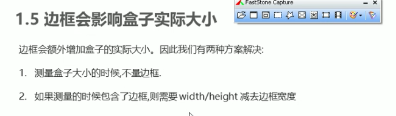


## 1.2 padding - 内边距

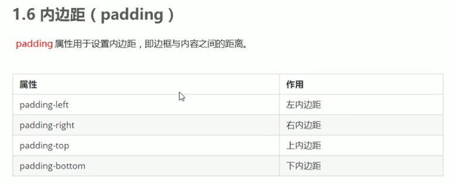

```
<style>
        div {
            width: 200px;
            height: 200px;
            background-color: pink;
            padding-left: 20px;
            padding-top: 30px;
        }
    </style>
```


### 1. 简写

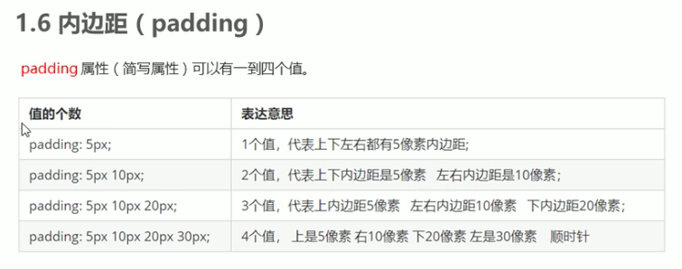


### 2. padding影响盒子宽高

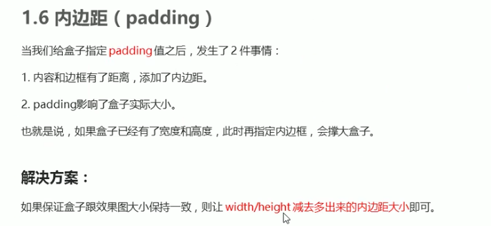


### 3. padding不会撑开盒子的情况

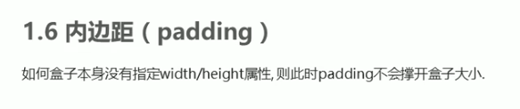

```html
<head>
    <meta charset="UTF-8">
    <meta name="viewport" content="width=device-width, initial-scale=1.0">
    <meta http-equiv="X-UA-Compatible" content="ie=edge">
    <title>padding不会影响盒子大小的情况</title>
    <style>   
       h1 {
           /* width: 100%; */
           height: 200px;
           background-color: pink;
           padding: 30px;
       }
       div {
           width: 300px;
           height: 100px;
           background-color: purple;
       }
       div p {
           padding: 30px;
           background-color: skyblue;
       }
    </style>
</head>
<body>
   <h1></h1>
   <div>
       <p></p>
   </div>
</body>
```


### 4. padding实战

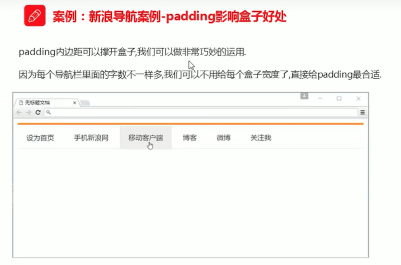


## 1.3 外边距 - margin

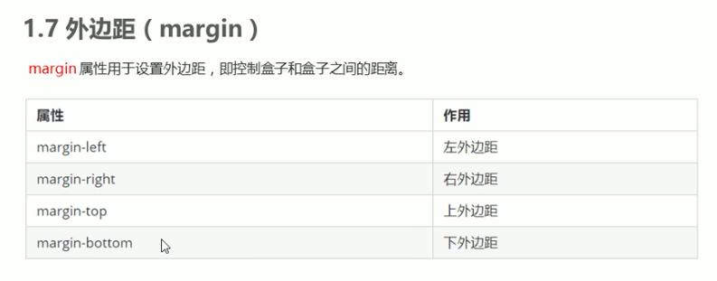

```html
<head>
    <meta charset="UTF-8">
    <meta name="viewport" content="width=device-width, initial-scale=1.0">
    <meta http-equiv="X-UA-Compatible" content="ie=edge">
    <title>盒子模型之外边距margin</title>
    <style>
      div {
          width: 200px;
          height: 200px;
          background-color: pink;
      }
      /* .one {
          margin-bottom: 20px;
      } */
      .two {
          /* margin-top: 20px; */
          /* margin: 30px; */
          margin: 30px 50px;
      }
    </style>
</head>
<body>
    <div class="one">1</div>
    <div class="two">2</div>
</body>
```


### 1. margin典型应用 - 盒子水平居中

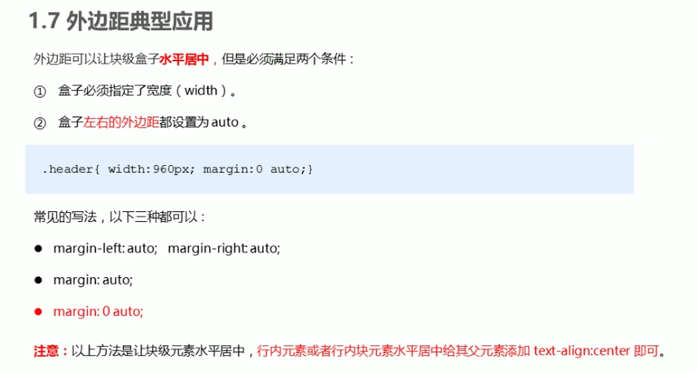


### 2. 块级盒子水平居中

```html
<head>
    <title>块级盒子水平居中对齐</title>
    <style>
      .header {
          width: 900px;
          height: 200px;
          background-color: pink;
          margin: 100px auto;
      }
    </style>
</head>
<body>
    <div class="header"></div>
</body>
```


### 3. 行内元素或者行内块元素水平居中

```html
<head>
    <title>行内元素/行内块元素水平居中对齐</title>
    <style>
        .header {
            width: 900px;
            height: 200px;
            background-color: pink;
            margin: 100px auto;
        
            /* 行内元素或者行内块元素水平居中给其父元素添加 text-align:center 即可 */
            text-align: center;
        }
    </style>
</head>
<body>
    <div class="header">
        <span>里面的文字</span>
    </div>
    <div class="header">
        
    </div>
</body>
```


### 4. 外边距合并 - 嵌套塌陷

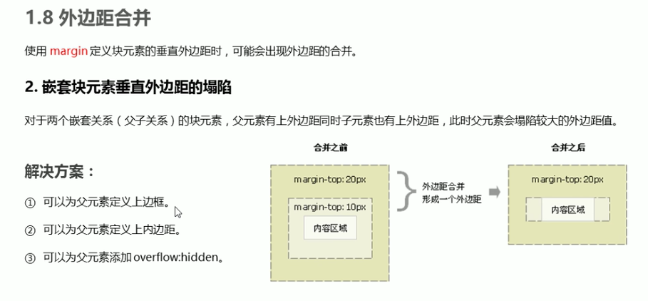

**塌陷**

> 此时 son元素无法margin  100px

```html
<head>
    <meta charset="UTF-8">
    <meta name="viewport" content="width=device-width, initial-scale=1.0">
    <meta http-equiv="X-UA-Compatible" content="ie=edge">
    <title>外边距合并-嵌套块级元素垂直外边距塌陷</title>
    <style>
        .father {
            width: 400px;
            height: 400px;
            background-color: purple;
            margin-top: 50px;
        }
        .son {
            width: 200px;
            height: 200px;
            background-color: pink;
            margin-top: 100px;
        }
    </style>
</head>
<body>
    <div class="father">
        <div class="son"></div>
    </div>
</body>
```

**解决方案**

```html
<head>
    <meta charset="UTF-8">
    <meta name="viewport" content="width=device-width, initial-scale=1.0">
    <meta http-equiv="X-UA-Compatible" content="ie=edge">
    <title>外边距合并-嵌套块级元素垂直外边距塌陷</title>
    <style>
        .father {
            width: 400px;
            height: 400px;
            background-color: purple;
            margin-top: 50px;

            /* 解决方案1: 新增外边框 */
            border: 1px solid red;
            border: 1px solid transparent;

            /* 解决方案2: 新增内边距 */
            padding: 1px;
            
            /* 解决方案3: 新增overflow: hidden */
            overflow: hidden;

            /* 其他解决方案：浮动、固定、绝对定位的盒子不会有塌陷的问题！！！ */
        }
        .son {
            width: 200px;
            height: 200px;
            background-color: pink;
            margin-top: 100px;
        }
    </style>
</head>
<body>
    <div class="father">
        <div class="son"></div>
    </div>
</body>
```


## 1.4 清除内外边距

* 1.先清理默认内外边距；
* 2.行内元素尽量设置左右边距，上下边距设置也不起作用；若想要设置上下边距，则需要转为块元素 或 行内块元素

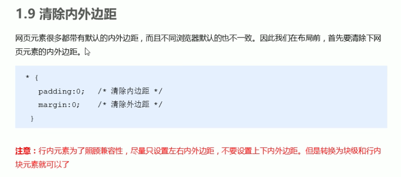

```css
<style>
    /* 这句话也是我们css 的第一行代码 */
    * {
        margin: 0;
        padding: 0;
    }
</style>
```


# 二、盒子模型 - 案例

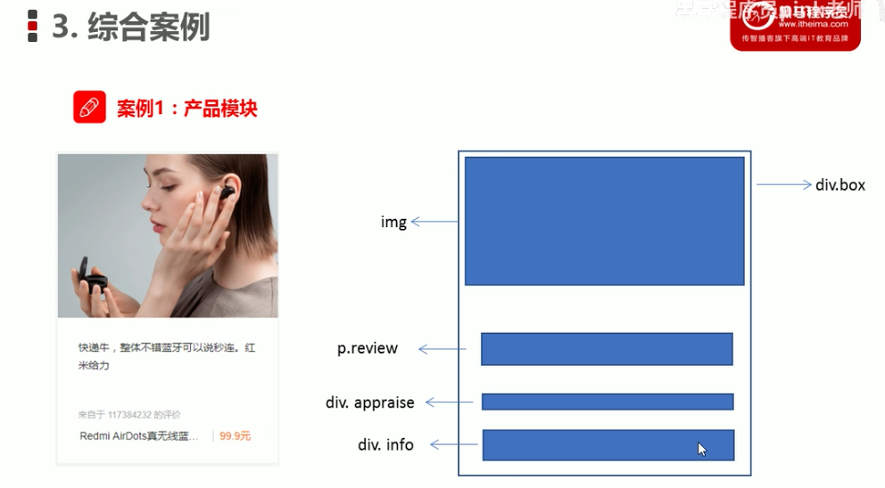

