# 一、网页布局的三种方式

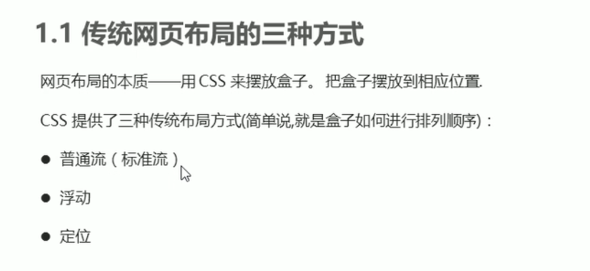

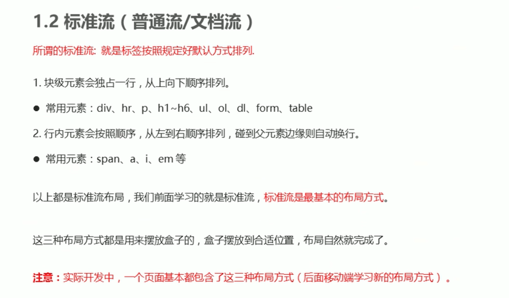


# 二、浮动

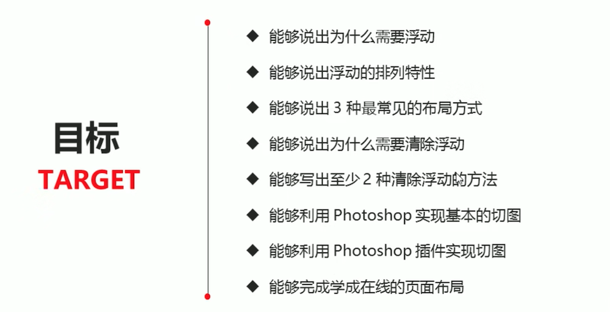


## 2.1 为什么需要浮动？

> 标准流解决垂直布局；浮动解决水平布局。

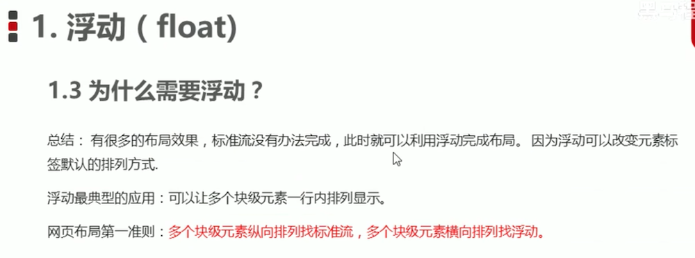


## 2.2 什么是浮动？

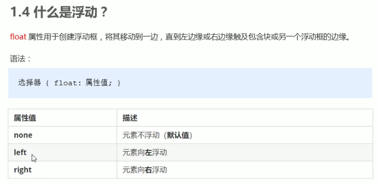


## 2.3 浮动特性

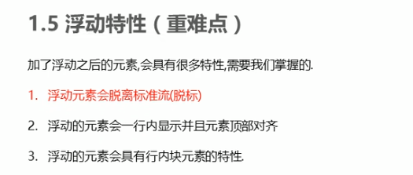

### 特性1：脱标

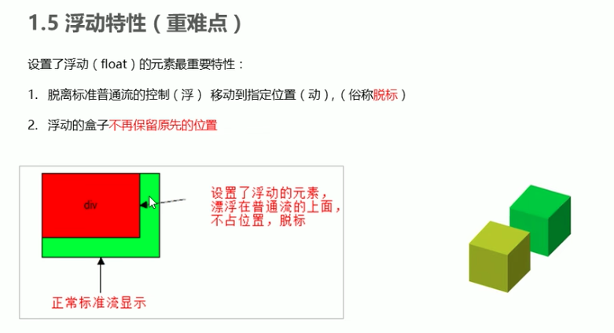

### 特性2：浮动元素一行显示

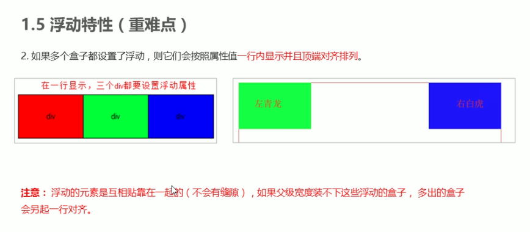

### 特性3：具有行内块元素特性

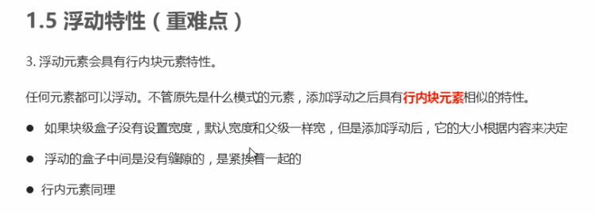

```
<style>
     /* 任何元素都可以浮动。不管原先是什么模式的元素，添加浮动之后具有行内块元素相似的特性。 */
     span,
     div {
         float: left;
         width: 200px;
         height: 100px;
         background-color: pink;
     }

     /* 如果行内元素有了浮动,则不需要转换块级\行内块元素就可以直接给高度和宽度 */
     p {
         float: right;
         height: 200px;
         background-color: purple;
     }
 </style>
```


## 2.4 浮动搭配标准流父级使用

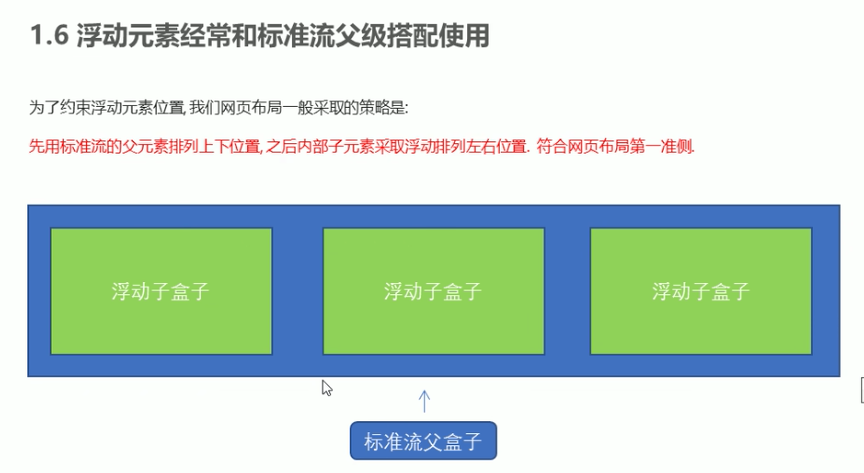


## 2.5 浮动实战 - 小米网站

......


## 2.6 浮动的两个注意点

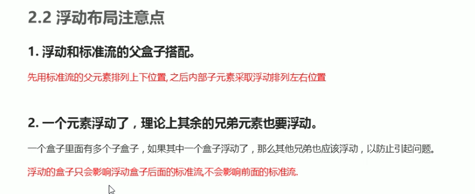


## 2.7 清除浮动

### 1. 为什么清除浮动？

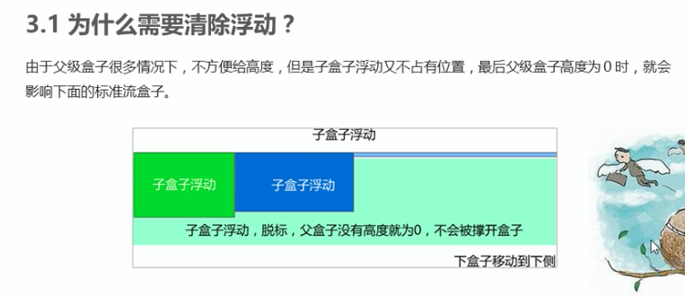


### 2. 清除浮动本质

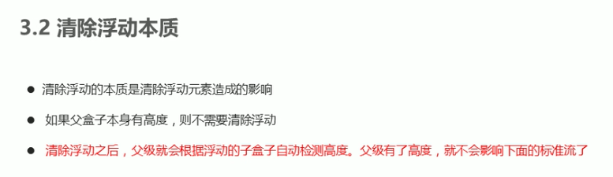


### 3. 如何清除浮动

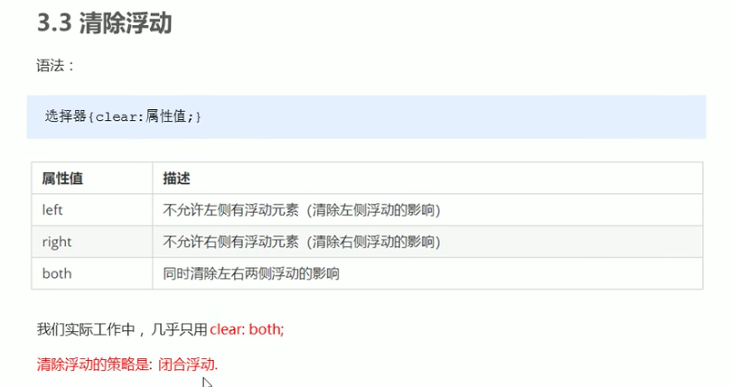


### 4. 清除浮动的方法

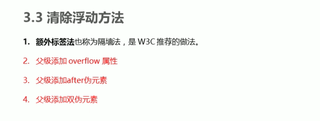


#### a. 额外标签法 - W3C推荐

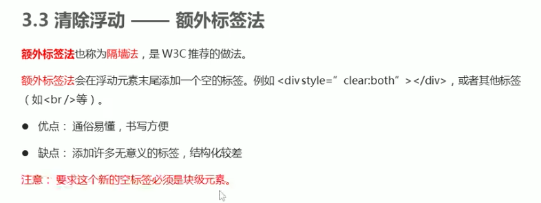

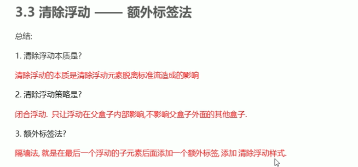

```
<style>
    .clear {
        clear: both;
    }
</style>

<body>
    <div class="box">
        <div class="damao">大毛</div>
        <div class="ermao">二毛</div>

        <!-- 这个新增的盒子要求必须是块级元素不能是行内元素 -->
        <span class="clear"></span>
    </div>
    <div class="footer"></div>
</body>
```


#### b. 父级添加overflow


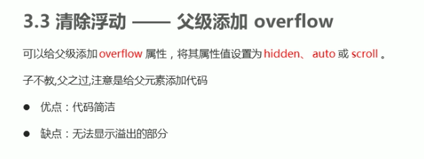

```
<style>
    .box {
        /* 清除浮动 */
        overflow: hidden;
        width: 800px;
        border: 1px solid blue;
        margin: 0 auto;
    }
</style>
```


#### c. :after伪元素法

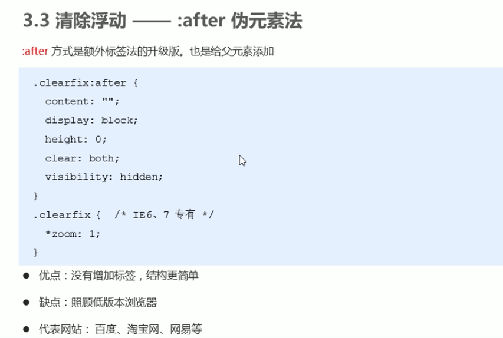

```
 <style>
        .clearfix:after {
            content: "";
            display: block;
            height: 0;
            clear: both;
            visibility: hidden;
        }

        .clearfix {
            /* IE6、7 专有 */
            *zoom: 1;
        }
</style>

<body>
    <div class="box clearfix">
        <div class="damao">大毛</div>
        <div class="ermao">二毛</div>
    </div>
    <div class="footer"></div>
</body>
```


#### d. 双伪类元素法

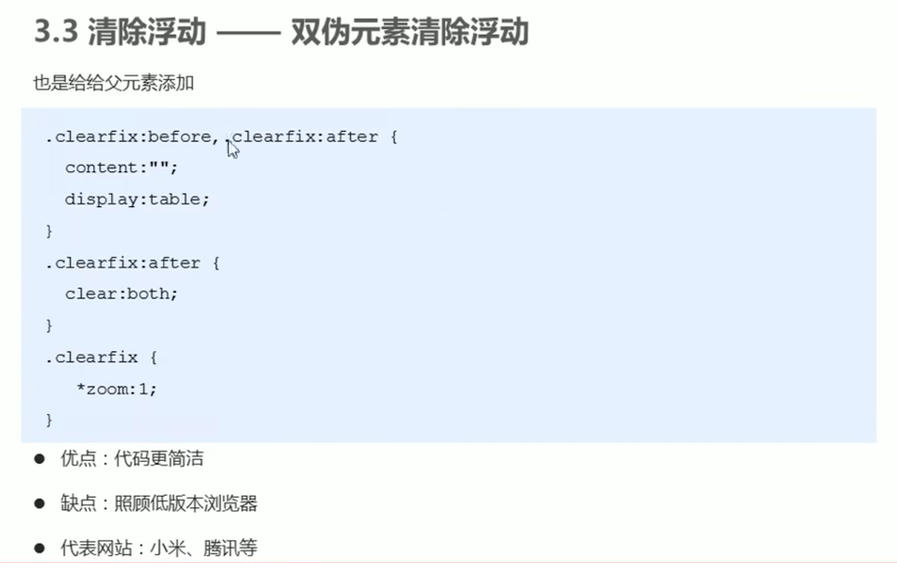

```
 <style>
        .clearfix:before,
        .clearfix:after {
            content: "";
            display: table;
        }

        .clearfix:after {
            clear: both;
        }

        .clearfix {
            *zoom: 1;
        }
</style>

<body>
    <div class="box clearfix">
        <div class="damao">大毛</div>
        <div class="ermao">二毛</div>
    </div>
    <div class="footer"></div>
</body>
```


### 5. 清除浮动总结

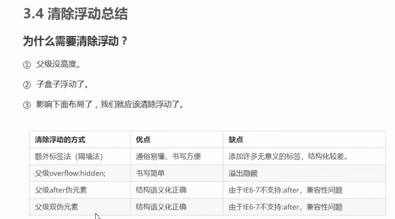


