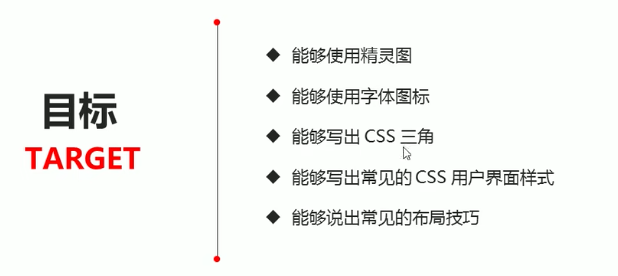

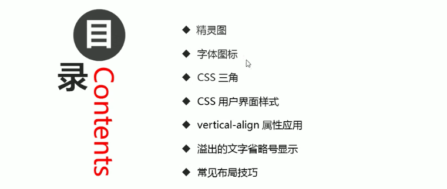


# 一、精灵图

## 1.1 为什么需要精灵图


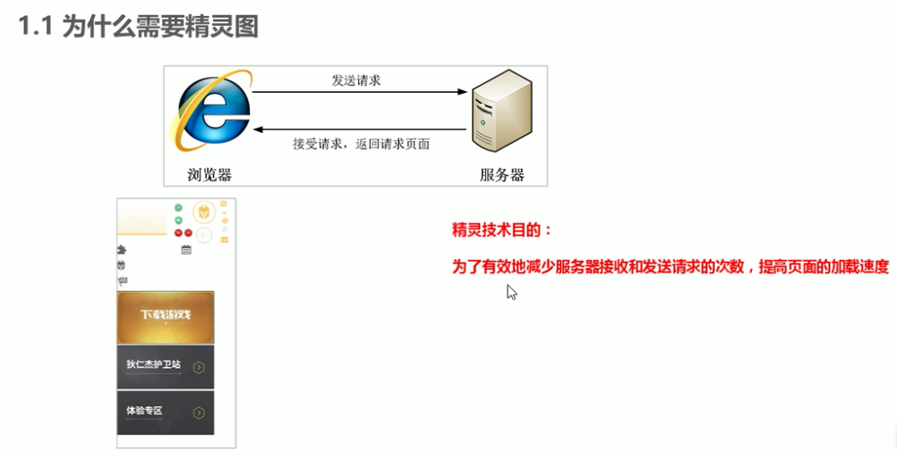


## 1.2 精灵图的使用

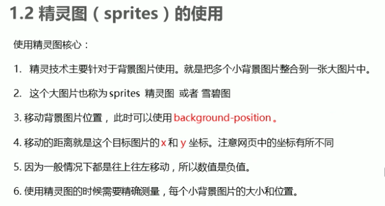

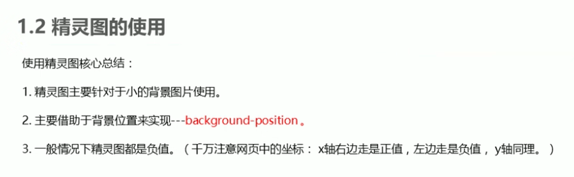


```
.box1 {
    width: 60px;
    height: 60px;   
    margin: 100px auto;
    background: url(images/sprites.png) no-repeat -182px 0;
}
```


## 1.3 案例 - 拼出英文名


# 二、字体图标

## 2.1 字体图标的产生

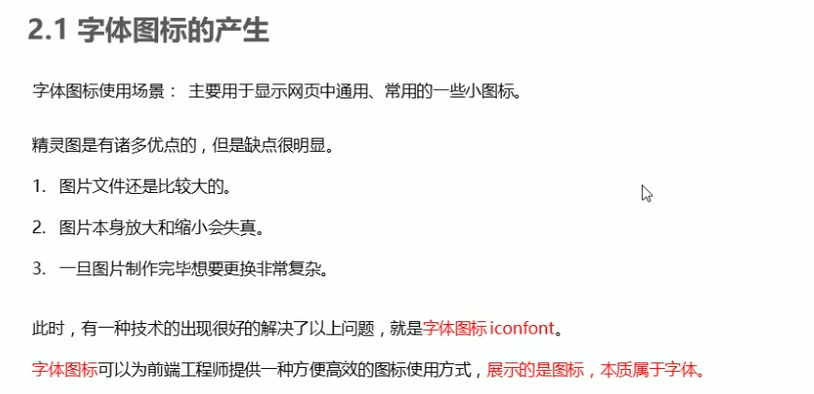


## 2.2 字体图标优点

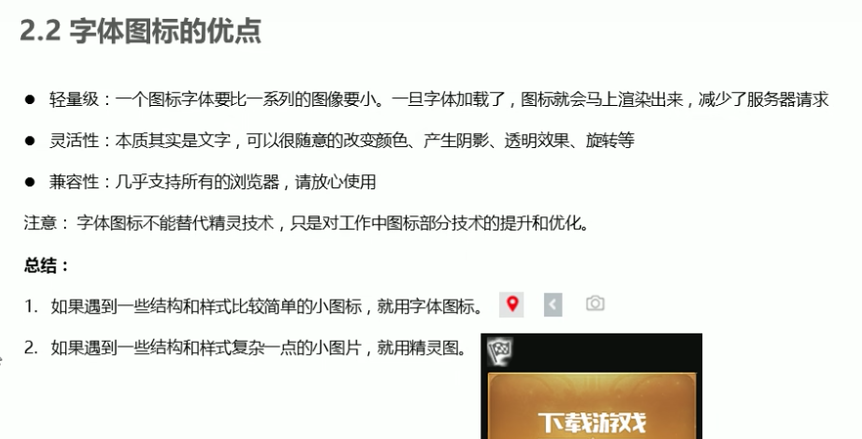


## 2.3 下载推荐

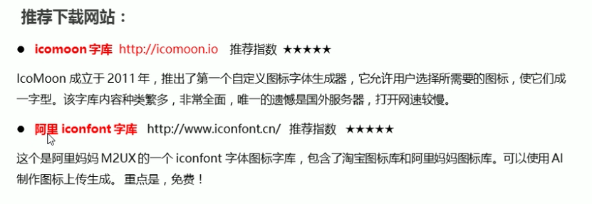


## 2.4 字体图标使用

### 1.引入到fonts目录下

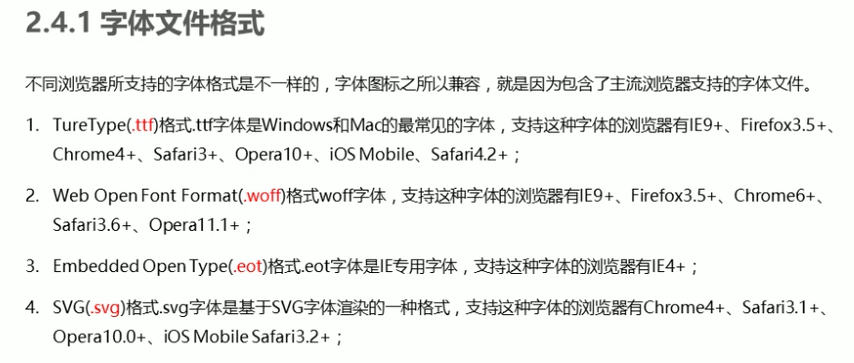

### 2.字体声明

```
<style>
    /* 字体声明 */
    @font-face {
        font-family: 'icomoon';
        src: url('fonts/icomoon.eot?p4ssmb');
        src: url('fonts/icomoon.eot?p4ssmb#iefix') format('embedded-opentype'),
             url('fonts/icomoon.ttf?p4ssmb') format('truetype'),
             url('fonts/icomoon.woff?p4ssmb') format('woff'),
             url('fonts/icomoon.svg?p4ssmb#icomoon') format('svg');
        font-weight: normal;
        font-style: normal;
        font-display: block;
    }
  </style>
```

### 3.使用

```
<style>
    /* 字体声明 */
    @font-face {
        font-family: 'icomoon';
        src: url('fonts/icomoon.eot?p4ssmb');
        src: url('fonts/icomoon.eot?p4ssmb#iefix') format('embedded-opentype'),
             url('fonts/icomoon.ttf?p4ssmb') format('truetype'),
             url('fonts/icomoon.woff?p4ssmb') format('woff'),
             url('fonts/icomoon.svg?p4ssmb#icomoon') format('svg');
        font-weight: normal;
        font-style: normal;
        font-display: block;
    }

    span {
        font-family: 'icomoon';
        font-size: 100px;
        color:pink;
    }
  </style>

<body>
    <span></span>
<span></span>
</body>
```


## 2.5 字体图标的新增 - 视频258


# 三、CSS三角

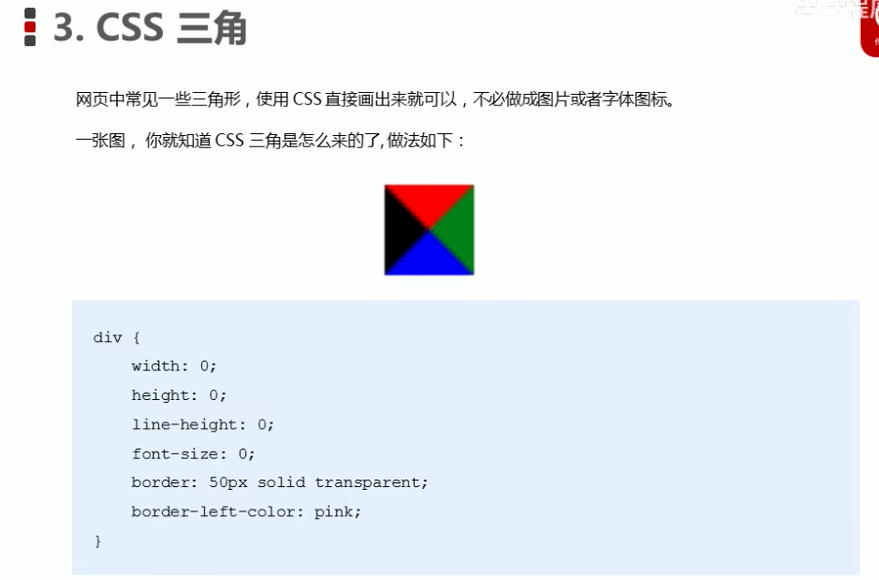

```css
.box1 {
    width: 0;
    height: 0;
    /* border: 10px solid pink; */
    border-top: 10px solid pink;
    border-right: 10px solid red;
    border-bottom: 10px solid blue;
    border-left: 10px solid green;
}
.box2 {
    width: 0;
    height: 0;
    border: 50px solid transparent;
    border-left-color: pink;
    margin: 100px auto;
}
```


# 四、CSS用户界面样式

## 4.1.鼠标

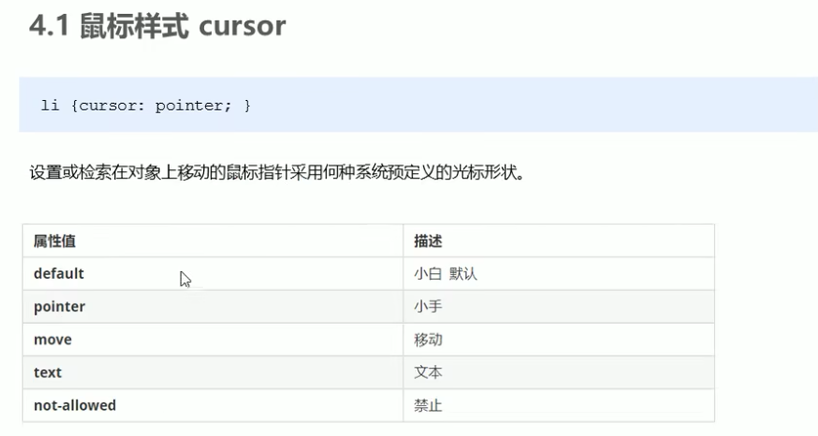

```html
<body>
    <ul>
        <li style="cursor: default;">我是默认的小白鼠标样式</li>
        <li style="cursor: pointer;">我是鼠标小手样式</li>
        <li style="cursor: move;">我是鼠标移动样式</li>
        <li style="cursor: text;">我是鼠标文本样式</li>
        <li style="cursor: not-allowed;">我是鼠标禁止样式</li>
    </ul>
</body>
```


## 4.2.表单

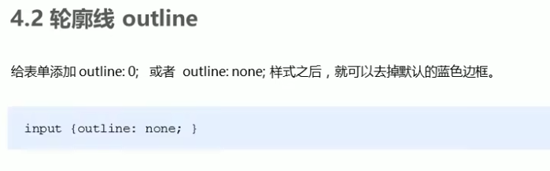

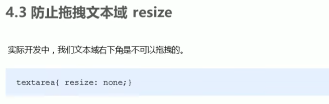

```css
input {
    /* 取消表单轮廓 */
    outline: none;
}

textarea {
    /* 防止拖拽文本域 */
    resize: none;
}
```


# 五、vertical-align属性应用

## 5.1.图片/表单/文字垂直居中

> 行内元素 或 行内块元素有效

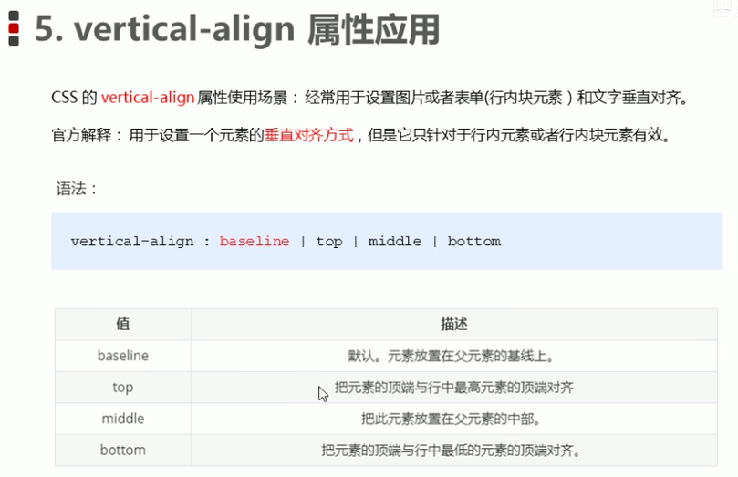

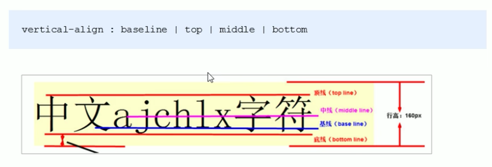

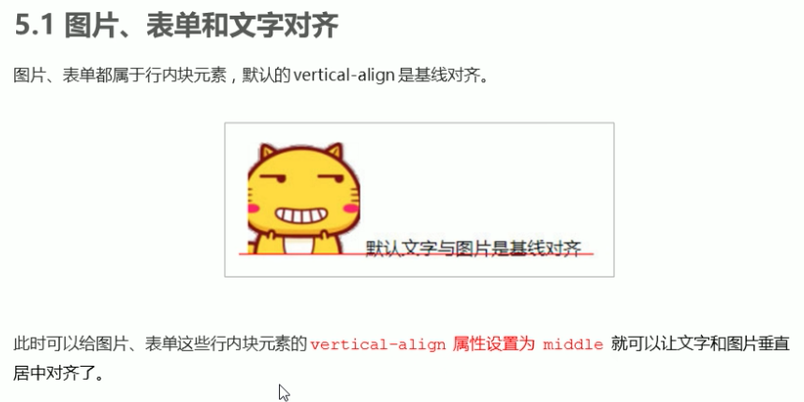


## 5.2.图片底部留白问题

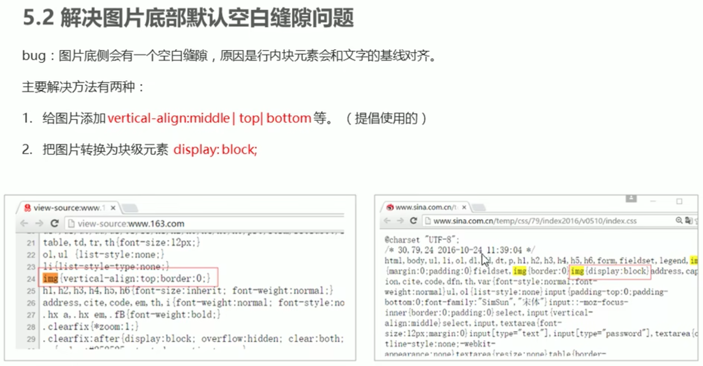

```
img {
    <!-- 方法一 -->
    vertical-align: middle;
    
    <!-- 方法二 -->
    display: block;
}
```


# 六、溢出文字省略号...

## 6.1.单行文字省略号

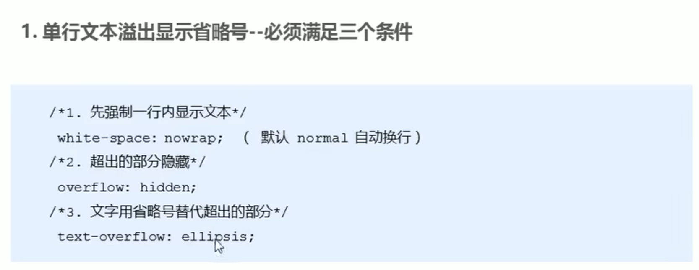

```css
div {
    width: 150px;
    height: 80px;
    background-color: pink;
    margin: 100px auto;
    
    /* 这个单词的意思是如果文字显示不开自动换行 */
    /* white-space: normal; */
    /* 1.这个单词的意思是如果文字显示不开也必须强制一行内显示 */
    white-space: nowrap;
    /* 2.溢出的部分隐藏起来 */
    overflow: hidden;
    /* 3. 文字溢出的时候用省略号来显示 */
    text-overflow: ellipsis;
}
```


## 6.2.多行文字省略号

> 缺点：有兼容问题

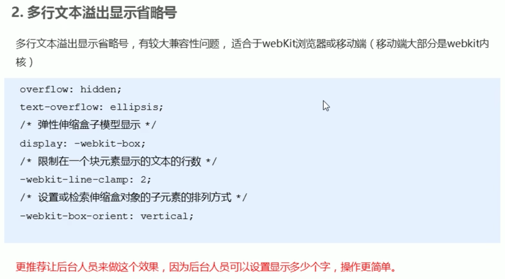


```css
div {
    width: 150px;
    height: 65px;
    background-color: pink;
    margin: 100px auto;

    /* 溢出的部分隐藏起来 */
    overflow: hidden;
    /* 文字溢出的时候用省略号来显示 */
    text-overflow: ellipsis;
    /* 弹性伸缩盒子模型显示 */
    display: -webkit-box;
    /* 限制在一个块元素显示的文本的行数 */
    -webkit-line-clamp: 3;
    /* 设置或检索伸缩盒对象的子元素的排列方式 */
    -webkit-box-orient: vertical;
}
```


# 七、常见布局技巧

## 7.1.margin负值运用


### 接上：显示完整边框

```css
<!-- 方法一 -->
ul li:hover {
    /* 1. 如果盒子没有定位，则鼠标经过添加相对定位即可 */
    position: relative;
    border: 1px solid blue;

}

<!-- 方法二 -->
ul li:hover {
    /* 2.如果li都有定位，则利用 z-index提高层级 */
    z-index: 1;
    border: 1px solid blue;
}
```


## 7.2.文字换位浮动元素

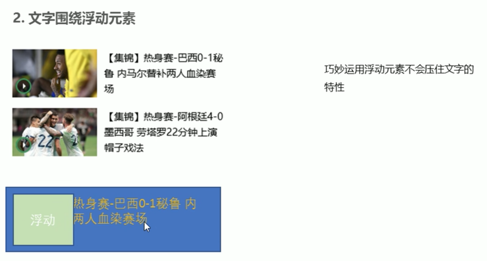

```html
<head>
    <title>文字围绕浮动元素的妙用</title>
    <style>
        * {
            margin: 0;
            padding: 0;
        }
        .box {
            width: 300px;
            height: 70px;
            background-color: pink;
            margin: 0 auto;
            padding: 5px;
        }
        .pic {
            float: left;
            width: 120px;
            height: 60px;
            margin-right: 5px;
        }
        .pic img {
            width: 100%;
        }
    </style>
</head>

<body>
    <div class="box">
        <div class="pic">
            
        </div>
        <p>【集锦】热身赛-巴西0-1秘鲁 内马尔替补两人血染赛场</p>
    </div>
</body>
```

## 7.3.行内块巧妙运用 - 斜三角


# 八、CSS初始化

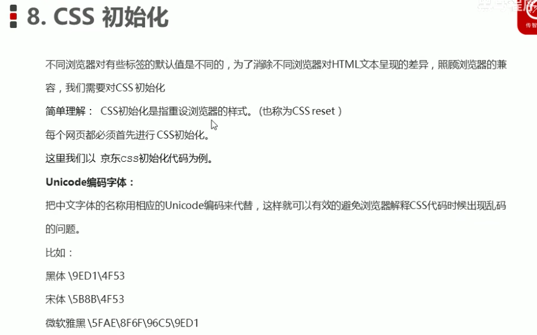

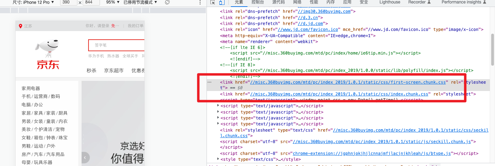

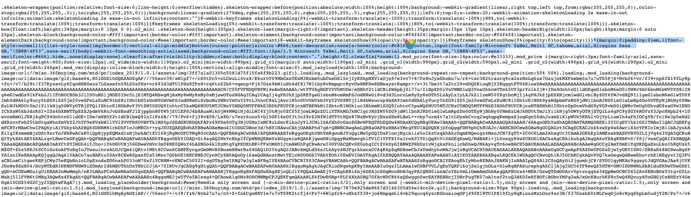


```css
/* 把我们所有标签的内外边距清零 */
* {
    margin: 0;
    padding: 0
}
/* em 和 i 斜体的文字不倾斜 */
em,
i {
    font-style: normal
}
/* 去掉li 的小圆点 */
li {
    list-style: none
}

img {
    /* border 0 照顾低版本浏览器 如果 图片外面包含了链接会有边框的问题 */
    border: 0;
    /* 取消图片底侧有空白缝隙的问题 */
    vertical-align: middle
}

button {
    /* 当我们鼠标经过button 按钮的时候，鼠标变成小手 */
    cursor: pointer
}

a {
    color: #666;
    text-decoration: none
}

a:hover {
    color: #c81623
}

button,
input {
    /* "\5B8B\4F53" 就是宋体的意思 这样浏览器兼容性比较好 */
    font-family: Microsoft YaHei, Heiti SC, tahoma, arial, Hiragino Sans GB, "\5B8B\4F53", sans-serif
}

body {
    /* CSS3 抗锯齿形 让文字显示的更加清晰 */
    -webkit-font-smoothing: antialiased;
    background-color: #fff;
    font: 12px/1.5 Microsoft YaHei, Heiti SC, tahoma, arial, Hiragino Sans GB, "\5B8B\4F53", sans-serif;
    color: #666
}

.hide,
.none {
    display: none
}
/* 清除浮动 */
.clearfix:after {
    visibility: hidden;
    clear: both;
    display: block;
    content: ".";
    height: 0
}

.clearfix {
    *zoom: 1
}
```

